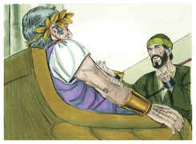
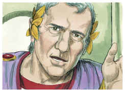
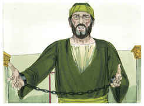
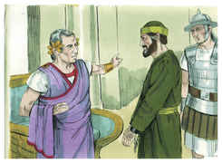
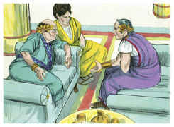
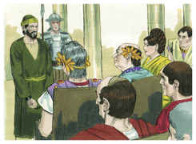

# Atos dos Apóstolos Capítulo 25

## 1
ENTRANDO, pois, Festo na província, subiu dali a três dias de Cesaréia a Jerusalém.

## 2
E o sumo sacerdote e os principais dos judeus compareceram perante ele contra Paulo, e lhe rogaram,

## 3
Pedindo como favor contra ele que o fizesse vir a Jerusalém, armando ciladas para o matarem no caminho.

## 4
Mas Festo respondeu que Paulo estava guardado em Cesaréia, e que ele brevemente partiria para lá.

## 5
Os que, pois, disse, dentre vós, têm poder, desçam comigo e, se neste homem houver algum crime, acusem-no.

## 6
E, havendo-se demorado entre eles mais de dez dias, desceu a Cesaréia; e no dia seguinte, assentando-se no tribunal, mandou que trouxessem Paulo.

## 7
E, chegando ele, rodearam-no os judeus que haviam descido de Jerusalém, trazendo contra Paulo muitas e graves acusações, que não podiam provar.

## 8
Mas ele, em sua defesa, disse: Eu não pequei em coisa alguma contra a lei dos judeus, nem contra o templo, nem contra César.

## 9
Todavia Festo, querendo comprazer aos judeus, respondendo a Paulo, disse: Queres tu subir a Jerusalém, e ser lá perante mim julgado acerca destas coisas?

## 10
Mas Paulo disse: Estou perante o tribunal de César, onde convém que seja julgado; não fiz agravo algum aos judeus, como tu muito bem sabes.

## 11
Se fiz algum agravo, ou cometi alguma coisa digna de morte, não recuso morrer; mas, se nada há das coisas de que estes me acusam, ninguém me pode entregar a eles; apelo para César.

## 12
Então Festo, tendo falado com o conselho, respondeu: Apelaste para César? para César irás.

## 13
E, passados alguns dias, o rei Agripa e Berenice vieram a Cesaréia, a saudar Festo.

## 14
E, como ali ficassem muitos dias, Festo contou ao rei os negócios de Paulo, dizendo: Um certo homem foi deixado por Félix aqui preso,

## 15
Por cujo respeito os principais dos sacerdotes e os anciãos dos judeus, estando eu em Jerusalém, compareceram perante mim, pedindo sentença contra ele.

## 16
Aos quais respondi não ser costume dos romanos entregar algum homem à morte, sem que o acusado tenha presentes os seus acusadores, e possa defender-se da acusação.

## 17
De sorte que, chegando eles aqui juntos, no dia seguinte, sem fazer dilação alguma, assentado no tribunal, mandei que trouxessem o homem.

## 18
Acerca do qual, estando presentes os acusadores, nenhuma coisa apontaram daquelas que eu suspeitava.

## 19
Tinham, porém, contra ele algumas questões acerca da sua superstição, e de um tal Jesus, morto, que Paulo afirmava viver.

## 20
E, estando eu perplexo acerca da inquirição desta causa, disse se queria ir a Jerusalém, e lá ser julgado acerca destas coisas.

## 21
E, apelando Paulo para que fosse reservado ao conhecimento de Augusto, mandei que o guardassem até que o envie a César.

## 22
Então Agripa disse a Festo: Bem quisera eu também ouvir esse homem. E ele disse: Amanhã o ouvirás.

## 23
E, no dia seguinte, vindo Agripa e Berenice, com muito aparato, entraram no auditório com os tribunos e homens principais da cidade, sendo trazido Paulo por mandado de Festo.

## 24
E Festo disse: Rei Agripa, e todos os senhores que estais presentes conosco; aqui vedes um homem de quem toda a multidão dos judeus me tem falado, tanto em Jerusalém como aqui, clamando que não convém que viva mais.

## 25
Mas, achando eu que nenhuma coisa digna de morte fizera, e apelando ele mesmo também para Augusto, tenho determinado enviar-lho.

## 26
Do qual não tenho coisa alguma certa que escreva ao meu senhor, e por isso perante vós o trouxe, principalmente perante ti, ó rei Agripa, para que, depois de interrogado, tenha alguma coisa que escrever.

## 27
Porque me parece contra a razão enviar um preso, e não notificar contra ele as acusações.

