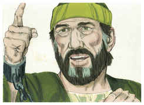
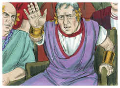
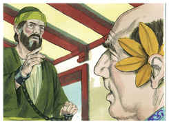
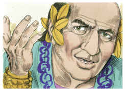
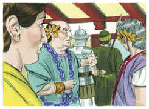

# Atos dos Apóstolos Capítulo 26

## 1
DEPOIS Agripa disse a Paulo: É permitido que te defendas. Então Paulo, estendendo a mão em sua defesa, respondeu:

## 2
Tenho-me por feliz, ó rei Agripa, de que perante ti me haja hoje de defender de todas as coisas de que sou acusado pelos judeus;

## 3
Mormente sabendo eu que tens conhecimento de todos os costumes e questões que há entre os judeus; por isso te rogo que me ouças com paciência.

## 4
Quanto à minha vida, desde a mocidade, como decorreu desde o princípio entre os da minha nação, em Jerusalém, todos os judeus a conhecem,

## 5
Sabendo de mim desde o princípio (se o quiserem testificar), que, conforme a mais severa seita da nossa religião, vivi fariseu.

## 6
E agora pela esperança da promessa que por Deus foi feita a nossos pais estou aqui e sou julgado.

## 7
À qual as nossas doze tribos esperam chegar, servindo a Deus continuamente, noite e dia. Por esta esperança, ó rei Agripa, eu sou acusado pelos judeus.

## 8
Pois quê? julga-se coisa incrível entre vós que Deus ressuscite os mortos?

## 9
Bem tinha eu imaginado que contra o nome de Jesus Nazareno devia eu praticar muitos atos;

## 10
O que também fiz em Jerusalém. E, havendo recebido autorização dos principais dos sacerdotes, encerrei muitos dos santos nas prisões; e quando os matavam eu dava o meu voto contra eles.

## 11
E, castigando-os muitas vezes por todas as sinagogas, os obriguei a blasfemar. E, enfurecido demasiadamente contra eles, até nas cidades estranhas os persegui.

## 12
Sobre o que, indo então a Damasco, com poder e comissão dos principais dos sacerdotes,

## 13
Ao meio-dia, ó rei, vi no caminho uma luz do céu, que excedia o esplendor do sol, cuja claridade me envolveu a mim e aos que iam comigo.

## 14
E, caindo nós todos por terra, ouvi uma voz que me falava, e em língua hebraica dizia: Saulo, Saulo, por que me persegues? Dura coisa te é recalcitrar contra os aguilhões.

## 15
E disse eu: Quem és, Senhor? E ele respondeu: Eu sou Jesus, a quem tu persegues;

## 16
Mas levanta-te e põe-te sobre teus pés, porque te apareci por isto, para te pôr por ministro e testemunha tanto das coisas que tens visto como daquelas pelas quais te aparecerei ainda;

## 17
Livrando-te deste povo, e dos gentios, a quem agora te envio,

## 18
Para lhes abrires os olhos, e das trevas os converteres à luz, e do poder de Satanás a Deus; a fim de que recebam a remissão de pecados, e herança entre os que são santificados pela fé em mim.

## 19
Por isso, ó rei Agripa, não fui desobediente à visão celestial.

## 20
Antes anunciei primeiramente aos que estão em Damasco e em Jerusalém, e por toda a terra da Judéia, e aos gentios, que se emendassem e se convertessem a Deus, fazendo obras dignas de arrependimento.

## 21
Por causa disto os judeus lançaram mão de mim no templo, e procuraram matar-me.

## 22
Mas, alcançando socorro de Deus, ainda até ao dia de hoje permaneço dando testemunho tanto a pequenos como a grandes, não dizendo nada mais do que o que os profetas e Moisés disseram que devia acontecer,

## 23
Isto é, que o Cristo devia padecer, e sendo o primeiro da ressurreição dentre os mortos, devia anunciar a luz a este povo e aos gentios.

## 24
E, dizendo ele isto em sua defesa, disse Festo em alta voz: Estás louco, Paulo; as muitas letras te fazem delirar.

## 25
Mas ele disse: Não deliro, ó potentíssimo Festo; antes digo palavras de verdade e de um são juízo.

## 26
Porque o rei, diante de quem também falo com ousadia, sabe estas coisas, pois não creio que nada disto lhe é oculto; porque isto não se fez em qualquer canto.

## 27
Crês tu nos profetas, ó rei Agripa? Bem sei que crês.

## 28
E disse Agripa a Paulo: Por pouco me queres persuadir a que me faça cristão!

## 29
E disse Paulo: Prouvera a Deus que, ou por pouco ou por muito, não somente tu, mas também todos quantos hoje me estão ouvindo, se tornassem tais qual eu sou, exceto estas cadeias.

## 30
E, dizendo ele isto, levantou-se o rei, o presidente, e Berenice, e os que com eles estavam assentados.

## 31
E, apartando-se dali falavam uns com os outros, dizendo: Este homem nada fez digno de morte ou de prisões.

## 32
E Agripa disse a Festo: Bem podia soltar-se este homem, se não houvera apelado para César.

