# Atos dos Apóstolos Capítulo 28

1	E, HAVENDO escapado, então souberam que a ilha se chamava Malta.

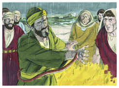

2	E os bárbaros usaram conosco de não pouca humanidade; porque, acendendo uma grande fogueira, nos recolheram a todos por causa da chuva que caía, e por causa do frio.

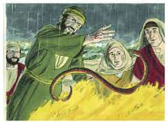

3	E, havendo Paulo ajuntado uma quantidade de vides, e pondo-as no fogo, uma víbora, fugindo do calor, lhe acometeu a mão.

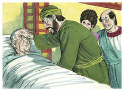

4	E os bárbaros, vendo-lhe a víbora pendurada na mão, diziam uns aos outros: Certamente este homem é homicida, visto como, escapando do mar, a justiça não o deixa viver.

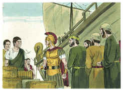

5	Mas, sacudindo ele a víbora no fogo, não sofreu nenhum mal.

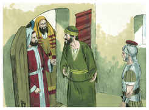

6	E eles esperavam que viesse a inchar ou a cair morto de repente; mas tendo esperado já muito, e vendo que nenhum incômodo lhe sobrevinha, mudando de parecer, diziam que era um deus.

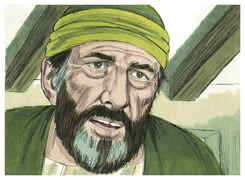

7	E ali, próximo daquele lugar, havia umas herdades que pertenciam ao principal da ilha, por nome Públio, o qual nos recebeu e hospedou benignamente por três dias.

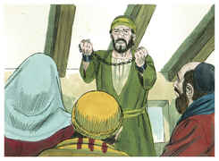

8	E aconteceu estar de cama enfermo de febre e disenteria o pai de Públio, que Paulo foi ver, e, havendo orado, pôs as mãos sobre ele, e o curou.

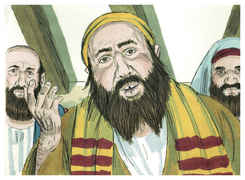

9	Feito, pois, isto, vieram também ter com ele os demais que na ilha tinham enfermidades, e sararam.

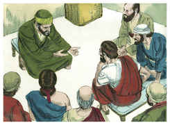

10	Os quais nos distinguiram também com muitas honras; e, havendo de navegar, nos proveram das coisas necessárias.

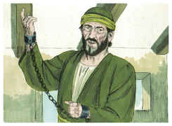

11	E três meses depois partimos num navio de Alexandria que invernara na ilha, o qual tinha por insígnia Castor e Pólux.

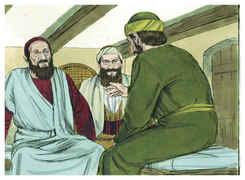

12	E, chegando a Siracusa, ficamos ali três dias.

13	De onde, indo costeando, viemos a Régio; e soprando, um dia depois, um vento do sul, chegamos no segundo dia a Potéoli.

14	Onde, achando alguns irmãos, nos rogaram que por sete dias ficássemos com eles; e depois nos dirigimos a Roma.

15	E de lá, ouvindo os irmãos novas de nós, nos saíram ao encontro à Praça de Ápio e às Três Vendas, e Paulo, vendo-os, deu graças a Deus e tomou ânimo.

16	E, logo que chegamos a Roma, o centurião entregou os presos ao capitão da guarda; mas a Paulo se lhe permitiu morar por sua conta à parte, com o soldado que o guardava.

17	E aconteceu que, três dias depois, Paulo convocou os principais dos judeus e, juntos eles, lhes disse: Homens irmãos, não havendo eu feito nada contra o povo, ou contra os ritos paternos, vim contudo preso desde Jerusalém, entregue nas mãos dos romanos;

18	Os quais, havendo-me examinado, queriam soltar-me, por não haver em mim crime algum de morte.

19	Mas, opondo-se os judeus, foi-me forçoso apelar para César, não tendo, contudo, de que acusar a minha nação.

20	Por esta causa vos chamei, para vos ver e falar; porque pela esperança de Israel estou com esta cadeia.

21	Então eles lhe disseram: Nós não recebemos acerca de ti carta alguma da Judéia, nem veio aqui algum dos irmãos, que nos anunciasse ou dissesse de ti mal algum.

22	No entanto bem quiséramos ouvir de ti o que sentes; porque, quanto a esta seita, notório nos é que em toda a parte se fala contra ela.

23	E, havendo-lhe eles assinalado um dia, muitos foram ter com ele à pousada, aos quais declarava com bom testemunho o reino de Deus, e procurava persuadi-los à fé em Jesus, tanto pela lei de Moisés como pelos profetas, desde a manhã até à tarde.

24	E alguns criam no que se dizia; mas outros não criam.

25	E, como ficaram entre si discordes, despediram-se, dizendo Paulo esta palavra: Bem falou o Espírito Santo a nossos pais pelo profeta Isaías,

26	Dizendo: Vai a este povo, e dize: De ouvido ouvireis, e de maneira nenhuma entendereis; E, vendo vereis, e de maneira nenhuma percebereis.

27	Porquanto o coração deste povo está endurecido, E com os ouvidos ouviram pesadamente, E fecharam os olhos, Para que nunca com os olhos vejam, Nem com os ouvidos ouçam, Nem do coração entendam, E se convertam, E eu os cure.

28	Seja-vos, pois, notório que esta salvação de Deus é enviada aos gentios, e eles a ouvirão.

29	E, havendo ele dito estas palavras, partiram os judeus, tendo entre si grande contenda.

30	E Paulo ficou dois anos inteiros na sua própria habitação que alugara, e recebia todos quantos vinham vê-lo;

31	Pregando o reino de Deus, e ensinando com toda a liberdade as coisas pertencentes ao Senhor Jesus Cristo, sem impedimento algum.

