# Atos dos Apóstolos Capítulo 6

## 1
ORA, naqueles dias, crescendo o número dos discípulos, houve uma murmuração dos gregos contra os hebreus, porque as suas viúvas eram desprezadas no ministério cotidiano.

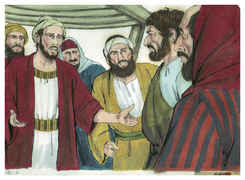

## 2
E os doze, convocando a multidão dos discípulos, disseram: Não é razoável que nós deixemos a palavra de Deus e sirvamos às mesas.

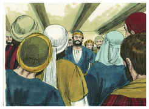

## 3
Escolhei, pois, irmãos, dentre vós, sete homens de boa reputação, cheios do Espírito Santo e de sabedoria, aos quais constituamos sobre este importante negócio.

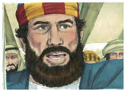

## 4
Mas nós perseveraremos na oração e no ministério da palavra.

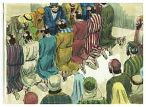

## 5
E este parecer contentou a toda a multidão, e elegeram Estêvão, homem cheio de fé e do Espírito Santo, e Filipe, e Prócoro, e Nicanor, e Timão, e Parmenas e Nicolau, prosélito de Antioquia;

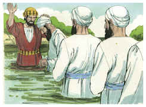

## 6
E os apresentaram ante os apóstolos, e estes, orando, lhes impuseram as mãos.

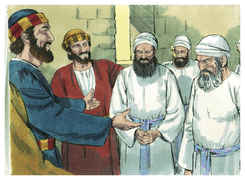

## 7
E crescia a palavra de Deus, e em Jerusalém se multiplicava muito o número dos discípulos, e grande parte dos sacerdotes obedecia à fé.

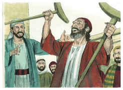

## 8
E Estêvão, cheio de fé e de poder, fazia prodígios e grandes sinais entre o povo.

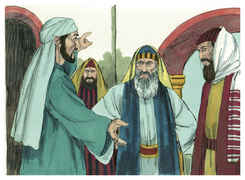

## 9
E levantaram-se alguns que eram da sinagoga chamada dos libertinos, e dos cireneus e dos alexandrinos, e dos que eram da Cilícia e da Ásia, e disputavam com Estêvão.

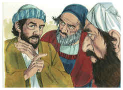

## 10
E não podiam resistir à sabedoria, e ao Espírito com que falava.

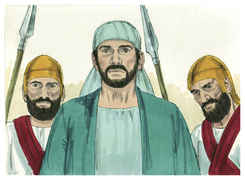

## 11
Então subornaram uns homens, para que dissessem: Ouvimos-lhe proferir palavras blasfemas contra Moisés e contra Deus.

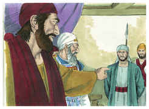

## 12
E excitaram o povo, os anciãos e os escribas; e, investindo contra ele, o arrebataram e o levaram ao conselho.

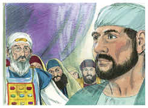

## 13
E apresentaram falsas testemunhas, que diziam: Este homem não cessa de proferir palavras blasfemas contra este santo lugar e a lei;

## 14
Porque nós lhe ouvimos dizer que esse Jesus Nazareno há de destruir este lugar e mudar os costumes que Moisés nos deu.

## 15
Então todos os que estavam assentados no conselho, fixando os olhos nele, viram o seu rosto como o rosto de um anjo.

