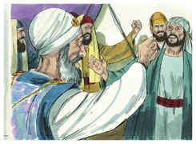
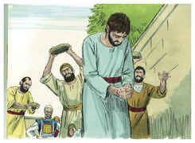
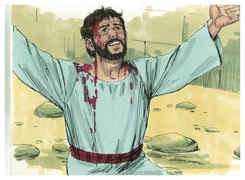
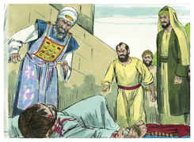

# Atos dos Apóstolos Capítulo 7

## 1
E DISSE o sumo sacerdote: Porventura é isto assim?

## 2
E ele disse: Homens, irmãos, e pais, ouvi. O Deus da glória apareceu a nosso pai Abraão, estando na Mesopotâmia, antes de habitar em Harã,

## 3
E disse-lhe: Sai da tua terra e dentre a tua parentela, e dirige-te à terra que eu te mostrar.

## 4
Então saiu da terra dos caldeus, e habitou em Harã. E dali, depois que seu pai faleceu, Deus o trouxe para esta terra em que habitais agora.

## 5
E não lhe deu nela herança, nem ainda o espaço de um pé; mas prometeu que lhe daria a posse dela, e depois dele, à sua descendência, não tendo ele ainda filho.

## 6
E falou Deus assim: Que a sua descendência seria peregrina em terra alheia, e a sujeitariam à escravidão, e a maltratariam por quatrocentos anos.

## 7
E eu julgarei a nação que os tiver escravizado, disse Deus. E depois disto sairão e me servirão neste lugar.

## 8
E deu-lhe a aliança da circuncisão; e assim gerou a Isaque, e o circuncidou ao oitavo dia; e Isaque a Jacó; e Jacó aos doze patriarcas.

## 9
E os patriarcas, movidos de inveja, venderam José para o Egito; mas Deus era com ele.

## 10
E livrou-o de todas as suas tribulações, e lhe deu graça e sabedoria ante Faraó, rei do Egito, que o constituiu governador sobre o Egito e toda a sua casa.

## 11
Sobreveio então a todo o país do Egito e de Canaã fome e grande tribulação; e nossos pais não achavam alimentos.

## 12
Mas tendo ouvido Jacó que no Egito havia trigo, enviou ali nossos pais, a primeira vez.

## 13
E na segunda vez foi José conhecido por seus irmãos, e a sua linhagem foi manifesta a Faraó.

## 14
E José mandou chamar a seu pai Jacó, e a toda a sua parentela, que era de setenta e cinco almas.

## 15
E Jacó desceu ao Egito, e morreu, ele e nossos pais;

## 16
E foram transportados para Siquém, e depositados na sepultura que Abraão comprara por certa soma de dinheiro aos filhos de Emor, pai de Siquém.

## 17
Aproximando-se, porém, o tempo da promessa que Deus tinha feito a Abraão, o povo cresceu e se multiplicou no Egito;

## 18
Até que se levantou outro rei, que não conhecia a José.

## 19
Esse, usando de astúcia contra a nossa linhagem, maltratou nossos pais, a ponto de os fazer enjeitar as suas crianças, para que não se multiplicassem.

## 20
Nesse tempo nasceu Moisés, e era mui formoso, e foi criado três meses em casa de seu pai.

## 21
E, sendo enjeitado, tomou-o a filha de Faraó, e o criou como seu filho.

## 22
E Moisés foi instruído em toda a ciência dos egípcios; e era poderoso em suas palavras e obras.

## 23
E, quando completou a idade de quarenta anos, veio-lhe ao coração ir visitar seus irmãos, os filhos de Israel.

## 24
E, vendo maltratado um deles, o defendeu, e vingou o ofendido, matando o egípcio.

## 25
E ele cuidava que seus irmãos entenderiam que Deus lhes havia de dar a liberdade pela sua mão; mas eles não entenderam.

## 26
E no dia seguinte, pelejando eles, foi por eles visto, e quis levá-los à paz, dizendo: Homens, sois irmãos; por que vos agravais um ao outro?

## 27
E o que ofendia o seu próximo o repeliu, dizendo: Quem te constituiu príncipe e juiz sobre nós?

## 28
Queres tu matar-me, como ontem mataste o egípcio?

## 29
E a esta palavra fugiu Moisés, e esteve como estrangeiro na terra de Midiã, onde gerou dois filhos.

## 30
E, completados quarenta anos, apareceu-lhe o anjo do Senhor no deserto do monte Sinai, numa chama de fogo no meio de uma sarça.

## 31
Então Moisés, quando viu isto, se maravilhou da visão; e, aproximando-se para observar, foi-lhe dirigida a voz do Senhor,

## 32
Dizendo: Eu sou o Deus de teus pais, o Deus de Abraão, e o Deus de Isaque, e o Deus de Jacó. E Moisés, todo trêmulo, não ousava olhar.

## 33
E disse-lhe o Senhor: Tira as alparcas dos teus pés, porque o lugar em que estás é terra santa.

## 34
Tenho visto atentamente a aflição do meu povo que está no Egito, e ouvi os seus gemidos, e desci a livrá-los. Agora, pois, vem, e enviar-te-ei ao Egito.

## 35
A este Moisés, ao qual haviam negado, dizendo: Quem te constituiu príncipe e juiz? a este enviou Deus como príncipe e libertador, pela mão do anjo que lhe aparecera na sarça.

## 36
Foi este que os conduziu para fora, fazendo prodígios e sinais na terra do Egito, e no Mar Vermelho, e no deserto, por quarenta anos.

## 37
Este é aquele Moisés que disse aos filhos de Israel: O Senhor vosso Deus vos levantará dentre vossos irmãos um profeta como eu; a ele ouvireis.

## 38
Este é o que esteve entre a congregação no deserto, com o anjo que lhe falava no monte Sinai, e com nossos pais, o qual recebeu as palavras de vida para no-las dar.

## 39
Ao qual nossos pais não quiseram obedecer, antes o rejeitaram e em seu coração se tornaram ao Egito,

## 40
Dizendo a Arão: Faze-nos deuses que vão adiante de nós; porque a esse Moisés, que nos tirou da terra do Egito, não sabemos o que lhe aconteceu.

## 41
E naqueles dias fizeram o bezerro, e ofereceram sacrifícios ao ídolo, e se alegraram nas obras das suas mãos.

## 42
Mas Deus se afastou, e os abandonou a que servissem ao exército do céu, como está escrito no livro dos profetas: Porventura me oferecestes vítimas e sacrifícios No deserto por quarenta anos, ó casa de Israel?

## 43
Antes tomastes o tabernáculo de Moloque, E a estrela do vosso deus Renfã, Figuras que vós fizestes para as adorar. Transportar-vos-ei, pois, para além da Babilônia.

## 44
Estava entre nossos pais no deserto o tabernáculo do testemunho, como ordenara aquele que disse a Moisés que o fizesse segundo o modelo que tinha visto.

## 45
O qual, nossos pais, recebendo-o também, o levaram com Josué quando entraram na posse das nações que Deus lançou para fora da presença de nossos pais, até aos dias de Davi,

## 46
Que achou graça diante de Deus, e pediu que pudesse achar tabernáculo para o Deus de Jacó.

## 47
E Salomão lhe edificou casa;

## 48
Mas o Altíssimo não habita em templos feitos por mãos de homens, como diz o profeta:

## 49
O céu é o meu trono, E a terra o estrado dos meus pés. Que casa me edificareis? diz o Senhor, ou qual é o lugar do meu repouso?

## 50
Porventura não fez a minha mão todas estas coisas?

## 51
Homens de dura cerviz, e incircuncisos de coração e ouvido, vós sempre resistis ao Espírito Santo; assim vós sois como vossos pais.

## 52
A qual dos profetas não perseguiram vossos pais? Até mataram os que anteriormente anunciaram a vinda do Justo, do qual vós agora fostes traidores e homicidas;

## 53
Vós, que recebestes a lei por ordenação dos anjos, e não a guardastes.

## 54
E, ouvindo eles isto, enfureciam-se em seus corações, e rangiam os dentes contra ele.

## 55
Mas ele, estando cheio do Espírito Santo, fixando os olhos no céu, viu a glória de Deus, e Jesus, que estava à direita de Deus;

## 56
E disse: Eis que vejo os céus abertos, e o Filho do homem, que está em pé à mão direita de Deus.

## 57
Mas eles gritaram com grande voz, taparam os seus ouvidos, e arremeteram unânimes contra ele.

## 58
E, expulsando-o da cidade, o apedrejavam. E as testemunhas depuseram as suas capas aos pés de um jovem chamado Saulo.

## 59
E apedrejaram a Estêvão que em invocação dizia: Senhor Jesus, recebe o meu espírito.

## 60
E, pondo-se de joelhos, clamou com grande voz: Senhor, não lhes imputes este pecado. E, tendo dito isto, adormeceu.

