# Atos dos Apóstolos Capítulo 9

## 1
E SAULO, respirando ainda ameaças e mortes contra os discípulos do Senhor, dirigiu-se ao sumo sacerdote.

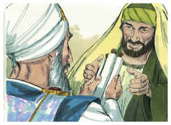

## 2
E pediu-lhe cartas para Damasco, para as sinagogas, a fim de que, se encontrasse alguns deste Caminho, quer homens quer mulheres, os conduzisse presos a Jerusalém.

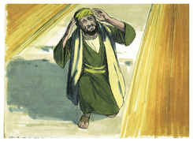

## 3
E, indo no caminho, aconteceu que, chegando perto de Damasco, subitamente o cercou um resplendor de luz do céu.

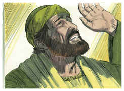

## 4
E, caindo em terra, ouviu uma voz que lhe dizia: Saulo, Saulo, por que me persegues?

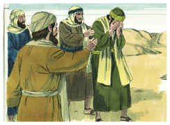

## 5
E ele disse: Quem és, Senhor? E disse o Senhor: Eu sou Jesus, a quem tu persegues. Duro é para ti recalcitrar contra os aguilhões.

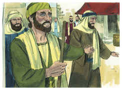

## 6
E ele, tremendo e atônito, disse: Senhor, que queres que eu faça? E disse-lhe o Senhor: Levanta-te, e entra na cidade, e lá te será dito o que te convém fazer.

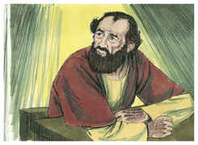

## 7
E os homens, que iam com ele, pararam espantados, ouvindo a voz, mas não vendo ninguém.

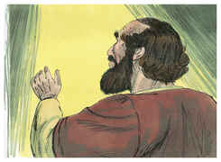

## 8
E Saulo levantou-se da terra, e, abrindo os olhos, não via a ninguém. E, guiando-o pela mão, o conduziram a Damasco.

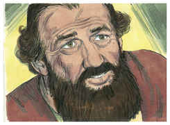

## 9
E esteve três dias sem ver, e não comeu nem bebeu.

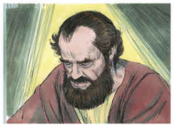

## 10
E havia em Damasco um certo discípulo chamado Ananias; e disse-lhe o Senhor em visão: Ananias! E ele respondeu: Eis-me aqui, Senhor.

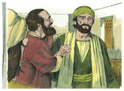

## 11
E disse-lhe o Senhor: Levanta-te, e vai à rua chamada Direita, e pergunta em casa de Judas por um homem de Tarso chamado Saulo; pois eis que ele está orando;

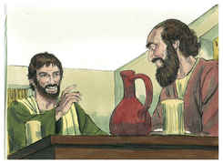

## 12
E numa visão ele viu que entrava um homem chamado Ananias, e punha sobre ele a mão, para que tornasse a ver.

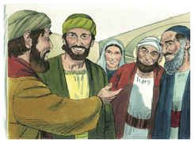

## 13
E respondeu Ananias: Senhor, a muitos ouvi acerca deste homem, quantos males tem feito aos teus santos em Jerusalém;

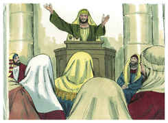

## 14
E aqui tem poder dos principais dos sacerdotes para prender a todos os que invocam o teu nome.

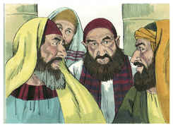

## 15
Disse-lhe, porém, o Senhor: Vai, porque este é para mim um vaso escolhido, para levar o meu nome diante dos gentios, e dos reis e dos filhos de Israel.

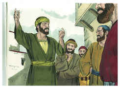

## 16
E eu lhe mostrarei quanto deve padecer pelo meu nome.

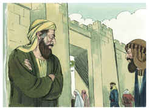

## 17
E Ananias foi, e entrou na casa e, impondo-lhe as mãos, disse: Irmão Saulo, o Senhor Jesus, que te apareceu no caminho por onde vinhas, me enviou, para que tornes a ver e sejas cheio do Espírito Santo.

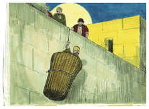

## 18
E logo lhe caíram dos olhos como que umas escamas, e recuperou a vista; e, levantando-se, foi batizado.

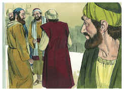

## 19
E, tendo comido, ficou confortado. E esteve Saulo alguns dias com os discípulos que estavam em Damasco.

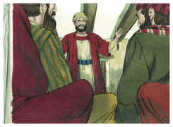

## 20
E logo nas sinagogas pregava a Cristo, que este é o Filho de Deus.

## 21
E todos os que o ouviam estavam atônitos, e diziam: Não é este o que em Jerusalém perseguia os que invocavam este nome, e para isso veio aqui, para os levar presos aos principais dos sacerdotes?

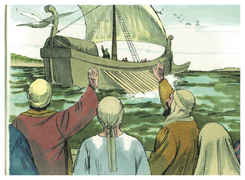

## 22
Saulo, porém, se esforçava muito mais, e confundia os judeus que habitavam em Damasco, provando que aquele era o Cristo.

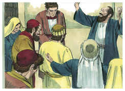

## 23
E, tendo passado muitos dias, os judeus tomaram conselho entre si para o matar.

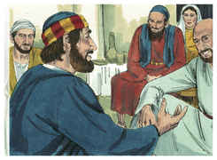

## 24
Mas as suas ciladas vieram ao conhecimento de Saulo; e como eles guardavam as portas, tanto de dia como de noite, para poderem tirar-lhe a vida,

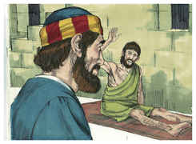

## 25
Tomando-o de noite os discípulos o desceram, dentro de um cesto, pelo muro.

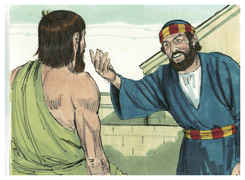

## 26
E, quando Saulo chegou a Jerusalém, procurava ajuntar-se aos discípulos, mas todos o temiam, não crendo que fosse discípulo.

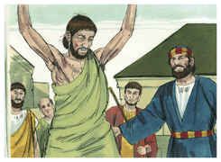

## 27
Então Barnabé, tomando-o consigo, o trouxe aos apóstolos, e lhes contou como no caminho ele vira ao Senhor e lhe falara, e como em Damasco falara ousadamente no nome de Jesus.

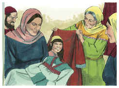

## 28
E andava com eles em Jerusalém, entrando e saindo,

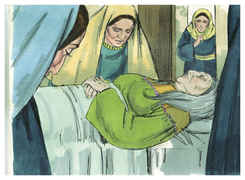

## 29
E falava ousadamente no nome do Senhor Jesus. Falava e disputava também contra os gregos, mas eles procuravam matá-lo.

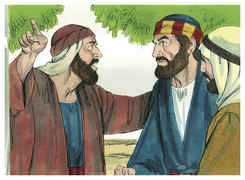

## 30
Sabendo-o, porém, os irmãos, o acompanharam até Cesaréia, e o enviaram a Tarso.

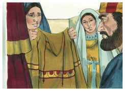

## 31
Assim, pois, as igrejas em toda a Judéia, e Galiléia e Samaria tinham paz, e eram edificadas; e se multiplicavam, andando no temor do Senhor e consolação do Espírito Santo.

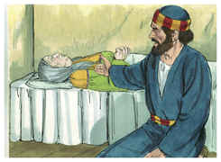

## 32
E aconteceu que, passando Pedro por toda a parte, veio também aos santos que habitavam em Lida.

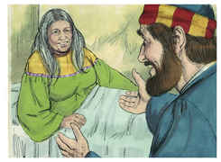

## 33
E achou ali certo homem, chamado Enéias, jazendo numa cama havia oito anos, o qual era paralítico.

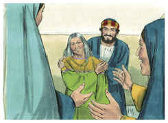

## 34
E disse-lhe Pedro: Enéias, Jesus Cristo te dá saúde; levanta-te e faze a tua cama. E logo se levantou.

## 35
E viram-no todos os que habitavam em Lida e Sarona, os quais se converteram ao Senhor.

## 36
E havia em Jope uma discípula chamada Tabita, que traduzido se diz Dorcas. Esta estava cheia de boas obras e esmolas que fazia.

## 37
E aconteceu naqueles dias que, enfermando ela, morreu; e, tendo-a lavado, a depositaram num quarto alto.

## 38
E, como Lida era perto de Jope, ouvindo os discípulos que Pedro estava ali, lhe mandaram dois homens, rogando-lhe que não se demorasse em vir ter com eles.

## 39
E, levantando-se Pedro, foi com eles; e quando chegou o levaram ao quarto alto, e todas as viúvas o rodearam, chorando e mostrando as túnicas e roupas que Dorcas fizera quando estava com elas.

## 40
Mas Pedro, fazendo sair a todos, pôs-se de joelhos e orou: e, voltando-se para o corpo, disse: Tabita, levanta-te. E ela abriu os olhos, e, vendo a Pedro, assentou-se.

## 41
E ele, dando-lhe a mão, a levantou e, chamando os santos e as viúvas, apresentou-lha viva.

## 42
E foi isto notório por toda a Jope, e muitos creram no Senhor.

## 43
E ficou muitos dias em Jope, com um certo Simão curtidor.

