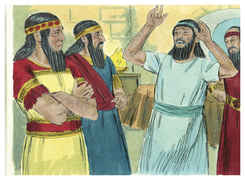
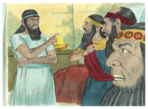
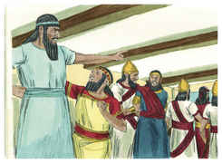
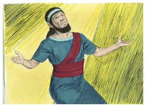
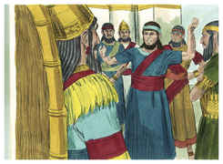
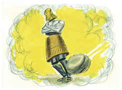
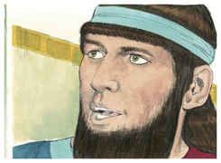
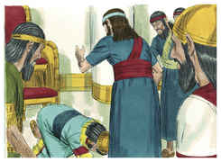

# Daniel Capítulo 2

## 1
E NO segundo ano do reinado de Nabucodonosor, Nabucodonosor teve sonhos; e o seu espírito se perturbou, e passou-se-lhe o sono.

## 2
Então o rei mandou chamar os magos, os astrólogos, os encantadores e os caldeus, para que declarassem ao rei os seus sonhos; e eles vieram e se apresentaram diante do rei.

## 3
E o rei lhes disse: Tive um sonho; e para saber o sonho está perturbado o meu espírito.

## 4
E os caldeus disseram ao rei em aramaico: Ó rei, vive eternamente! Dize o sonho a teus servos, e daremos a interpretação.

## 5
Respondeu o rei, e disse aos caldeus: O assunto me tem escapado; se não me fizerdes saber o sonho e a sua interpretação, sereis despedaçados, e as vossas casas serão feitas um monturo;

## 6
Mas se vós me declarardes o sonho e a sua interpretação, recebereis de mim dádivas, recompensas e grande honra; portanto declarai-me o sonho e a sua interpretação.

## 7
Responderam segunda vez, e disseram: Diga o rei o sonho a seus servos, e daremos a sua interpretação.

## 8
Respondeu o rei, e disse: Percebo muito bem que vós quereis ganhar tempo; porque vedes que o assunto me tem escapado.

## 9
De modo que, se não me fizerdes saber o sonho, uma só sentença será a vossa; pois vós preparastes palavras mentirosas e perversas para as proferirdes na minha presença, até que se mude o tempo; portanto dizei-me o sonho, para que eu entenda que me podeis dar a sua interpretação.

## 10
Responderam os caldeus na presença do rei, e disseram: Não há ninguém sobre a terra que possa declarar a palavra ao rei; pois nenhum rei há, grande ou dominador, que requeira coisas semelhantes de algum mago, ou astrólogo, ou caldeu.

## 11
Porque o assunto que o rei requer é difícil; e ninguém há que o possa declarar diante do rei, senão os deuses, cuja morada não é com a carne.

## 12
Por isso o rei muito se irou e enfureceu; e ordenou que matassem a todos os sábios de Babilônia.

## 13
E saiu o decreto, segundo o qual deviam ser mortos os sábios; e buscaram a Daniel e aos seus companheiros, para que fossem mortos.

## 14
Então Daniel falou avisada e prudentemente a Arioque, capitão da guarda do rei, que tinha saído para matar os sábios de Babilônia.

## 15
Respondeu, e disse a Arioque, capitão do rei: Por que se apressa tanto o decreto da parte do rei? Então Arioque explicou o caso a Daniel.

## 16
E Daniel entrou; e pediu ao rei que lhe desse tempo, para que lhe pudesse dar a interpretação.

## 17
Então Daniel foi para a sua casa, e fez saber o caso a Hananias, Misael e Azarias, seus companheiros;

## 18
Para que pedissem misericórdia ao Deus do céu, sobre este mistério, a fim de que Daniel e seus companheiros não perecessem, juntamente com o restante dos sábios da Babilônia.

## 19
Então foi revelado o mistério a Daniel numa visão de noite; então Daniel louvou o Deus do céu.

## 20
Falou Daniel, dizendo: Seja bendito o nome de Deus de eternidade a eternidade, porque dele são a sabedoria e a força;

## 21
E ele muda os tempos e as estações; ele remove os reis e estabelece os reis; ele dá sabedoria aos sábios e conhecimento aos entendidos.

## 22
Ele revela o profundo e o escondido; conhece o que está em trevas, e com ele mora a luz.

## 23
Ó Deus de meus pais, eu te dou graças e te louvo, porque me deste sabedoria e força; e agora me fizeste saber o que te pedimos, porque nos fizeste saber este assunto do rei.

## 24
Por isso Daniel foi ter com Arioque, ao qual o rei tinha constituído para matar os sábios de Babilônia; entrou, e disse-lhe assim: Não mates os sábios de Babilônia; introduze-me na presença do rei, e declararei ao rei a interpretação.

## 25
Então Arioque depressa introduziu a Daniel na presença do rei, e disse-lhe assim: Achei um homem dentre os cativos de Judá, o qual fará saber ao rei a interpretação.

## 26
Respondeu o rei, e disse a Daniel (cujo nome era Beltessazar): Podes tu fazer-me saber o sonho que tive e a sua interpretação?

## 27
Respondeu Daniel na presença do rei, dizendo: O segredo que o rei requer, nem sábios, nem astrólogos, nem magos, nem adivinhos o podem declarar ao rei;

## 28
Mas há um Deus no céu, o qual revela os mistérios; ele, pois, fez saber ao rei Nabucodonosor o que há de acontecer nos últimos dias; o teu sonho e as visões da tua cabeça que tiveste na tua cama são estes:

## 29
Estando tu, ó rei, na tua cama, subiram os teus pensamentos, acerca do que há de ser depois disto. Aquele, pois, que revela os mistérios te fez saber o que há de ser.

## 30
E a mim me foi revelado esse mistério, não porque haja em mim mais sabedoria que em todos os viventes, mas para que a interpretação se fizesse saber ao rei, e para que entendesses os pensamentos do teu coração.

## 31
Tu, ó rei, estavas vendo, e eis aqui uma grande estátua; esta estátua, que era imensa, cujo esplendor era excelente, e estava em pé diante de ti; e a sua aparência era terrível.

## 32
A cabeça daquela estátua era de ouro fino; o seu peito e os seus braços de prata; o seu ventre e as suas coxas de cobre;

## 33
As pernas de ferro; os seus pés em parte de ferro e em parte de barro.

## 34
Estavas vendo isto, quando uma pedra foi cortada, sem auxílio de mão, a qual feriu a estátua nos pés de ferro e de barro, e os esmiuçou.

## 35
Então foi juntamente esmiuçado o ferro, o barro, o bronze, a prata e o ouro, os quais se fizeram como pragana das eiras do estio, e o vento os levou, e não se achou lugar algum para eles; mas a pedra, que feriu a estátua, se tornou grande monte, e encheu toda a terra.

## 36
Este é o sonho; também a sua interpretação diremos na presença do rei.

## 37
Tu, ó rei, és rei de reis; a quem o Deus do céu tem dado o reino, o poder, a força, e a glória.

## 38
E onde quer que habitem os filhos de homens, na tua mão entregou os animais do campo, e as aves do céu, e fez que reinasse sobre todos eles; tu és a cabeça de ouro.

## 39
E depois de ti se levantará outro reino, inferior ao teu; e um terceiro reino, de bronze, o qual dominará sobre toda a terra.

## 40
E o quarto reino será forte como ferro; pois, como o ferro, esmiúça e quebra tudo; como o ferro que quebra todas as coisas, assim ele esmiuçará e fará em pedaços.

## 41
E, quanto ao que viste dos pés e dos dedos, em parte de barro de oleiro, e em parte de ferro, isso será um reino dividido; contudo haverá nele alguma coisa da firmeza do ferro, pois viste o ferro misturado com barro de lodo.

## 42
E como os dedos dos pés eram em parte de ferro e em parte de barro, assim por uma parte o reino será forte, e por outra será frágil.

## 43
Quanto ao que viste do ferro misturado com barro de lodo, misturar-se-ão com semente humana, mas não se ligarão um ao outro, assim como o ferro não se mistura com o barro.

## 44
Mas, nos dias desses reis, o Deus do céu levantará um reino que não será jamais destruído; e este reino não passará a outro povo; esmiuçará e consumirá todos esses reinos, mas ele mesmo subsistirá para sempre,

## 45
Da maneira que viste que do monte foi cortada uma pedra, sem auxílio de mãos, e ela esmiuçou o ferro, o bronze, o barro, a prata e o ouro; o grande Deus fez saber ao rei o que há de ser depois disto. Certo é o sonho, e fiel a sua interpretação.

## 46
Então o rei Nabucodonosor caiu sobre a sua face, e adorou a Daniel, e ordenou que lhe oferecessem uma oblação e perfumes suaves.

## 47
Respondeu o rei a Daniel, e disse: Certamente o vosso Deus é Deus dos deuses, e o Senhor dos reis e revelador de mistérios, pois pudeste revelar este mistério.

## 48
Então o rei engrandeceu a Daniel, e lhe deu muitas e grandes dádivas, e o pôs por governador de toda a província de Babilônia, como também o fez chefe dos governadores sobre todos os sábios de Babilônia.

## 49
E pediu Daniel ao rei, e constituiu ele sobre os negócios da província de Babilônia a Sadraque, Mesaque e Abednego; mas Daniel permaneceu na porta do rei.

