# Daniel Capítulo 3

1	O REI Nabucodonosor fez uma estátua de ouro, cuja altura era de sessenta côvados, e a sua largura de seis côvados; levantou-a no campo de Dura, na província de Babilônia.

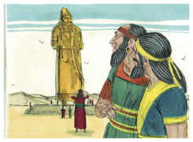

2	Então o rei Nabucodonosor mandou reunir os príncipes, os prefeitos, os governadores, os conselheiros, os tesoureiros, os juízes, os capitães, e todos os oficiais das províncias, para que viessem à consagração da estátua que o rei Nabucodonosor tinha levantado.

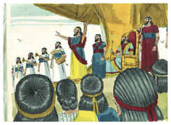

3	Então se reuniram os príncipes, os prefeitos e governadores, os capitães, os juízes, os tesoureiros, os conselheiros, e todos os oficiais das províncias, à consagração da estátua que o rei Nabucodonosor tinha levantado; e estavam em pé diante da imagem que Nabucodonosor tinha levantado.

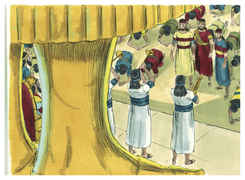

4	E o arauto apregoava em alta voz: Ordena-se a vós, ó povos, nações e línguas:

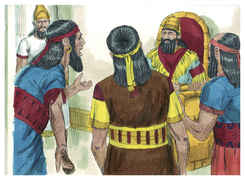

5	Quando ouvirdes o som da buzina, da flauta, da harpa, da sambuca, do saltério, da gaita de foles, e de toda a espécie de música, prostrar-vos-eis, e adorareis a estátua de ouro que o rei Nabucodonosor tem levantado.

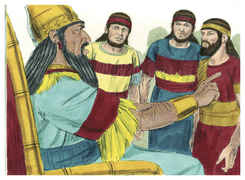

6	E qualquer que não se prostrar e não a adorar, será na mesma hora lançado dentro da fornalha de fogo ardente.

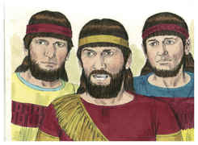

7	Portanto, no mesmo instante em que todos os povos ouviram o som da buzina, da flauta, da harpa, da sambuca, do saltério e de toda a espécie de música, prostraram-se todos os povos, nações e línguas, e adoraram a estátua de ouro que o rei Nabucodonosor tinha levantado.

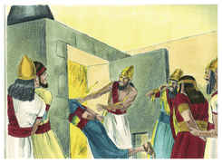

8	Por isso, no mesmo instante chegaram perto alguns caldeus, e acusaram os judeus.

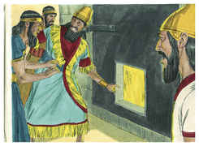

9	E responderam, dizendo ao rei Nabucodonosor: Ó rei, vive eternamente!

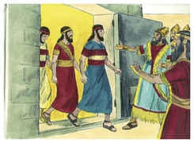

10	Tu, ó rei, fizeste um decreto, pelo qual todo homem que ouvisse o som da buzina, da flauta, da harpa, da sambuca, do saltério, e da gaita de foles, e de toda a espécie de música, se prostrasse e adorasse a estátua de ouro;

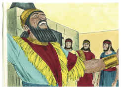

11	E, qualquer que não se prostrasse e adorasse, seria lançado dentro da fornalha de fogo ardente.

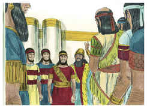

12	Há uns homens judeus, os quais constituíste sobre os negócios da província de Babilônia: Sadraque, Mesaque e Abednego; estes homens, ó rei, não fizeram caso de ti; a teus deuses não servem, nem adoram a estátua de ouro que levantaste.

13	Então Nabucodonosor, com ira e furor, mandou trazer a Sadraque, Mesaque e Abednego. E trouxeram a estes homens perante o rei.

14	Falou Nabucodonosor, e lhes disse: É de propósito, ó Sadraque, Mesaque e Abednego, que vós não servis a meus deuses nem adorais a estátua de ouro que levantei?

15	Agora, pois, se estais prontos, quando ouvirdes o som da buzina, da flauta, da harpa, da sambuca, do saltério, da gaita de foles, e de toda a espécie de música, para vos prostrardes e adorardes a estátua que fiz, bom é; mas, se não a adorardes, sereis lançados, na mesma hora, dentro da fornalha de fogo ardente. E quem é o Deus que vos poderá livrar das minhas mãos?

16	Responderam Sadraque, Mesaque e Abednego, e disseram ao rei Nabucodonosor: Não necessitamos de te responder sobre este negócio.

17	Eis que o nosso Deus, a quem nós servimos, é que nos pode livrar; ele nos livrará da fornalha de fogo ardente, e da tua mão, ó rei.

18	E, se não, fica sabendo ó rei, que não serviremos a teus deuses nem adoraremos a estátua de ouro que levantaste.

19	Então Nabucodonosor se encheu de furor, e mudou-se o aspecto do seu semblante contra Sadraque, Mesaque e Abednego; falou, e ordenou que a fornalha se aquecesse sete vezes mais do que se costumava aquecer.

20	E ordenou aos homens mais poderosos, que estavam no seu exército, que atassem a Sadraque, Mesaque e Abednego, para lançá-los na fornalha de fogo ardente.

21	Então estes homens foram atados, vestidos com as suas capas, suas túnicas, e seus chapéus, e demais roupas, e foram lançados dentro da fornalha de fogo ardente.

22	E, porque a palavra do rei era urgente, e a fornalha estava sobremaneira quente, a chama do fogo matou aqueles homens que carregaram a Sadraque, Mesaque, e Abednego.

23	E estes três homens, Sadraque, Mesaque e Abednego, caíram atados dentro da fornalha de fogo ardente.

24	Então o rei Nabucodonosor se espantou, e se levantou depressa; falou, dizendo aos seus conselheiros: Não lançamos nós, dentro do fogo, três homens atados? Responderam e disseram ao rei: É verdade, ó rei.

25	Respondeu, dizendo: Eu, porém, vejo quatro homens soltos, que andam passeando dentro do fogo, sem sofrer nenhum dano; e o aspecto do quarto é semelhante ao Filho de Deus.

26	Então chegando-se Nabucodonosor à porta da fornalha de fogo ardente, falou, dizendo: Sadraque, Mesaque e Abednego, servos do Deus Altíssimo, saí e vinde! Então Sadraque, Mesaque e Abednego saíram do meio do fogo.

27	E reuniram-se os príncipes, os capitães, os governadores e os conselheiros do rei e, contemplando estes homens, viram que o fogo não tinha tido poder algum sobre os seus corpos; nem um só cabelo da sua cabeça se tinha queimado, nem as suas capas se mudaram, nem cheiro de fogo tinha passado sobre eles.

28	Falou Nabucodonosor, dizendo: Bendito seja o Deus de Sadraque, Mesaque e Abednego, que enviou o seu anjo, e livrou os seus servos, que confiaram nele, pois violaram a palavra do rei, preferindo entregar os seus corpos, para que não servissem nem adorassem algum outro deus, senão o seu Deus.

29	Por mim, pois, é feito um decreto, pelo qual todo o povo, e nação e língua que disser blasfêmia contra o Deus de Sadraque, Mesaque e Abednego, seja despedaçado, e as suas casas sejam feitas um monturo; porquanto não há outro Deus que possa livrar como este.

30	Então o rei fez prosperar a Sadraque, Mesaque e Abednego, na província de Babilônia.

