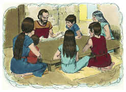

# Deuteronomio Capítulo 11

## 1
AMARÁS, pois, ao Senhor teu Deus, e guardarás as suas ordenanças, e os seus estatutos, e os seus juízos, e os seus mandamentos, todos os dias.

## 2
E hoje sabereis que falo, não com vossos filhos, que o não sabem, e não viram a instrução do Senhor vosso Deus, a sua grandeza, a sua mão forte, e o seu braço estendido;

## 3
Nem tampouco os seus sinais, nem os seus feitos, que fez no meio do Egito a Faraó, rei do Egito, e a toda a sua terra;

## 4
Nem o que fez ao exército dos egípcios, aos seus cavalos e aos seus carros, fazendo passar sobre eles as águas do Mar Vermelho quando vos perseguiam, e como o Senhor os destruiu, até ao dia de hoje;

## 5
Nem o que vos fez no deserto, até que chegastes a este lugar;

## 6
E o que fez a Datã e a Abirão, filhos de Eliabe, filho de Rúben; como a terra abriu a sua boca e os tragou com as suas casas e com as suas tendas, como também tudo o que subsistia, e lhes pertencia, no meio de todo o Israel;

## 7
Porquanto os vossos olhos são os que viram toda a grande obra que fez o Senhor.

## 8
Guardai, pois, todos os mandamentos que eu vos ordeno hoje, para que sejais fortes, e entreis, e ocupeis a terra que passais a possuir;

## 9
E para que prolongueis os dias na terra que o Senhor jurou dar a vossos pais e à sua descendência, terra que mana leite e mel.

## 10
Porque a terra que passas a possuir não é como a terra do Egito, de onde saíste, em que semeavas a tua semente, e a regavas com o teu pé, como a uma horta.

## 11
Mas a terra que passais a possuir é terra de montes e de vales; da chuva dos céus beberá as águas;

## 12
Terra de que o Senhor teu Deus tem cuidado; os olhos do Senhor teu Deus estão sobre ela continuamente, desde o princípio até ao fim do ano.

## 13
E será que, se diligentemente obedecerdes a meus mandamentos que hoje vos ordeno, de amar ao Senhor vosso Deus, e de o servir de todo o vosso coração e de toda a vossa alma,

## 14
Então darei a chuva da vossa terra a seu tempo, a temporã e a serôdia, para que recolhais o vosso grão, e o vosso mosto e o vosso azeite.

## 15
E darei erva no teu campo aos teus animais, e comerás, e fartar-te-ás.

## 16
Guardai-vos, que o vosso coração não se engane, e vos desvieis, e sirvais a outros deuses, e vos inclineis perante eles;

## 17
E a ira do Senhor se acenda contra vós, e feche ele os céus, e não haja água, e a terra não dê o seu fruto, e cedo pereçais da boa terra que o Senhor vos dá.

## 18
Ponde, pois, estas minhas palavras no vosso coração e na vossa alma, e atai-as por sinal na vossa mão, para que estejam por frontais entre os vossos olhos.

## 19
E ensinai-as a vossos filhos, falando delas assentado em tua casa, e andando pelo caminho, e deitando-te, e levantando-te;

## 20
E escreve-as nos umbrais de tua casa, e nas tuas portas;

## 21
Para que se multipliquem os vossos dias e os dias de vossos filhos na terra que o Senhor jurou a vossos pais dar-lhes, como os dias dos céus sobre a terra.

## 22
Porque se diligentemente guardardes todos estes mandamentos, que vos ordeno para os guardardes, amando ao Senhor vosso Deus, andando em todos os seus caminhos, e a ele vos achegardes,

## 23
Também o Senhor, de diante de vós, lançará fora todas estas nações, e possuireis nações maiores e mais poderosas do que vós.

## 24
Todo o lugar que pisar a planta do vosso pé será vosso; desde o deserto, e desde o Líbano, desde o rio, o rio Eufrates, até ao mar ocidental, será o vosso termo.

## 25
Ninguém resistirá diante de vós; o Senhor vosso Deus porá sobre toda a terra, que pisardes, o vosso terror e o temor de vós, como já vos tem dito.

## 26
Eis que hoje eu ponho diante de vós a bênção e a maldição;

## 27
A bênção, quando cumprirdes os mandamentos do Senhor vosso Deus, que hoje vos mando;

## 28
Porém a maldição, se não cumprirdes os mandamentos do Senhor vosso Deus, e vos desviardes do caminho que hoje vos ordeno, para seguirdes outros deuses que não conhecestes.

## 29
E será que, quando o Senhor teu Deus te introduzir na terra, a que vais para possuí-la, então pronunciarás a bênção sobre o monte Gerizim, e a maldição sobre o monte Ebal.

## 30
Porventura não estão eles além do Jordão, junto ao caminho do pôr do sol, na terra dos cananeus, que habitam na campina defronte de Gilgal, junto aos carvalhais de Moré?

## 31
Porque passareis o Jordão para entrardes a possuir a terra, que vos dá o Senhor vosso Deus; e a possuireis, e nela habitareis.

## 32
Tende, pois, cuidado em cumprir todos os estatutos e os juízos, que eu hoje vos proponho.

