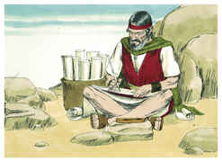
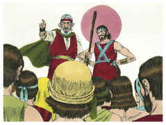
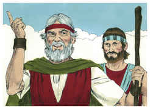
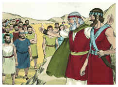
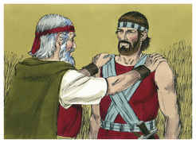

# Deuteronomio Capítulo 31

## 1
DEPOIS foi Moisés, e falou estas palavras a todo o Israel,

## 2
E disse-lhes: Da idade de cento e vinte anos sou eu hoje; já não poderei mais sair e entrar; além disto o Senhor me disse: Não passarás o Jordão.

## 3
O Senhor teu Deus passará adiante de ti; ele destruirá estas nações de diante de ti, para que as possuas; Josué passará adiante de ti, como o Senhor tem falado.

## 4
E o Senhor lhes fará como fez a Siom e a Ogue, reis dos amorreus, e à sua terra, os quais destruiu.

## 5
Quando, pois, o Senhor vo-los der diante de vós, então com eles fareis conforme a todo o mandamento que vos tenho ordenado.

## 6
Esforçai-vos, e animai-vos; não temais, nem vos espanteis diante deles; porque o Senhor teu Deus é o que vai contigo; não te deixará nem te desamparará.

## 7
E chamou Moisés a Josué, e lhe disse aos olhos de todo o Israel: Esforça-te e anima-te; porque com este povo entrarás na terra que o Senhor jurou a teus pais lhes dar; e tu os farás herdá-la.

## 8
O Senhor, pois, é aquele que vai adiante de ti; ele será contigo, não te deixará, nem te desamparará; não temas, nem te espantes.

## 9
E Moisés escreveu esta lei, e a deu aos sacerdotes, filhos de Levi, que levavam a arca da aliança do Senhor, e a todos os anciãos de Israel.

## 10
E ordenou-lhes Moisés, dizendo: Ao fim de cada sete anos, no tempo determinado do ano da remissão, na festa dos tabernáculos,

## 11
Quando todo o Israel vier a comparecer perante o Senhor teu Deus, no lugar que ele escolher, lerás esta lei diante de todo o Israel aos seus ouvidos.

## 12
Ajunta o povo, os homens e as mulheres, os meninos e os estrangeiros que estão dentro das tuas portas, para que ouçam e aprendam e temam ao Senhor vosso Deus, e tenham cuidado de fazer todas as palavras desta lei;

## 13
E que seus filhos, que não a souberem, ouçam e aprendam a temer ao Senhor vosso Deus, todos os dias que viverdes sobre a terra a qual ides, passando o Jordão, para a possuir.

## 14
E disse o Senhor a Moisés: Eis que os teus dias são chegados, para que morras; chama a Josué, e apresentai-vos na tenda da congregação, para que eu lhe dê ordens. Assim foram Moisés e Josué, e se apresentaram na tenda da congregação.

## 15
Então o Senhor apareceu na tenda, na coluna de nuvem; e a coluna de nuvem estava sobre a porta da tenda.

## 16
E disse o Senhor a Moisés: Eis que dormirás com teus pais; e este povo se levantará, e prostituir-se-á indo após os deuses estranhos na terra, para cujo meio vai, e me deixará, e anulará a minha aliança que tenho feito com ele.

## 17
Assim se acenderá a minha ira naquele dia contra ele, e desampará-lo-ei, e esconderei o meu rosto dele, para que seja devorado; e tantos males e angústias o alcançarão, que dirá naquele dia: Não me alcançaram estes males, porque o meu Deus não está no meio de mim?

## 18
Esconderei, pois, totalmente o meu rosto naquele dia, por todo o mal que tiver feito, por se haverem tornado a outros deuses.

## 19
Agora, pois, escrevei-vos este cântico, e ensinai-o aos filhos de Israel; ponde-o na sua boca, para que este cântico me seja por testemunha contra os filhos de Israel.

## 20
Porque introduzirei o meu povo na terra que jurei a seus pais, que mana leite e mel; e comerá, e se fartará, e se engordará; então se tornará a outros deuses, e os servirá, e me irritarão, e anularão a minha aliança.

## 21
E será que, quando o alcançarem muitos males e angústias, então este cântico responderá contra ele por testemunha, pois não será esquecido da boca de sua descendência; porquanto conheço a sua imaginação, o que ele faz hoje, antes que o introduza na terra que tenho jurado.

## 22
Assim Moisés escreveu este cântico naquele dia, e o ensinou aos filhos de Israel.

## 23
E ordenou a Josué, filho de Num, e disse: Esforça-te e anima-te; porque tu introduzirás os filhos de Israel na terra que lhes jurei; e eu serei contigo.

## 24
E aconteceu que, acabando Moisés de escrever num livro, todas as palavras desta lei,

## 25
Deu ordem aos levitas, que levavam a arca da aliança do Senhor, dizendo:

## 26
Tomai este livro da lei, e ponde-o ao lado da arca da aliança do Senhor vosso Deus, para que ali esteja por testemunha contra ti.

## 27
Porque conheço a tua rebelião e a tua dura cerviz; eis que, vivendo eu ainda hoje convosco, rebeldes fostes contra o Senhor; e quanto mais depois da minha morte?

## 28
Ajuntai perante mim todos os anciãos das vossas tribos, e vossos oficiais, e aos seus ouvidos falarei estas palavras, e contra eles por testemunhas tomarei o céu e a terra.

## 29
Porque eu sei que depois da minha morte certamente vos corrompereis, e vos desviareis do caminho que vos ordenei; então este mal vos alcançará nos últimos dias, quando fizerdes mal aos olhos do Senhor, para o provocar à ira com a obra das vossas mãos.

## 30
Então Moisés falou as palavras deste cântico aos ouvidos de toda a congregação de Israel, até se acabarem.

