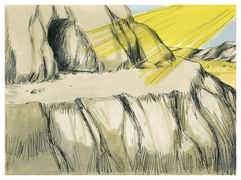

# Deuteronomio Capítulo 33

1	ESTA, porém, é a bênção com que Moisés, homem de Deus, abençoou os filhos de Israel antes da sua morte.

2	Disse pois: O Senhor veio de Sinai, e lhes subiu de Seir; resplandeceu desde o monte Parã, e veio com dez milhares de santos; à sua direita havia para eles o fogo da lei.

3	Na verdade ama os povos; todos os seus santos estão na sua mão; postos serão no meio, entre os teus pés, e cada um receberá das tuas palavras.

4	Moisés nos deu a lei, como herança da congregação de Jacó.

5	E foi rei em Jesurum, quando se congregaram os cabeças do povo com as tribos de Israel.

6	Viva Rúben, e não morra, e que os seus homens não sejam poucos.

7	E isto é o que disse de Judá: Ouve, ó Senhor, a voz de Judá, e introduze-o no seu povo; as suas mãos lhe bastem, e tu lhe sejas em ajuda contra os seus inimigos.

8	E de Levi disse: Teu Tumim e teu Urim são para o teu amado, que tu provaste em Massá, com quem contendeste junto às águas de Meribá.

9	Aquele que disse a seu pai, e à sua mãe: Nunca os vi; e não conheceu a seus irmãos, e não estimou a seus filhos; pois guardaram a tua palavra e observaram a tua aliança.

10	Ensinaram os teus juízos a Jacó, e a tua lei a Israel; puseram incenso no teu nariz, e o holocausto sobre o teu altar.

11	Abençoa o seu poder, ó Senhor, e aceita a obra das suas mãos; fere os lombos dos que se levantam contra ele e o odeiam, para que nunca mais se levantem.

12	E de Benjamim disse: O amado do Senhor habitará seguro com ele; todo o dia o cobrirá, e morará entre os seus ombros.

13	E de José disse: Bendita do Senhor seja a sua terra, com o mais excelente dos céus, com o orvalho e com o abismo que jaz abaixo.

14	E com os mais excelentes frutos do sol, e com as mais excelentes produções das luas,

15	E com o mais excelente dos montes antigos, e com o mais excelente dos outeiros eternos.

16	E com o mais excelente da terra, e da sua plenitude, e com a benevolência daquele que habitava na sarça, venha sobre a cabeça de José, e sobre o alto da cabeça daquele que foi separado de seus irmãos.

17	Ele tem a glória do primogênito do seu touro, e os seus chifres são chifres de boi selvagem; com eles rechaçará todos os povos até às extremidades da terra; estes pois são os dez milhares de Efraim, e estes são os milhares de Manassés.

18	E de Zebulom disse: Zebulom, alegra-te nas tuas saídas; e tu, Issacar, nas tuas tendas.

19	Eles chamarão os povos ao monte; ali apresentarão ofertas de justiça, porque chuparão a abundância dos mares e os tesouros escondidos da areia.

20	E de Gade disse: Bendito aquele que faz dilatar a Gade; habita como a leoa, e despedaça o braço e o alto da cabeça.

21	E se proveu da melhor parte, porquanto ali estava escondida a porção do legislador; por isso veio com os chefes do povo, executou a justiça do Senhor e os seus juízos para com Israel.

22	E de Dã disse: Dã é cria de leão; que salta de Basã.

23	E de Naftali disse: Farta-te, ó Naftali, da benevolência, e enche-te da bênção do Senhor; possui o ocidente e o sul.

24	E de Aser disse: Bendito seja Aser com seus filhos; agrade a seus irmãos, e banhe em azeite o seu pé.

25	Seja de ferro e de metal o teu calçado; e a tua força seja como os teus dias.

26	Não há outro, ó Jesurum, semelhante a Deus, que cavalga sobre os céus para a tua ajuda, e com a sua majestade sobre as mais altas nuvens.

27	O Deus eterno é a tua habitação, e por baixo estão os braços eternos; e ele lançará o inimigo de diante de ti, e dirá: Destrói-o.

28	Israel, pois, habitará só, seguro, na terra da fonte de Jacó, na terra de grão e de mosto; e os seus céus gotejarão orvalho.

29	Bem-aventurado tu, ó Israel! Quem é como tu? Um povo salvo pelo Senhor, o escudo do teu socorro, e a espada da tua majestade; por isso os teus inimigos te serão sujeitos, e tu pisarás sobre as suas alturas.

