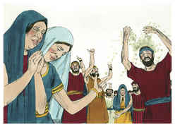
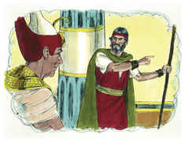

# Deuteronomio Capítulo 34

## 1
ENTÃO subiu Moisés das campinas de Moabe ao monte Nebo, ao cume de Pisga, que está em frente a Jericó e o Senhor mostrou-lhe toda a terra desde Gileade até Dã;

## 2
E todo Naftali, e a terra de Efraim, e Manassés e toda a terra de Judá, até ao mar ocidental;

## 3
E o sul, e a campina do vale de Jericó, a cidade das palmeiras, até Zoar.

## 4
E disse-lhe o Senhor: Esta é a terra que jurei a Abraão, Isaque, e Jacó, dizendo: À tua descendência a darei; eu te faço vê-la com os teus olhos, porém lá não passarás.

## 5
Assim morreu ali Moisés, servo do Senhor, na terra de Moabe, conforme a palavra do Senhor.

## 6
E o sepultou num vale, na terra de Moabe, em frente de Bete-Peor; e ninguém soube até hoje o lugar da sua sepultura.

## 7
Era Moisés da idade de cento e vinte anos quando morreu; os seus olhos nunca se escureceram, nem perdeu o seu vigor.

## 8
E os filhos de Israel prantearam a Moisés trinta dias, nas campinas de Moabe; e os dias do pranto no luto de Moisés se cumpriram.

## 9
E Josué, filho de Num, foi cheio do espírito de sabedoria, porquanto Moisés tinha posto sobre ele as suas mãos; assim os filhos de Israel lhe deram ouvidos, e fizeram como o Senhor ordenara a Moisés.

## 10
E nunca mais se levantou em Israel profeta algum como Moisés, a quem o Senhor conhecera face a face;

## 11
Nem semelhante em todos os sinais e maravilhas, que o Senhor o enviou para fazer na terra do Egito, a Faraó, e a todos os seus servos, e toda a sua terra.

## 12
E em toda a mão forte, e em todo o grande espanto, que praticou Moisés aos olhos de todo o Israel.

