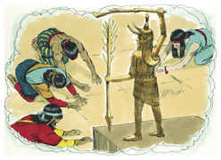

# Deuteronomio Capítulo 4

## 1
AGORA, pois, ó Israel, ouve os estatutos e os juízos que eu vos ensino, para os cumprirdes; para que vivais, e entreis, e possuais a terra que o Senhor Deus de vossos pais vos dá.

## 2
Não acrescentareis à palavra que vos mando, nem diminuireis dela, para que guardeis os mandamentos do Senhor vosso Deus, que eu vos mando.

## 3
Os vossos olhos têm visto o que o Senhor fez por causa de Baal-Peor; pois a todo o homem que seguiu a Baal-Peor o Senhor teu Deus consumiu do meio de ti.

## 4
Porém vós, que vos achegastes ao Senhor vosso Deus, hoje todos estais vivos.

## 5
Vedes aqui vos tenho ensinado estatutos e juízos, como me mandou o Senhor meu Deus; para que assim façais no meio da terra a qual ides a herdar.

## 6
Guardai-os pois, e cumpri-os, porque isso será a vossa sabedoria e o vosso entendimento perante os olhos dos povos, que ouvirão todos estes estatutos, e dirão: Este grande povo é nação sábia e entendida.

## 7
Pois, que nação há tão grande, que tenha deuses tão chegados como o Senhor nosso Deus, todas as vezes que o invocamos?

## 8
E que nação há tão grande, que tenha estatutos e juízos tão justos como toda esta lei que hoje ponho perante vós?

## 9
Tão-somente guarda-te a ti mesmo, e guarda bem a tua alma, que não te esqueças daquelas coisas que os teus olhos têm visto, e não se apartem do teu coração todos os dias da tua vida; e as farás saber a teus filhos, e aos filhos de teus filhos.

## 10
O dia em que estiveste perante o Senhor teu Deus em Horebe, quando o Senhor me disse: Ajunta-me este povo, e os farei ouvir as minhas palavras, e aprendê-las-ão, para me temerem todos os dias que na terra viverem, e as ensinarão a seus filhos;

## 11
E vós vos chegastes, e vos pusestes ao pé do monte; e o monte ardia em fogo até ao meio dos céus, e havia trevas, e nuvens e escuridão;

## 12
Então o Senhor vos falou do meio do fogo; a voz das palavras ouvistes; porém, além da voz, não vistes figura alguma.

## 13
Então vos anunciou ele a sua aliança que vos ordenou cumprir, os dez mandamentos, e os escreveu em duas tábuas de pedra.

## 14
Também o Senhor me ordenou ao mesmo tempo que vos ensinasse estatutos e juízos, para que os cumprísseis na terra a qual passais a possuir.

## 15
Guardai, pois, com diligência as vossas almas, pois nenhuma figura vistes no dia em que o Senhor, em Horebe, falou convosco do meio do fogo;

## 16
Para que não vos corrompais, e vos façais alguma imagem esculpida na forma de qualquer figura, semelhança de homem ou mulher;

## 17
Figura de algum animal que haja na terra; figura de alguma ave alada que voa pelos céus;

## 18
Figura de algum animal que se arrasta sobre a terra; figura de algum peixe que esteja nas águas debaixo da terra;

## 19
Que não levantes os teus olhos aos céus e vejas o sol, e a lua, e as estrelas, todo o exército dos céus; e sejas impelido a que te inclines perante eles, e sirvas àqueles que o Senhor teu Deus repartiu a todos os povos debaixo de todos os céus.

## 20
Mas o Senhor vos tomou, e vos tirou da fornalha de ferro do Egito, para que lhe sejais por povo hereditário, como neste dia se vê.

## 21
Também o Senhor se indignou contra mim por causa das vossas palavras, e jurou que eu não passaria o Jordão, e que não entraria na boa terra que o Senhor teu Deus te dará por herança.

## 22
Porque eu nesta terra morrerei, não passarei o Jordão; porém vós o passareis, e possuireis aquela boa terra.

## 23
Guardai-vos e não vos esqueçais da aliança do Senhor vosso Deus, que tem feito convosco, e não façais para vós escultura alguma, imagem de alguma coisa que o Senhor vosso Deus vos proibiu.

## 24
Porque o Senhor teu Deus é um fogo que consome, um Deus zeloso.

## 25
Quando, pois, gerardes filhos, e filhos de filhos, e vos envelhecerdes na terra, e vos corromperdes, e fizerdes alguma escultura, semelhança de alguma coisa, e fizerdes o que é mau aos olhos do Senhor teu Deus, para o provocar à ira;

## 26
Hoje tomo por testemunhas contra vós o céu e a terra, que certamente logo perecereis da terra, a qual passais o Jordão para a possuir; não prolongareis os vossos dias nela, antes sereis de todo destruídos.

## 27
E o Senhor vos espalhará entre os povos, e ficareis poucos em número entre as nações às quais o Senhor vos conduzirá.

## 28
E ali servireis a deuses que são obra de mãos de homens, madeira e pedra, que não vêem, nem ouvem, nem comem, nem cheiram.

## 29
Então dali buscarás ao Senhor teu Deus, e o acharás, quando o buscares de todo o teu coração e de toda a tua alma.

## 30
Quando estiverdes em angústia, e todas estas coisas te alcançarem, então nos últimos dias voltarás para o Senhor teu Deus, e ouvirás a sua voz.

## 31
Porquanto o Senhor teu Deus é Deus misericordioso, e não te desamparará, nem te destruirá, nem se esquecerá da aliança que jurou a teus pais.

## 32
Agora, pois, pergunta aos tempos passados, que te precederam desde o dia em que Deus criou o homem sobre a terra, desde uma extremidade do céu até à outra, se sucedeu jamais coisa tão grande como esta, ou se jamais se ouviu coisa como esta?

## 33
Ou se algum povo ouviu a voz de Deus falando do meio do fogo, como tu a ouviste, e ficou vivo?

## 34
Ou se Deus intentou ir tomar para si um povo do meio de outro povo com provas, com sinais, e com milagres, e com peleja, e com mão forte, e com braço estendido, e com grandes espantos, conforme a tudo quanto o Senhor vosso Deus vos fez no Egito aos vossos olhos?

## 35
A ti te foi mostrado para que soubesses que o Senhor é Deus; nenhum outro há senão ele.

## 36
Desde os céus te fez ouvir a sua voz, para te ensinar, e sobre a terra te mostrou o seu grande fogo, e ouviste as suas palavras do meio do fogo.

## 37
E, porquanto amou teus pais, e escolheu a sua descendência depois deles, te tirou do Egito diante de si, com a sua grande força,

## 38
Para lançar fora de diante de ti nações maiores e mais poderosas do que tu, para te introduzir e te dar a sua terra por herança, como neste dia se vê.

## 39
Por isso hoje saberás, e refletirás no teu coração, que só o Senhor é Deus, em cima no céu e em baixo na terra; nenhum outro há.

## 40
E guardarás os seus estatutos e os seus mandamentos, que te ordeno hoje para que te vá bem a ti, e a teus filhos depois de ti, e para que prolongues os dias na terra que o Senhor teu Deus te dá para todo o sempre.

## 41
Então Moisés separou três cidades além do Jordão, do lado do nascimento do sol;

## 42
Para que ali se acolhesse o homicida que involuntariamente matasse o seu próximo a quem dantes não tivesse ódio algum; e se acolhesse a uma destas cidades, e vivesse;

## 43
A Bezer, no deserto, no planalto, para os rubenitas; e a Ramote, em Gileade, para os gaditas; e a Golã, em Basã, para os manassitas.

## 44
Esta é, pois, a lei que Moisés propôs aos filhos de Israel.

## 45
Estes são os testemunhos, e os estatutos, e os juízos, que Moisés falou aos filhos de Israel, havendo saído do Egito;

## 46
Além do Jordão, no vale defronte de Bete-Peor, na terra de Siom, rei dos amorreus, que habitava em Hesbom, a quem feriu Moisés e os filhos de Israel, havendo eles saído do Egito.

## 47
E tomaram a sua terra em possessão, como também a terra de Ogue, rei de Basã, dois reis dos amorreus, que estavam além do Jordão, do lado do nascimento do sol.

## 48
Desde Aroer, que está à margem do ribeiro de Arnom, até ao monte Sião, que é Hermom,

## 49
E toda a campina além do Jordão, do lado do oriente, até ao mar da campina, abaixo de Asdote-Pisga.

