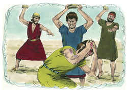

# Deuteronomio Capítulo 7

1	QUANDO o Senhor teu Deus te houver introduzido na terra, à qual vais para a possuir, e tiver lançado fora muitas nações de diante de ti, os heteus, e os girgaseus, e os amorreus, e os cananeus, e os perizeus, e os heveus, e os jebuseus, sete nações mais numerosas e mais poderosas do que tu;

2	E o Senhor teu Deus as tiver dado diante de ti, para as ferir, totalmente as destruirás; não farás com elas aliança, nem terás piedade delas;

3	Nem te aparentarás com elas; não darás tuas filhas a seus filhos, e não tomarás suas filhas para teus filhos;

4	Pois fariam desviar teus filhos de mim, para que servissem a outros deuses; e a ira do Senhor se acenderia contra vós, e depressa vos consumiria.

5	Porém assim lhes fareis: Derrubareis os seus altares, quebrareis as suas estátuas; e cortareis os seus bosques, e queimareis a fogo as suas imagens de escultura.

6	Porque povo santo és ao Senhor teu Deus; o Senhor teu Deus te escolheu, para que lhe fosses o seu povo especial, de todos os povos que há sobre a terra.

7	O Senhor não tomou prazer em vós, nem vos escolheu, porque a vossa multidão era mais do que a de todos os outros povos, pois vós éreis menos em número do que todos os povos;

8	Mas, porque o Senhor vos amava, e para guardar o juramento que fizera a vossos pais, o Senhor vos tirou com mão forte e vos resgatou da casa da servidão, da mão de Faraó, rei do Egito.

9	Saberás, pois, que o Senhor teu Deus, ele é Deus, o Deus fiel, que guarda a aliança e a misericórdia até mil gerações aos que o amam e guardam os seus mandamentos.

10	E retribui no rosto qualquer dos que o odeiam, fazendo-o perecer; não será tardio ao que o odeia; em seu rosto lho pagará.

11	Guarda, pois, os mandamentos e os estatutos e os juízos que hoje te mando cumprir.

12	Será, pois, que, se ouvindo estes juízos, os guardardes e cumprirdes, o Senhor teu Deus te guardará a aliança e a misericórdia que jurou a teus pais;

13	E amar-te-á, e abençoar-te-á, e te fará multiplicar; abençoará o fruto do teu ventre, e o fruto da tua terra, o teu grão, e o teu mosto, e o teu azeite, e a criação das tuas vacas, e o rebanho do teu gado miúdo, na terra que jurou a teus pais dar-te.

14	Bendito serás mais do que todos os povos; não haverá estéril entre ti, seja homem, seja mulher, nem entre os teus animais.

15	E o Senhor de ti desviará toda a enfermidade; sobre ti não porá nenhuma das más doenças dos egípcios, que bem sabes, antes as porá sobre todos os que te odeiam.

16	Pois consumirás a todos os povos que te der o Senhor teu Deus; os teus olhos não os poupará; e não servirás a seus deuses, pois isto te seria por laço.

17	Se disseres no teu coração: Estas nações são mais numerosas do que eu; como as poderei lançar fora?

18	Delas não tenhas temor; não deixes de te lembrar do que o Senhor teu Deus fez a Faraó e a todos os egípcios;

19	Das grandes provas que viram os teus olhos, e dos sinais, e maravilhas, e mão forte, e braço estendido, com que o Senhor teu Deus te tirou; assim fará o Senhor teu Deus com todos os povos, diante dos quais tu temes.

20	E mais, o Senhor teu Deus entre eles mandará vespões, até que pereçam os que ficarem e se esconderem de diante de ti.

21	Não te espantes diante deles; porque o Senhor teu Deus está no meio de ti, Deus grande e terrível.

22	E o Senhor teu Deus lançará fora estas nações pouco a pouco de diante de ti; não poderás destruí-las todas de pronto, para que as feras do campo não se multipliquem contra ti.

23	E o Senhor teu Deus as entregará a ti, e lhes infligirá uma grande confusão até que sejam consumidas.

24	Também os seus reis te entregará na mão, para que apagues os seus nomes de debaixo dos céus; nenhum homem resistirá diante de ti, até que os destruas.

25	As imagens de escultura de seus deuses queimarás a fogo; a prata e o ouro que estão sobre elas não cobiçarás, nem os tomarás para ti, para que não te enlaces neles; pois abominação é ao Senhor teu Deus.

26	Não porás, pois, abominação em tua casa, para que não sejas anátema, assim como ela; de todo a detestarás, e de todo a abominarás, porque anátema é.

