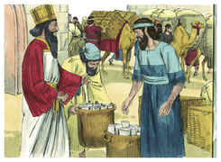

# Esdras Capítulo 1

## 1
NO primeiro ano de Ciro, rei da Pérsia (para que se cumprisse a palavra do Senhor, pela boca de Jeremias), despertou o Senhor o espírito de Ciro, rei da Pérsia, o qual fez passar pregão por todo o seu reino, como também por escrito, dizendo:

## 2
Assim diz Ciro, rei da Pérsia: O Senhor Deus dos céus me deu todos os reinos da terra, e me encarregou de lhe edificar uma casa em Jerusalém, que está em Judá.

## 3
Quem há entre vós, de todo o seu povo, seja seu Deus com ele, e suba a Jerusalém, que está em Judá, e edifique a casa do Senhor Deus de Israel (ele é o Deus) que está em Jerusalém.

## 4
E todo aquele que ficar atrás em algum lugar em que andar peregrinando, os homens do seu lugar o ajudarão com prata, com ouro, com bens, e com gados, além das dádivas voluntárias para a casa de Deus, que está em Jerusalém.

## 5
Então se levantaram os chefes dos pais de Judá e Benjamim, e os sacerdotes e os levitas, com todos aqueles cujo espírito Deus despertou, para subirem a edificar a casa do Senhor, que está em Jerusalém.

## 6
E todos os que habitavam nos arredores lhes firmaram as mãos com vasos de prata, com ouro, com bens e com gado, e com coisas preciosas; além de tudo o que voluntariamente se deu.

## 7
Também o rei Ciro tirou os utensílios da casa do Senhor, que Nabucodonosor tinha trazido de Jerusalém, e que tinha posto na casa de seus deuses.

## 8
Estes tirou Ciro, rei da Pérsia, pela mão de Mitredate, o tesoureiro, que os entregou contados a Sesbazar, príncipe de Judá.

## 9
E este é o número deles: trinta travessas de ouro, mil travessas de prata, vinte e nove facas,

## 10
Trinta bacias de ouro, mais outras quatrocentas e dez bacias de prata, e mil outros utensílios.

## 11
Todos os utensílios de ouro e de prata foram cinco mil e quatrocentos; todos estes levou Sesbazar, quando os do cativeiro subiram de Babilônia para Jerusalém.

