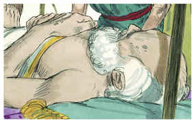
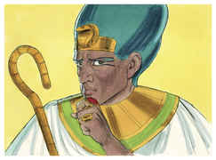
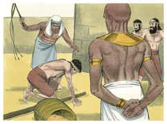
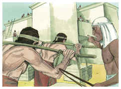
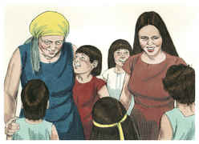
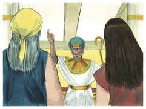
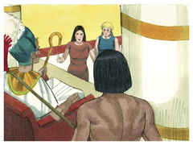
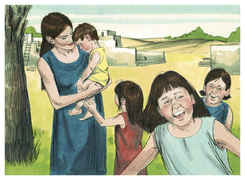
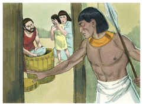
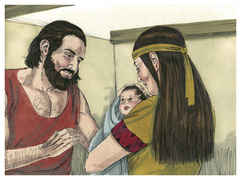

# Êxodo Capítulo 1

## 1
ESTES pois são os nomes dos filhos de Israel, que entraram no Egito com Jacó; cada um entrou com sua casa:

## 2
Rúben, Simeão, Levi, e Judá;

## 3
Issacar, Zebulom, e Benjamim;

## 4
Dã e Naftali, Gade e Aser.

## 5
Todas as almas, pois, que procederam dos lombos de Jacó, foram setenta almas; José, porém, estava no Egito.

## 6
Faleceu José, e todos os seus irmãos, e toda aquela geração.

## 7
E os filhos de Israel frutificaram, aumentaram muito, e multiplicaram-se, e foram fortalecidos grandemente; de maneira que a terra se encheu deles.

## 8
E levantou-se um novo rei sobre o Egito, que não conhecera a José;

## 9
O qual disse ao seu povo: Eis que o povo dos filhos de Israel é muito, e mais poderoso do que nós.

## 10
Eia, usemos de sabedoria para com eles, para que não se multipliquem, e aconteça que, vindo guerra, eles também se ajuntem com os nossos inimigos, e pelejem contra nós, e subam da terra.

## 11
E puseram sobre eles maiorais de tributos, para os afligirem com suas cargas. Porque edificaram a Faraó cidades-armazéns, Pitom e Ramessés.

## 12
Mas quanto mais os afligiam, tanto mais se multiplicavam, e tanto mais cresciam; de maneira que se enfadavam por causa dos filhos de Israel.

## 13
E os egípcios faziam servir os filhos de Israel com dureza;

## 14
Assim que lhes fizeram amargar a vida com dura servidão, em barro e em tijolos, e com todo o trabalho no campo; com todo o seu serviço, em que os obrigavam com dureza.

## 15
E o rei do Egito falou às parteiras das hebréias (das quais o nome de uma era Sifrá, e o da outra Puá),

## 16
E disse: Quando ajudardes a dar à luz às hebréias, e as virdes sobre os assentos, se for filho, matai-o; mas se for filha, então viva.

## 17
As parteiras, porém, temeram a Deus e não fizeram como o rei do Egito lhes dissera, antes conservavam os meninos com vida.

## 18
Então o rei do Egito chamou as parteiras e disse-lhes: Por que fizestes isto, deixando os meninos com vida?

## 19
E as parteiras disseram a Faraó: É que as mulheres hebréias não são como as egípcias; porque são vivas, e já têm dado à luz antes que a parteira venha a elas.

## 20
Portanto Deus fez bem às parteiras. E o povo se aumentou, e se fortaleceu muito.

## 21
E aconteceu que, como as parteiras temeram a Deus, ele estabeleceu-lhes casas.

## 22
Então ordenou Faraó a todo o seu povo, dizendo: A todos os filhos que nascerem lançareis no rio, mas a todas as filhas guardareis com vida.

