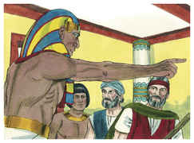
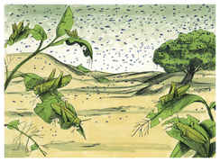
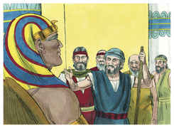
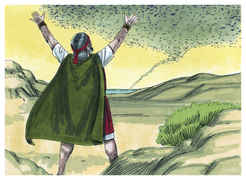
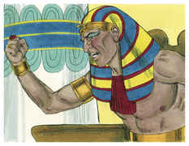
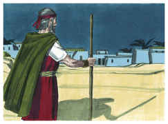
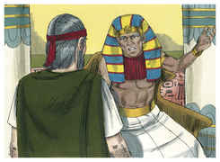
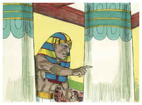
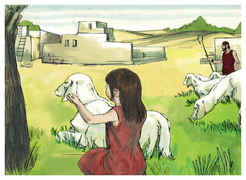

# Êxodo Capítulo 10

1	DEPOIS disse o Senhor a Moisés: Vai a Faraó, porque tenho endurecido o seu coração, e o coração de seus servos, para fazer estes meus sinais no meio deles,

2	E para que contes aos ouvidos de teus filhos, e dos filhos de teus filhos, as coisas que fiz no Egito, e os meus sinais, que tenho feito entre eles; para que saibais que eu sou o Senhor.

3	Assim foram Moisés e Arão a Faraó, e disseram-lhe: Assim diz o Senhor Deus dos hebreus: Até quando recusarás humilhar-te diante de mim? Deixa ir o meu povo para que me sirva;

4	Porque se ainda recusares deixar ir o meu povo, eis que trarei amanhã gafanhotos aos teus termos.

5	E cobrirão a face da terra, de modo que não se poderá ver a terra; e eles comerão o restante que escapou, o que vos ficou da saraiva; também comerão toda a árvore que vos cresce no campo;

6	E encherão as tuas casas, e as casas de todos os teus servos e as casas de todos os egípcios, quais nunca viram teus pais, nem os pais de teus pais, desde o dia em que se acharam na terra até o dia de hoje. E virou-se, e saiu da presença de Faraó.

7	E os servos de Faraó disseram-lhe: Até quando este homem nos há de ser por laço? Deixa ir os homens, para que sirvam ao Senhor seu Deus; ainda não sabes que o Egito está destruído?

8	Então Moisés e Arão foram levados outra vez a Faraó, e ele disse-lhes: Ide, servi ao Senhor vosso Deus. Quais são os que hão de ir?

9	E Moisés disse: Havemos de ir com os nossos jovens, e com os nossos velhos; com os nossos filhos, e com as nossas filhas, com as nossas ovelhas, e com os nossos bois havemos de ir; porque temos de celebrar uma festa ao Senhor.

10	Então ele lhes disse: Seja o Senhor assim convosco, como eu vos deixarei ir a vós e a vossos filhos; olhai que há mal diante da vossa face.

11	Não será assim; agora ide vós, homens, e servi ao Senhor; pois isso é o que pedistes. E os expulsaram da presença de Faraó.

12	Então disse o Senhor a Moisés: Estende a tua mão sobre a terra do Egito para que os gafanhotos venham sobre a terra do Egito, e comam toda a erva da terra, tudo o que deixou a saraiva.

13	Então estendeu Moisés sua vara sobre a terra do Egito, e o Senhor trouxe sobre a terra um vento oriental todo aquele dia e toda aquela noite; e aconteceu que pela manhã o vento oriental trouxe os gafanhotos.

14	E vieram os gafanhotos sobre toda a terra do Egito, e assentaram-se sobre todos os termos do Egito; tão numerosos foram que, antes destes nunca houve tantos, nem depois deles haverá.

15	Porque cobriram a face de toda a terra, de modo que a terra se escureceu; e comeram toda a erva da terra, e todo o fruto das árvores, que deixara a saraiva; e não ficou verde algum nas árvores, nem na erva do campo, em toda a terra do Egito.

16	Então Faraó se apressou a chamar a Moisés e a Arão, e disse: Pequei contra o Senhor vosso Deus, e contra vós.

17	Agora, pois, peço-vos que perdoeis o meu pecado somente desta vez, e que oreis ao Senhor vosso Deus que tire de mim somente esta morte.

18	E saiu da presença de Faraó, e orou ao Senhor.

19	Então o Senhor trouxe um vento ocidental fortíssimo, o qual levantou os gafanhotos e os lançou no Mar Vermelho; não ficou um só gafanhoto em todos os termos do Egito.

20	O Senhor, porém, endureceu o coração de Faraó, e este não deixou ir os filhos de Israel.

21	Então disse o Senhor a Moisés: Estende a tua mão para o céu, e virão trevas sobre a terra do Egito, trevas que se apalpem.

22	E Moisés estendeu a sua mão para o céu, e houve trevas espessas em toda a terra do Egito por três dias.

23	Não viu um ao outro, e ninguém se levantou do seu lugar por três dias; mas todos os filhos de Israel tinham luz em suas habitações.

24	Então Faraó chamou a Moisés, e disse: Ide, servi ao Senhor; somente fiquem vossas ovelhas e vossas vacas; vão também convosco as vossas crianças.

25	Moisés, porém, disse: Tu também darás em nossas mãos sacrifícios e holocaustos, que ofereçamos ao Senhor nosso Deus.

26	E também o nosso gado há de ir conosco, nem uma unha ficará; porque daquele havemos de tomar, para servir ao Senhor nosso Deus; porque não sabemos com que havemos de servir ao Senhor, até que cheguemos lá.

27	O Senhor, porém, endureceu o coração de Faraó, e este não os quis deixar ir.

28	E disse-lhe Faraó: Vai-te de mim, guarda-te que não mais vejas o meu rosto; porque no dia em que vires o meu rosto, morrerás.

29	E disse Moisés: Bem disseste; eu nunca mais verei o teu rosto.

