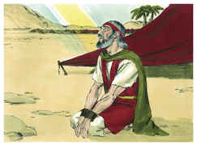
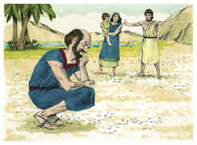
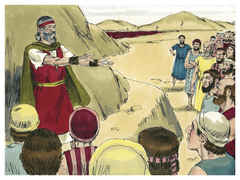
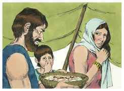
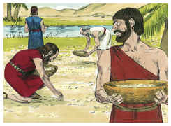
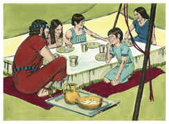
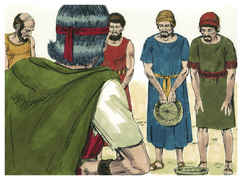
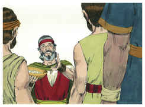
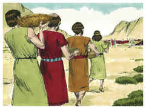
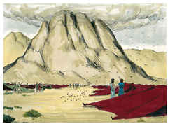

# Êxodo Capítulo 16

1	E PARTINDO de Elim, toda a congregação dos filhos de Israel veio ao deserto de Sim, que está entre Elim e Sinai, aos quinze dias do mês segundo, depois de sua saída da terra do Egito.

2	E toda a congregação dos filhos de Israel murmurou contra Moisés e contra Arão no deserto.

3	E os filhos de Israel disseram-lhes: Quem dera tivéssemos morrido por mão do Senhor na terra do Egito, quando estávamos sentados junto às panelas de carne, quando comíamos pão até fartar! Porque nos tendes trazido a este deserto, para matardes de fome a toda esta multidão.

4	Então disse o Senhor a Moisés: Eis que vos farei chover pão dos céus, e o povo sairá, e colherá diariamente a porção para cada dia, para que eu o prove se anda em minha lei ou não.

5	E acontecerá, no sexto dia, que prepararão o que colherem; e será o dobro do que colhem cada dia.

6	Então disseram Moisés e Arão a todos os filhos de Israel: À tarde sabereis que o Senhor vos tirou da terra do Egito,

7	E amanhã vereis a glória do Senhor, porquanto ouviu as vossas murmurações contra o Senhor. E quem somos nós, para que murmureis contra nós?

8	Disse mais Moisés: Isso será quando o Senhor à tarde vos der carne para comer, e pela manhã pão a fartar, porquanto o Senhor ouviu as vossas murmurações, com que murmurais contra ele. E quem somos nós? As vossas murmurações não são contra nós, mas sim contra o Senhor.

9	Depois disse Moisés a Arão: Dize a toda a congregação dos filhos de Israel: Chegai-vos à presença do Senhor, porque ouviu as vossas murmurações.

10	E aconteceu que, quando falou Arão a toda a congregação dos filhos de Israel, e eles se viraram para o deserto, eis que a glória do Senhor apareceu na nuvem.

11	E o Senhor falou a Moisés, dizendo:

12	Tenho ouvido as murmurações dos filhos de Israel. Fala-lhes, dizendo: Entre as duas tardes comereis carne, e pela manhã vos fartareis de pão; e sabereis que eu sou o Senhor vosso Deus.

13	E aconteceu que à tarde subiram codornizes, e cobriram o arraial; e pela manhã jazia o orvalho ao redor do arraial.

14	E quando o orvalho se levantou, eis que sobre a face do deserto estava uma coisa miúda, redonda, miúda como a geada sobre a terra.

15	E, vendo-a os filhos de Israel, disseram uns aos outros: Que é isto? Porque não sabiam o que era. Disse-lhes pois Moisés: Este é o pão que o Senhor vos deu para comer.

16	Esta é a palavra que o Senhor tem mandado: Colhei dele cada um conforme ao que pode comer, um ômer por cabeça, segundo o número das vossas almas; cada um tomará para os que se acharem na sua tenda.

17	E os filhos de Israel fizeram assim; e colheram, uns mais e outros menos.

18	Porém, medindo-o com o ômer, não sobejava ao que colhera muito, nem faltava ao que colhera pouco; cada um colheu tanto quanto podia comer.

19	E disse-lhes Moisés: Ninguém deixe dele para amanhã.

20	Eles, porém, não deram ouvidos a Moisés, antes alguns deles deixaram dele para o dia seguinte; e criou bichos, e cheirava mal; por isso indignou-se Moisés contra eles.

21	Eles, pois, o colhiam cada manhã, cada um conforme ao que podia comer; porque, aquecendo o sol, derretia-se.

22	E aconteceu que ao sexto dia colheram pão em dobro, dois ômeres para cada um; e todos os príncipes da congregação vieram, e contaram-no a Moisés.

23	E ele disse-lhes: Isto é o que o Senhor tem dito: Amanhã é repouso, o santo sábado do Senhor; o que quiserdes cozer no forno, cozei-o, e o que quiserdes cozer em água, cozei-o em água; e tudo o que sobejar, guardai para vós até amanhã.

24	E guardaram-no até o dia seguinte, como Moisés tinha ordenado; e não cheirou mal nem nele houve algum bicho.

25	Então disse Moisés: Comei-o hoje, porquanto hoje é o sábado do Senhor; hoje não o achareis no campo.

26	Seis dias o colhereis, mas o sétimo dia é o sábado; nele não haverá.

27	E aconteceu ao sétimo dia, que alguns do povo saíram para colher, mas não o acharam.

28	Então disse o Senhor a Moisés: Até quando recusareis guardar os meus mandamentos e as minhas leis?

29	Vede, porquanto o Senhor vos deu o sábado, portanto ele no sexto dia vos dá pão para dois dias; cada um fique no seu lugar, ninguém saia do seu lugar no sétimo dia.

30	Assim repousou o povo no sétimo dia.

31	E chamou a casa de Israel o seu nome maná; e era como semente de coentro branco, e o seu sabor como bolos de mel.

32	E disse Moisés: Esta é a palavra que o Senhor tem mandado: Encherás um ômer dele e guardá-lo-ás para as vossas gerações, para que vejam o pão que vos tenho dado a comer neste deserto, quando eu vos tirei da terra do Egito.

33	Disse também Moisés a Arão: Toma um vaso, e põe nele um ômer cheio de maná, e coloca-o diante do Senhor, para guardá-lo para as vossas gerações.

34	Como o Senhor tinha ordenado a Moisés, assim Arão o pôs diante do Testemunho, para ser guardado.

35	E comeram os filhos de Israel maná quarenta anos, até que entraram em terra habitada; comeram maná até que chegaram aos termos da terra de Canaã.

36	E um ômer é a décima parte do efa.

