# Êxodo Capítulo 3

1	E APASCENTAVA Moisés o rebanho de Jetro, seu sogro, sacerdote em Midiã; e levou o rebanho atrás do deserto, e chegou ao monte de Deus, a Horebe.

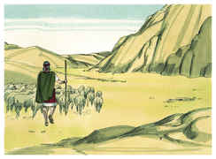

2	E apareceu-lhe o anjo do Senhor em uma chama de fogo do meio duma sarça; e olhou, e eis que a sarça ardia no fogo, e a sarça não se consumia.

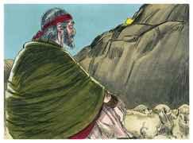

3	E Moisés disse: Agora me virarei para lá, e verei esta grande visão, porque a sarça não se queima.

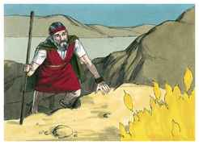

4	E vendo o Senhor que se virava para ver, bradou Deus a ele do meio da sarça, e disse: Moisés, Moisés. Respondeu ele: Eis-me aqui.

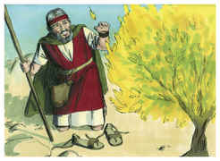

5	E disse: Não te chegues para cá; tira os sapatos de teus pés; porque o lugar em que tu estás é terra santa.

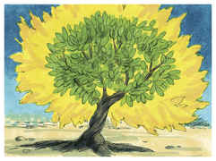

6	Disse mais: Eu sou o Deus de teu pai, o Deus de Abraão, o Deus de Isaque, e o Deus de Jacó. E Moisés encobriu o seu rosto, porque temeu olhar para Deus.

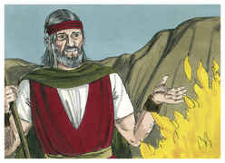

7	E disse o Senhor: Tenho visto atentamente a aflição do meu povo, que está no Egito, e tenho ouvido o seu clamor por causa dos seus exatores, porque conheci as suas dores.

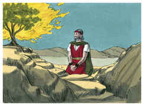

8	Portanto desci para livrá-lo da mão dos egípcios, e para fazê-lo subir daquela terra, a uma terra boa e larga, a uma terra que mana leite e mel; ao lugar do cananeu, e do heteu, e do amorreu, e do perizeu, e do heveu, e do jebuseu.

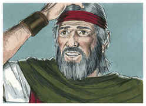

9	E agora, eis que o clamor dos filhos de Israel é vindo a mim, e também tenho visto a opressão com que os egípcios os oprimem.

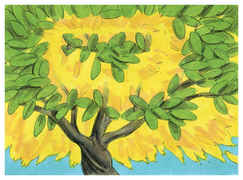

10	Vem agora, pois, e eu te enviarei a Faraó para que tires o meu povo (os filhos de Israel) do Egito.

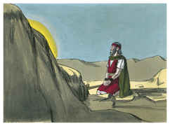

11	Então Moisés disse a Deus: Quem sou eu, que vá a Faraó e tire do Egito os filhos de Israel?

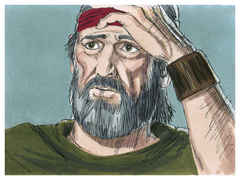

12	E disse: Certamente eu serei contigo; e isto te será por sinal de que eu te enviei: Quando houveres tirado este povo do Egito, servireis a Deus neste monte.

13	Então disse Moisés a Deus: Eis que quando eu for aos filhos de Israel, e lhes disser: O Deus de vossos pais me enviou a vós; e eles me disserem: Qual é o seu nome? Que lhes direi?

14	E disse Deus a Moisés: EU SOU O QUE SOU. Disse mais: Assim dirás aos filhos de Israel: EU SOU me enviou a vós.

15	E Deus disse mais a Moisés: Assim dirás aos filhos de Israel: O Senhor Deus de vossos pais, o Deus de Abraão, o Deus de Isaque, e o Deus de Jacó, me enviou a vós; este é meu nome eternamente, e este é meu memorial de geração em geração.

16	Vai, e ajunta os anciãos de Israel e dize-lhes: O Senhor Deus de vossos pais, o Deus de Abraão, de Isaque e de Jacó, me apareceu, dizendo: Certamente vos tenho visitado e visto o que vos é feito no Egito.

17	Portanto eu disse: Far-vos-ei subir da aflição do Egito à terra do cananeu, do heteu, do amorreu, do perizeu, do heveu e do jebuseu, a uma terra que mana leite e mel.

18	E ouvirão a tua voz; e irás, tu com os anciãos de Israel, ao rei do Egito, e dir-lhe-eis: O Senhor Deus dos hebreus nos encontrou. Agora, pois, deixa-nos ir caminho de três dias para o deserto, para que sacrifiquemos ao Senhor nosso Deus.

19	Eu sei, porém, que o rei do Egito não vos deixará ir, nem ainda por uma mão forte.

20	Porque eu estenderei a minha mão, e ferirei ao Egito com todas as minhas maravilhas que farei no meio dele; depois vos deixará ir.

21	E eu darei graça a este povo aos olhos dos egípcios; e acontecerá que, quando sairdes, não saireis vazios,

22	Porque cada mulher pedirá à sua vizinha e à sua hóspeda jóias de prata, e jóias de ouro, e vestes, as quais poreis sobre vossos filhos e sobre vossas filhas; e despojareis os egípcios.

