# Êxodo Capítulo 8

1	DEPOIS disse o Senhor a Moisés: Vai a Faraó e dize-lhe: Assim diz o Senhor: Deixa ir o meu povo, para que me sirva.

2	E se recusares deixá-lo ir, eis que ferirei com rãs todos os teus termos.

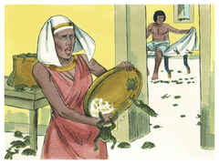

3	E o rio criará rãs, que subirão e virão à tua casa, e ao teu dormitório, e sobre a tua cama, e às casas dos teus servos, e sobre o teu povo, e aos teus fornos, e às tuas amassadeiras.

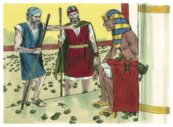

4	E as rãs subirão sobre ti, e sobre o teu povo, e sobre todos os teus servos.

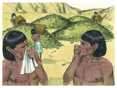

5	Disse mais o Senhor a Moisés: Dize a Arão: Estende a tua mão com tua vara sobre as correntes, e sobre os rios, e sobre os tanques, e faze subir rãs sobre a terra do Egito.

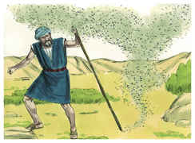

6	E Arão estendeu a sua mão sobre as águas do Egito, e subiram rãs, e cobriram a terra do Egito.

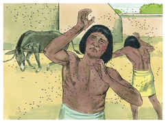

7	Então os magos fizeram o mesmo com os seus encantamentos, e fizeram subir rãs sobre a terra do Egito.

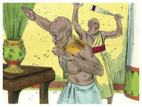

8	E Faraó chamou a Moisés e a Arão, e disse: Rogai ao Senhor que tire as rãs de mim e do meu povo; depois deixarei ir o povo, para que sacrifiquem ao Senhor.

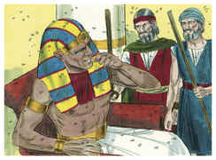

9	E disse Moisés a Faraó: Digna-te dizer-me quando é que hei de rogar por ti, e pelos teus servos, e por teu povo, para tirar as rãs de ti, e das tuas casas, e fiquem somente no rio?

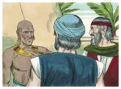

10	E ele disse: Amanhã. E Moisés disse: Seja conforme à tua palavra, para que saibas que ninguém há como o Senhor nosso Deus.

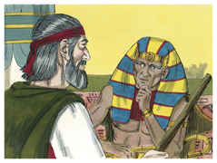

11	E as rãs apartar-se-ão de ti, das tuas casas, dos teus servos, e do teu povo; somente ficarão no rio.

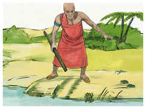

12	Então saíram Moisés e Arão da presença de Faraó; e Moisés clamou ao Senhor por causa das rãs que tinha posto sobre Faraó.

13	E o Senhor fez conforme a palavra de Moisés; e as rãs morreram nas casas, nos pátios, e nos campos.

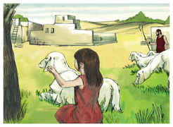

14	E ajuntaram-se em montões, e a terra cheirou mal.

15	Vendo, pois, Faraó que havia descanso, endureceu o seu coração, e não os ouviu, como o Senhor tinha dito.

16	Disse mais o Senhor a Moisés: Dize a Arão: Estende a tua vara, e fere o pó da terra, para que se torne em piolhos por toda a terra do Egito.

17	E fizeram assim; e Arão estendeu a sua mão com a sua vara, e feriu o pó da terra, e havia muitos piolhos nos homens e no gado; todo o pó da terra se tornou em piolhos em toda a terra do Egito.

18	E os magos fizeram também assim com os seus encantamentos para produzir piolhos, mas não puderam; e havia piolhos nos homens e no gado.

19	Então disseram os magos a Faraó: Isto é o dedo de Deus. Porém o coração de Faraó se endureceu, e não os ouvia, como o Senhor tinha dito.

20	Disse mais o Senhor a Moisés: Levanta-te pela manhã cedo e põe-te diante de Faraó; eis que ele sairá às águas; e dize-lhe: Assim diz o Senhor: Deixa ir o meu povo, para que me sirva.

21	Porque se não deixares ir o meu povo, eis que enviarei enxames de moscas sobre ti, e sobre os teus servos, e sobre o teu povo, e às tuas casas; e as casas dos egípcios se encherão destes enxames, e também a terra em que eles estiverem.

22	E naquele dia eu separarei a terra de Gósen, em que meu povo habita, que nela não haja enxames de moscas, para que saibas que eu sou o Senhor no meio desta terra.

23	E porei separação entre o meu povo e o teu povo; amanhã se fará este sinal.

24	E o Senhor fez assim; e vieram grandes enxames de moscas à casa de Faraó e às casas dos seus servos, e sobre toda a terra do Egito; a terra foi corrompida destes enxames.

25	Então chamou Faraó a Moisés e a Arão, e disse: Ide, e sacrificai ao vosso Deus nesta terra.

26	E Moisés disse: Não convém que façamos assim, porque sacrificaríamos ao Senhor nosso Deus a abominação dos egípcios; eis que se sacrificássemos a abominação dos egípcios perante os seus olhos, não nos apedrejariam eles?

27	Deixa-nos ir caminho de três dias ao deserto, para que sacrifiquemos ao Senhor nosso Deus, como ele nos disser.

28	Então disse Faraó: Deixar-vos-ei ir, para que sacrifiqueis ao Senhor vosso Deus no deserto; somente que, indo, não vades longe; orai também por mim.

29	E Moisés disse: Eis que saio de ti, e orarei ao Senhor, que estes enxames de moscas se retirem amanhã de Faraó, dos seus servos, e do seu povo; somente que Faraó não mais me engane, não deixando ir a este povo para sacrificar ao Senhor.

30	Então saiu Moisés da presença de Faraó, e orou ao Senhor.

31	E fez o Senhor conforme a palavra de Moisés, e os enxames de moscas se retiraram de Faraó, dos seus servos, e do seu povo; não ficou uma só.

32	Mas endureceu Faraó ainda esta vez seu coração, e não deixou ir o povo.

