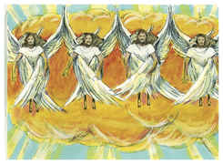
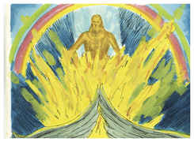
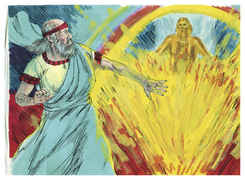
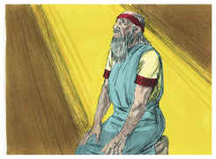

# Ezequiel Capítulo 1

## 1
E ACONTECEU no trigésimo ano, no quarto mês, no quinto dia do mês, que estando eu no meio dos cativos, junto ao rio Quebar, se abriram os céus, e eu tive visões de Deus.

## 2
No quinto dia do mês, no quinto ano do cativeiro do rei Jeoiaquim,

## 3
Veio expressamente a palavra do Senhor a Ezequiel, filho de Buzi, o sacerdote, na terra dos caldeus, junto ao rio Quebar, e ali esteve sobre ele a mão do Senhor.

## 4
Olhei, e eis que um vento tempestuoso vinha do norte, uma grande nuvem, com um fogo revolvendo-se nela, e um resplendor ao redor, e no meio dela havia uma coisa, como de cor de âmbar, que saía do meio do fogo.

## 5
E do meio dela saía a semelhança de quatro seres viventes. E esta era a sua aparência: tinham a semelhança de homem.

## 6
E cada um tinha quatro rostos, como também cada um deles quatro asas.

## 7
E os seus pés eram pés direitos; e as plantas dos seus pés como a planta do pé de uma bezerra, e luziam como a cor de cobre polido.

## 8
E tinham mãos de homem debaixo das suas asas, aos quatro lados; e assim todos quatro tinham seus rostos e suas asas.

## 9
Uniam-se as suas asas uma à outra; não se viravam quando andavam, e cada qual andava continuamente em frente.

## 10
E a semelhança dos seus rostos era como o rosto de homem; e do lado direito todos os quatro tinham rosto de leão, e do lado esquerdo todos os quatro tinham rosto de boi; e também tinham rosto de águia todos os quatro.

## 11
Assim eram os seus rostos. As suas asas estavam estendidas por cima; cada qual tinha duas asas juntas uma a outra, e duas cobriam os corpos deles.

## 12
E cada qual andava para adiante de si; para onde o espírito havia de ir, iam; não se viravam quando andavam.

## 13
E, quanto à semelhança dos seres viventes, o seu aspecto era como ardentes brasas de fogo, com uma aparência de lâmpadas; o fogo subia e descia por entre os seres viventes, e o fogo resplandecia, e do fogo saíam relâmpagos;

## 14
E os seres viventes corriam, e voltavam, à semelhança de um clarão de relâmpago.

## 15
E vi os seres viventes; e eis que havia uma roda sobre a terra junto aos seres viventes, uma para cada um dos quatro rostos.

## 16
O aspecto das rodas, e a obra delas, era como a cor de berilo; e as quatro tinham uma mesma semelhança; e o seu aspecto, e a sua obra, era como se estivera uma roda no meio de outra roda.

## 17
Andando elas, andavam pelos seus quatro lados; não se viravam quando andavam.

## 18
E os seus aros eram tão altos, que faziam medo; e estas quatro tinham as suas cambotas cheias de olhos ao redor.

## 19
E, andando os seres viventes, andavam as rodas ao lado deles; e, elevando-se os seres viventes da terra, elevavam-se também as rodas.

## 20
Para onde o espírito queria ir, eles iam; para onde o espírito tinha de ir; e as rodas se elevavam defronte deles, porque o espírito do ser vivente estava nas rodas.

## 21
Andando eles, andavam elas e, parando eles, paravam elas e, elevando-se eles da terra, elevavam-se também as rodas defronte deles; porque o espírito do ser vivente estava nas rodas.

## 22
E sobre as cabeças dos seres viventes havia uma semelhança de firmamento, com a aparência de cristal terrível, estendido por cima, sobre as suas cabeças.

## 23
E debaixo do firmamento estavam as suas asas direitas uma em direção à outra; cada um tinha duas, que lhe cobriam o corpo de um lado; e cada um tinha outras duas asas, que os cobriam do outro lado.

## 24
E, andando eles, ouvi o ruído das suas asas, como o ruído de muitas águas, como a voz do Onipotente, um tumulto como o estrépito de um exército; parando eles, abaixavam as suas asas.

## 25
E ouviu-se uma voz vinda do firmamento, que estava por cima das suas cabeças; parando eles, abaixavam as suas asas.

## 26
E por cima do firmamento, que estava por cima das suas cabeças, havia algo semelhante a um trono que parecia de pedra de safira; e sobre esta espécie de trono havia uma figura semelhante à de um homem, na parte de cima, sobre ele.

## 27
E vi-a como a cor de âmbar, como a aparência do fogo pelo interior dele ao redor, desde o aspecto dos seus lombos, e daí para cima; e, desde o aspecto dos seus lombos e daí para baixo, vi como a semelhança de fogo, e um resplendor ao redor dele.

## 28
Como o aspecto do arco que aparece na nuvem no dia da chuva, assim era o aspecto do resplendor em redor. Este era o aspecto da semelhança da glória do Senhor; e, vendo isto, caí sobre o meu rosto, e ouvi a voz de quem falava.

