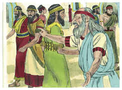

# Ezequiel Capítulo 2

## 1
E DISSE-ME: Filho do homem, põe-te em pé, e falarei contigo.

## 2
Então entrou em mim o Espírito, quando ele falava comigo, e me pôs em pé, e ouvi o que me falava.

## 3
E disse-me: Filho do homem, eu te envio aos filhos de Israel, às nações rebeldes que se rebelaram contra mim; eles e seus pais transgrediram contra mim até este mesmo dia.

## 4
E os filhos são de semblante duro, e obstinados de coração; eu te envio a eles, e lhes dirás: Assim diz o Senhor Deus.

## 5
E eles, quer ouçam quer deixem de ouvir (porque eles são casa rebelde), hão de saber, contudo, que esteve no meio deles um profeta.

## 6
E tu, ó filho do homem, não os temas, nem temas as suas palavras; ainda que estejam contigo sarças e espinhos, e tu habites entre escorpiões, não temas as suas palavras, nem te assustes com os seus semblantes, porque são casa rebelde.

## 7
Mas tu lhes dirás as minhas palavras, quer ouçam quer deixem de ouvir, pois são rebeldes.

## 8
Mas tu, ó filho do homem, ouve o que eu te falo, não sejas rebelde como a casa rebelde; abre a tua boca, e come o que eu te dou.

## 9
Então vi, e eis que uma mão se estendia para mim, e eis que nela havia um rolo de livro.

## 10
E estendeu-o diante de mim, e ele estava escrito por dentro e por fora; e nele estavam escritas lamentações, e suspiros e ais.

