# Gênesis Capítulo 12

## 1
ORA, o Senhor disse a Abrão: Sai-te da tua terra, da tua parentela e da casa de teu pai, para a terra que eu te mostrarei.

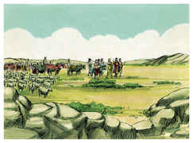

## 2
E far-te-ei uma grande nação, e abençoar-te-ei e engrandecerei o teu nome; e tu serás uma bênção.

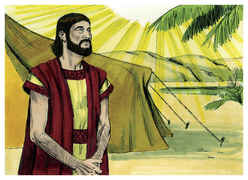

## 3
E abençoarei os que te abençoarem, e amaldiçoarei os que te amaldiçoarem; e em ti serão benditas todas as famílias da terra.

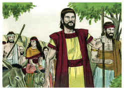

## 4
Assim partiu Abrão como o Senhor lhe tinha dito, e foi Ló com ele; e era Abrão da idade de setenta e cinco anos quando saiu de Harã.

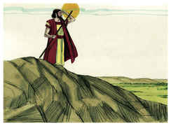

## 5
E tomou Abrão a Sarai, sua mulher, e a Ló, filho de seu irmão, e todos os bens que haviam adquirido, e as almas que lhe acresceram em Harã; e saíram para irem à terra de Canaã; e chegaram à terra de Canaã.

## 6
E passou Abrão por aquela terra até ao lugar de Siquém, até ao carvalho de Moré; e estavam então os cananeus na terra.

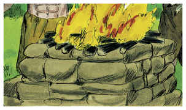

## 7
E apareceu o Senhor a Abrão, e disse: À tua descendência darei esta terra. E edificou ali um altar ao Senhor, que lhe aparecera.

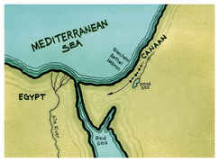

## 8
E moveu-se dali para a montanha do lado oriental de Betel, e armou a sua tenda, tendo Betel ao ocidente, e Ai ao oriente; e edificou ali um altar ao Senhor, e invocou o nome do Senhor.

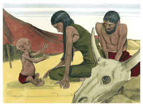

## 9
Depois caminhou Abrão dali, seguindo ainda para o lado do sul.

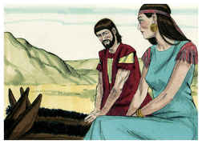

## 10
E havia fome naquela terra; e desceu Abrão ao Egito, para peregrinar ali, porquanto a fome era grande na terra.

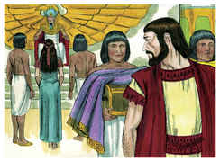

## 11
E aconteceu que, chegando ele para entrar no Egito, disse a Sarai, sua mulher: Ora, bem sei que és mulher formosa à vista;

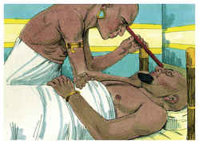

## 12
E será que, quando os egípcios te virem, dirão: Esta é sua mulher. E matar-me-ão a mim, e a ti te guardarão em vida.

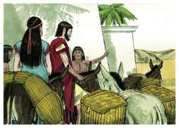

## 13
Dize, peço-te, que és minha irmã, para que me vá bem por tua causa, e que viva a minha alma por amor de ti.

## 14
E aconteceu que, entrando Abrão no Egito, viram os egípcios a mulher, que era mui formosa.

## 15
E viram-na os príncipes de Faraó, e gabaram-na diante de Faraó; e foi a mulher tomada para a casa de Faraó.

## 16
E fez bem a Abrão por amor dela; e ele teve ovelhas, vacas, jumentos, servos e servas, jumentas e camelos.

## 17
Feriu, porém, o Senhor a Faraó e a sua casa, com grandes pragas, por causa de Sarai, mulher de Abrão.

## 18
Então chamou Faraó a Abrão, e disse: Que é isto que me fizeste? Por que não me disseste que ela era tua mulher?

## 19
Por que disseste: É minha irmã? Por isso a tomei por minha mulher; agora, pois, eis aqui tua mulher; toma-a e vai-te.

## 20
E Faraó deu ordens aos seus homens a respeito dele; e acompanharam-no, a ele, e a sua mulher, e a tudo o que tinha.

