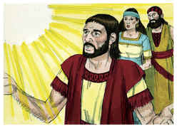
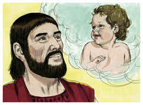
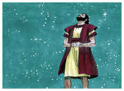
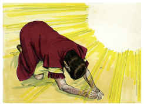
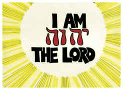
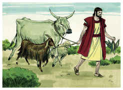
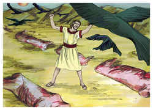
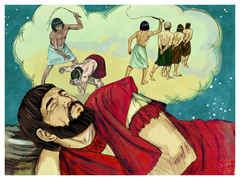
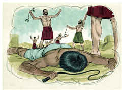
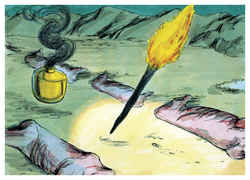

# Gênesis Capítulo 15

## 1
DEPOIS destas coisas veio a palavra do Senhor a Abrão em visão, dizendo: Não temas, Abrão, eu sou o teu escudo, o teu grandíssimo galardão.

## 2
Então disse Abrão: Senhor Deus, que me hás de dar, pois ando sem filhos, e o mordomo da minha casa é o damasceno Eliézer?

## 3
Disse mais Abrão: Eis que não me tens dado filhos, e eis que um nascido na minha casa será o meu herdeiro.

## 4
E eis que veio a palavra do Senhor a ele dizendo: Este não será o teu herdeiro; mas aquele que de tuas entranhas sair, este será o teu herdeiro.

## 5
Então o levou fora, e disse: Olha agora para os céus, e conta as estrelas, se as podes contar. E disse-lhe: Assim será a tua descendência.

## 6
E creu ele no Senhor, e imputou-lhe isto por justiça.

## 7
Disse-lhe mais: Eu sou o Senhor, que te tirei de Ur dos caldeus, para dar-te a ti esta terra, para herdá-la.

## 8
E disse ele: Senhor Deus, como saberei que hei de herdá-la?

## 9
E disse-lhe: Toma-me uma bezerra de três anos, e uma cabra de três anos, e um carneiro de três anos, uma rola e um pombinho.

## 10
E trouxe-lhe todos estes, e partiu-os pelo meio, e pôs cada parte deles em frente da outra; mas as aves não partiu.

## 11
E as aves desciam sobre os cadáveres; Abrão, porém, as enxotava.

## 12
E pondo-se o sol, um profundo sono caiu sobre Abrão; e eis que grande espanto e grande escuridão caiu sobre ele.

## 13
Então disse a Abrão: Saibas, de certo, que peregrina será a tua descendência em terra alheia, e será reduzida à escravidão, e será afligida por quatrocentos anos,

## 14
Mas também eu julgarei a nação, à qual ela tem de servir, e depois sairá com grande riqueza.

## 15
E tu irás a teus pais em paz; em boa velhice serás sepultado.

## 16
E a quarta geração tornará para cá; porque a medida da injustiça dos amorreus não está ainda cheia.

## 17
E sucedeu que, posto o sol, houve escuridão, e eis um forno de fumaça, e uma tocha de fogo, que passou por aquelas metades.

## 18
Naquele mesmo dia fez o Senhor uma aliança com Abrão, dizendo: À tua descendência tenho dado esta terra, desde o rio do Egito até ao grande rio Eufrates;

## 19
E o queneu, e o quenezeu, e o cadmoneu,

## 20
E o heteu, e o perizeu, e os refains,

## 21
E o amorreu, e o cananeu, e o girgaseu, e o jebuseu.

