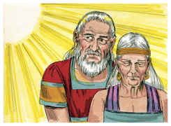
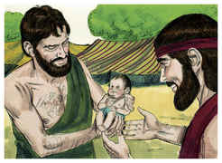
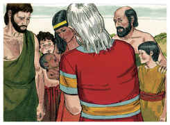

# Gênesis Capítulo 17

## 1
SENDO, pois, Abrão da idade de noventa e nove anos, apareceu o Senhor a Abrão, e disse-lhe: Eu sou o Deus Todo-Poderoso, anda em minha presença e sê perfeito.

## 2
E porei a minha aliança entre mim e ti, e te multiplicarei grandissimamente.

## 3
Então caiu Abrão sobre o seu rosto, e falou Deus com ele, dizendo:

## 4
Quanto a mim, eis a minha aliança contigo: serás o pai de muitas nações;

## 5
E não se chamará mais o teu nome Abrão, mas Abraão será o teu nome; porque por pai de muitas nações te tenho posto;

## 6
E te farei frutificar grandissimamente, e de ti farei nações, e reis sairão de ti;

## 7
E estabelecerei a minha aliança entre mim e ti e a tua descendência depois de ti em suas gerações, por aliança perpétua, para te ser a ti por Deus, e à tua descendência depois de ti.

## 8
E te darei a ti e à tua descendência depois de ti, a terra de tuas peregrinações, toda a terra de Canaã em perpétua possessão e ser-lhes-ei o seu Deus.

## 9
Disse mais Deus a Abraão: Tu, porém, guardarás a minha aliança, tu, e a tua descendência depois de ti, nas suas gerações.

## 10
Esta é a minha aliança, que guardareis entre mim e vós, e a tua descendência depois de ti: Que todo o homem entre vós será circuncidado.

## 11
E circuncidareis a carne do vosso prepúcio; e isto será por sinal da aliança entre mim e vós.

## 12
O filho de oito dias, pois, será circuncidado, todo o homem nas vossas gerações; o nascido na casa, e o comprado por dinheiro a qualquer estrangeiro, que não for da tua descendência.

## 13
Com efeito será circuncidado o nascido em tua casa, e o comprado por teu dinheiro; e estará a minha aliança na vossa carne por aliança perpétua.

## 14
E o homem incircunciso, cuja carne do prepúcio não estiver circuncidada, aquela alma será extirpada do seu povo; quebrou a minha aliança.

## 15
Disse Deus mais a Abraão: A Sarai tua mulher não chamarás mais pelo nome de Sarai, mas Sara será o seu nome.

## 16
Porque eu a hei de abençoar, e te darei dela um filho; e a abençoarei, e será mãe das nações; reis de povos sairão dela.

## 17
Então caiu Abraão sobre o seu rosto, e riu-se, e disse no seu coração: A um homem de cem anos há de nascer um filho? E dará à luz Sara da idade de noventa anos?

## 18
E disse Abraão a Deus: Quem dera que viva Ismael diante de teu rosto!

## 19
E disse Deus: Na verdade, Sara, tua mulher, te dará um filho, e chamarás o seu nome Isaque, e com ele estabelecerei a minha aliança, por aliança perpétua para a sua descendência depois dele.

## 20
E quanto a Ismael, também te tenho ouvido; eis aqui o tenho abençoado, e fá-lo-ei frutificar, e fá-lo-ei multiplicar grandissimamente; doze príncipes gerará, e dele farei uma grande nação.

## 21
A minha aliança, porém, estabelecerei com Isaque, o qual Sara dará à luz neste tempo determinado, no ano seguinte.

## 22
Ao acabar de falar com Abraão, subiu Deus de diante dele.

## 23
Então tomou Abraão a seu filho Ismael, e a todos os nascidos na sua casa, e a todos os comprados por seu dinheiro, todo o homem entre os da casa de Abraão; e circuncidou a carne do seu prepúcio, naquele mesmo dia, como Deus falara com ele.

## 24
E era Abraão da idade de noventa e nove anos, quando lhe foi circuncidada a carne do seu prepúcio.

## 25
E Ismael, seu filho, era da idade de treze anos, quando lhe foi circuncidada a carne do seu prepúcio.

## 26
Naquele mesmo dia foram circuncidados Abraão e Ismael seu filho,

## 27
E todos os homens da sua casa, os nascidos em casa, e os comprados por dinheiro ao estrangeiro, foram circuncidados com ele.

