# Gênesis Capítulo 18

1	DEPOIS apareceu-lhe o Senhor nos carvalhais de Manre, estando ele assentado à porta da tenda, no calor do dia.

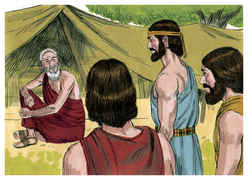

2	E levantou os seus olhos, e olhou, e eis três homens em pé junto a ele. E vendo-os, correu da porta da tenda ao seu encontro e inclinou-se à terra,

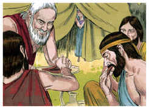

3	E disse: Meu Senhor, se agora tenho achado graça aos teus olhos, rogo-te que não passes de teu servo.

4	Que se traga já um pouco de água, e lavai os vossos pés, e recostai-vos debaixo desta árvore;

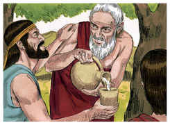

5	E trarei um bocado de pão, para que esforceis o vosso coração; depois passareis adiante, porquanto por isso chegastes até vosso servo. E disseram: Assim faze como disseste.

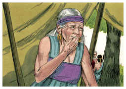

6	E Abraão apressou-se em ir ter com Sara à tenda, e disse-lhe: Amassa depressa três medidas de flor de farinha, e faze bolos.

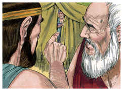

7	E correu Abraão às vacas, e tomou uma vitela tenra e boa, e deu-a ao moço, que se apressou em prepará-la.

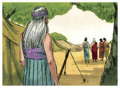

8	E tomou manteiga e leite, e a vitela que tinha preparado, e pôs tudo diante deles, e ele estava em pé junto a eles debaixo da árvore; e comeram.

9	E disseram-lhe: Onde está Sara, tua mulher? E ele disse: Ei-la aí na tenda.

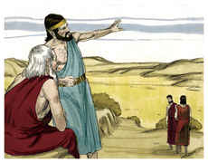

10	E disse: Certamente tornarei a ti por este tempo da vida; e eis que Sara tua mulher terá um filho. E Sara escutava à porta da tenda, que estava atrás dele.

11	E eram Abraão e Sara já velhos, e adiantados em idade; já a Sara havia cessado o costume das mulheres.

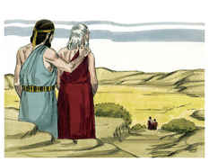

12	Assim, pois, riu-se Sara consigo, dizendo: Terei ainda deleite depois de haver envelhecido, sendo também o meu senhor já velho?

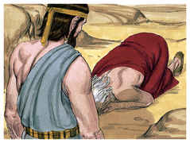

13	E disse o Senhor a Abraão: Por que se riu Sara, dizendo: Na verdade darei eu à luz ainda, havendo já envelhecido?

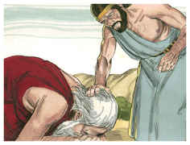

14	Haveria coisa alguma difícil ao Senhor? Ao tempo determinado tornarei a ti por este tempo da vida, e Sara terá um filho.

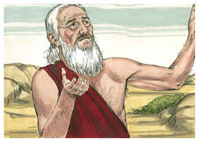

15	E Sara negou, dizendo: Não me ri; porquanto temeu. E ele disse: Não digas isso, porque te riste.

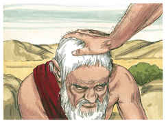

16	E levantaram-se aqueles homens dali, e olharam para o lado de Sodoma; e Abraão ia com eles, acompanhando-os.

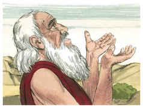

17	E disse o Senhor: Ocultarei eu a Abraão o que faço,

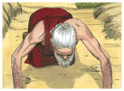

18	Visto que Abraão certamente virá a ser uma grande e poderosa nação, e nele serão benditas todas as nações da terra?

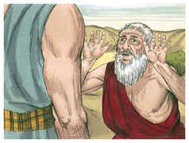

19	Porque eu o tenho conhecido, e sei que ele há de ordenar a seus filhos e à sua casa depois dele, para que guardem o caminho do Senhor, para agir com justiça e juízo; para que o Senhor faça vir sobre Abraão o que acerca dele tem falado.

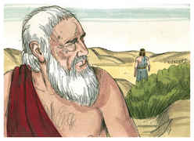

20	Disse mais o Senhor: Porquanto o clamor de Sodoma e Gomorra se tem multiplicado, e porquanto o seu pecado se tem agravado muito,

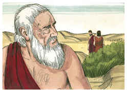

21	Descerei agora, e verei se com efeito têm praticado segundo o seu clamor, que é vindo até mim; e se não, sabê-lo-ei.

22	Então viraram aqueles homens os rostos dali, e foram-se para Sodoma; mas Abraão ficou ainda em pé diante da face do Senhor.

23	E chegou-se Abraão, dizendo: Destruirás também o justo com o ímpio?

24	Se porventura houver cinqüenta justos na cidade, destruirás também, e não pouparás o lugar por causa dos cinqüenta justos que estão dentro dela?

25	Longe de ti que faças tal coisa, que mates o justo com o ímpio; que o justo seja como o ímpio, longe de ti. Não faria justiça o Juiz de toda a terra?

26	Então disse o Senhor: Se eu em Sodoma achar cinqüenta justos dentro da cidade, pouparei a todo o lugar por amor deles.

27	E respondeu Abraão dizendo: Eis que agora me atrevi a falar ao Senhor, ainda que sou pó e cinza.

28	Se porventura de cinqüenta justos faltarem cinco, destruirás por aqueles cinco toda a cidade? E disse: Não a destruirei, se eu achar ali quarenta e cinco.

29	E continuou ainda a falar-lhe, e disse: Se porventura se acharem ali quarenta? E disse: Não o farei por amor dos quarenta.

30	Disse mais: Ora, não se ire o Senhor, se eu ainda falar: Se porventura se acharem ali trinta? E disse: Não o farei se achar ali trinta.

31	E disse: Eis que agora me atrevi a falar ao Senhor: Se porventura se acharem ali vinte? E disse: Não a destruirei por amor dos vinte.

32	Disse mais: Ora, não se ire o Senhor, que ainda só mais esta vez falo: Se porventura se acharem ali dez? E disse: Não a destruirei por amor dos dez.

33	E retirou-se o Senhor, quando acabou de falar a Abraão; e Abraão tornou-se ao seu lugar.

