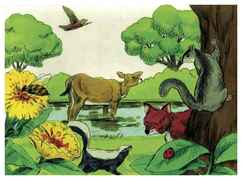
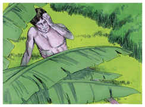
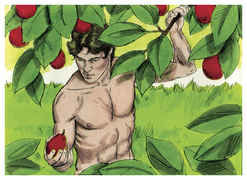
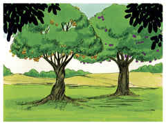
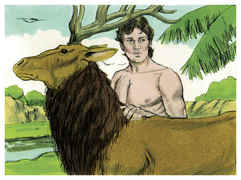
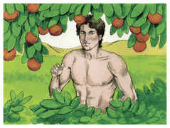
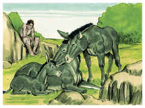
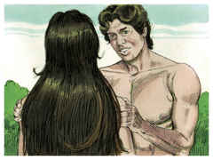
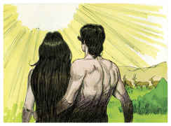

# Gênesis Capítulo 2

## 1
ASSIM os céus, a terra e todo o seu exército foram acabados.

## 2
E havendo Deus acabado no dia sétimo a obra que fizera, descansou no sétimo dia de toda a sua obra, que tinha feito.

## 3
E abençoou Deus o dia sétimo, e o santificou; porque nele descansou de toda a sua obra que Deus criara e fizera.

## 4
Estas são as origens dos céus e da terra, quando foram criados; no dia em que o Senhor Deus fez a terra e os céus,

## 5
E toda a planta do campo que ainda não estava na terra, e toda a erva do campo que ainda não brotava; porque ainda o Senhor Deus não tinha feito chover sobre a terra, e não havia homem para lavrar a terra.

## 6
Um vapor, porém, subia da terra, e regava toda a face da terra.

## 7
E formou o Senhor Deus o homem do pó da terra, e soprou em suas narinas o fôlego da vida; e o homem foi feito alma vivente.

## 8
E plantou o Senhor Deus um jardim no Éden, do lado oriental; e pôs ali o homem que tinha formado.

## 9
E o Senhor Deus fez brotar da terra toda a árvore agradável à vista, e boa para comida; e a árvore da vida no meio do jardim, e a árvore do conhecimento do bem e do mal.

## 10
E saía um rio do Éden para regar o jardim; e dali se dividia e se tornava em quatro braços.

## 11
O nome do primeiro é Pisom; este é o que rodeia toda a terra de Havilá, onde há ouro.

## 12
E o ouro dessa terra é bom; ali há o bdélio, e a pedra sardônica.

## 13
E o nome do segundo rio é Giom; este é o que rodeia toda a terra de Cuxe.

## 14
E o nome do terceiro rio é Tigre; este é o que vai para o lado oriental da Assíria; e o quarto rio é o Eufrates.

## 15
E tomou o Senhor Deus o homem, e o pôs no jardim do Éden para o lavrar e o guardar.

## 16
E ordenou o Senhor Deus ao homem, dizendo: De toda a árvore do jardim comerás livremente,

## 17
Mas da árvore do conhecimento do bem e do mal, dela não comerás; porque no dia em que dela comeres, certamente morrerás.

## 18
E disse o Senhor Deus: Não é bom que o homem esteja só; far-lhe-ei uma ajudadora idônea para ele.

## 19
Havendo, pois, o Senhor Deus formado da terra todo o animal do campo, e toda a ave dos céus, os trouxe a Adão, para este ver como lhes chamaria; e tudo o que Adão chamou a toda a alma vivente, isso foi o seu nome.

## 20
E Adão pôs os nomes a todo o gado, e às aves dos céus, e a todo o animal do campo; mas para o homem não se achava ajudadora idônea.

## 21
Então o Senhor Deus fez cair um sono pesado sobre Adão, e este adormeceu; e tomou uma das suas costelas, e cerrou a carne em seu lugar;

## 22
E da costela que o Senhor Deus tomou do homem, formou uma mulher, e trouxe-a a Adão.

## 23
E disse Adão: Esta é agora osso dos meus ossos, e carne da minha carne; esta será chamada mulher, porquanto do homem foi tomada.

## 24
Portanto deixará o homem o seu pai e a sua mãe, e apegar-se-á à sua mulher, e serão ambos uma carne.

## 25
E ambos estavam nus, o homem e a sua mulher; e não se envergonhavam.

