# Gênesis Capítulo 22

1	E ACONTECEU depois destas coisas, que provou Deus a Abraão, e disse-lhe: Abraão! E ele disse: Eis-me aqui.

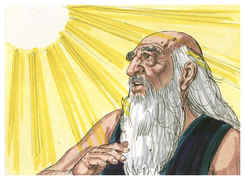

2	E disse: Toma agora o teu filho, o teu único filho, Isaque, a quem amas, e vai-te à terra de Moriá, e oferece-o ali em holocausto sobre uma das montanhas, que eu te direi.

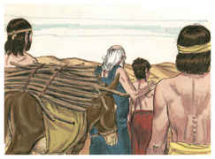

3	Então se levantou Abraão pela manhã de madrugada, e albardou o seu jumento, e tomou consigo dois de seus moços e Isaque seu filho; e cortou lenha para o holocausto, e levantou-se, e foi ao lugar que Deus lhe dissera.

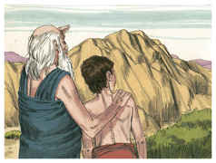

4	Ao terceiro dia levantou Abraão os seus olhos, e viu o lugar de longe.

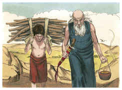

5	E disse Abraão a seus moços: Ficai-vos aqui com o jumento, e eu e o moço iremos até ali; e havendo adorado, tornaremos a vós.

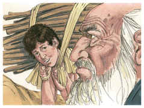

6	E tomou Abraão a lenha do holocausto, e pô-la sobre Isaque seu filho; e ele tomou o fogo e o cutelo na sua mão, e foram ambos juntos.

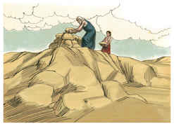

7	Então falou Isaque a Abraão seu pai, e disse: Meu pai! E ele disse: Eis-me aqui, meu filho! E ele disse: Eis aqui o fogo e a lenha, mas onde está o cordeiro para o holocausto?

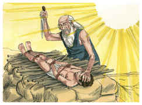

8	E disse Abraão: Deus proverá para si o cordeiro para o holocausto, meu filho. Assim caminharam ambos juntos.

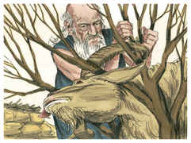

9	E chegaram ao lugar que Deus lhe dissera, e edificou Abraão ali um altar e pôs em ordem a lenha, e amarrou a Isaque seu filho, e deitou-o sobre o altar em cima da lenha.

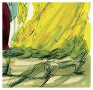

10	E estendeu Abraão a sua mão, e tomou o cutelo para imolar o seu filho;

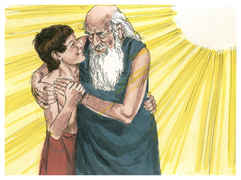

11	Mas o anjo do Senhor lhe bradou desde os céus, e disse: Abraão, Abraão! E ele disse: Eis-me aqui.

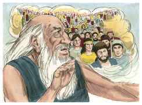

12	Então disse: Não estendas a tua mão sobre o moço, e não lhe faças nada; porquanto agora sei que temes a Deus, e não me negaste o teu filho, o teu único filho.

13	Então levantou Abraão os seus olhos e olhou; e eis um carneiro detrás dele, travado pelos seus chifres, num mato; e foi Abraão, e tomou o carneiro, e ofereceu-o em holocausto, em lugar de seu filho.

14	E chamou Abraão o nome daquele lugar: O Senhor PROVERÁ; donde se diz até ao dia de hoje: No monte do Senhor se proverá.

15	Então o anjo do Senhor bradou a Abraão pela segunda vez desde os céus,

16	E disse: Por mim mesmo jurei, diz o Senhor: Porquanto fizeste esta ação, e não me negaste o teu filho, o teu único filho,

17	Que deveras te abençoarei, e grandissimamente multiplicarei a tua descendência como as estrelas dos céus, e como a areia que está na praia do mar; e a tua descendência possuirá a porta dos seus inimigos;

18	E em tua descendência serão benditas todas as nações da terra; porquanto obedeceste à minha voz.

19	Então Abraão tornou aos seus moços, e levantaram-se, e foram juntos para Berseba; e Abraão habitou em Berseba.

20	E sucedeu depois destas coisas, que anunciaram a Abraão, dizendo: Eis que também Milca deu filhos a Naor teu irmão.

21	Uz o seu primogênito, e Buz seu irmão, e Quemuel, pai de Arã,

22	E Quésede, e Hazo, e Pildas, e Jidlafe, e Betuel.

23	E Betuel gerou Rebeca. Estes oito deu à luz Milca a Naor, irmão de Abraão.

24	E a sua concubina, cujo nome era Reumá, ela lhe deu também a Tebá, Gaã, Taás e Maaca.

