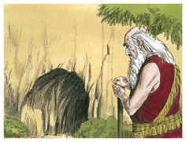

# Gênesis Capítulo 23

## 1
E FOI a vida de Sara cento e vinte e sete anos; estes foram os anos da vida de Sara.

## 2
E morreu Sara em Quiriate-Arba, que é Hebrom, na terra de Canaã; e veio Abraão lamentar Sara e chorar por ela.

## 3
Depois se levantou Abraão de diante de sua morta, e falou aos filhos de Hete, dizendo:

## 4
Estrangeiro e peregrino sou entre vós; dai-me possessão de sepultura convosco, para que eu sepulte a minha morta de diante da minha face.

## 5
E responderam os filhos de Hete a Abraão, dizendo-lhe:

## 6
Ouve-nos, meu senhor; príncipe poderoso és no meio de nós; enterra a tua morta na mais escolhida de nossas sepulturas; nenhum de nós te vedará a sua sepultura, para enterrar a tua morta.

## 7
Então se levantou Abraão, inclinou-se diante do povo da terra, diante dos filhos de Hete,

## 8
E falou com eles, dizendo: Se é de vossa vontade que eu sepulte a minha morta de diante de minha face, ouvi-me e falai por mim a Efrom, filho de Zoar,

## 9
Que ele me dê a cova de Macpela, que ele tem no fim do seu campo; que ma dê pelo devido preço em herança de sepulcro no meio de vós.

## 10
Ora Efrom habitava no meio dos filhos de Hete; e respondeu Efrom, heteu, a Abraão, aos ouvidos dos filhos de Hete, de todos os que entravam pela porta da sua cidade, dizendo:

## 11
Não, meu senhor, ouve-me: O campo te dou, também te dou a cova que nele está, diante dos olhos dos filhos do meu povo ta dou; sepulta a tua morta.

## 12
Então Abraão se inclinou diante da face do povo da terra,

## 13
E falou a Efrom, aos ouvidos do povo da terra, dizendo: Mas se tu estás por isto, ouve-me, peço-te. O preço do campo o darei; toma-o de mim e sepultarei ali a minha morta.

## 14
E respondeu Efrom a Abraão, dizendo-lhe:

## 15
Meu senhor, ouve-me, a terra é de quatrocentos siclos de prata; que é isto entre mim e ti? Sepulta a tua morta.

## 16
E Abraão deu ouvidos a Efrom, e Abraão pesou a Efrom a prata de que tinha falado aos ouvidos dos filhos de Hete, quatrocentos siclos de prata, corrente entre mercadores.

## 17
Assim o campo de Efrom, que estava em Macpela, em frente de Manre, o campo e a cova que nele estava, e todo o arvoredo que no campo havia, que estava em todo o seu contorno ao redor,

## 18
Se confirmou a Abraão em possessão diante dos olhos dos filhos de Hete, de todos os que entravam pela porta da cidade.

## 19
E depois sepultou Abraão a Sara sua mulher na cova do campo de Macpela, em frente de Manre, que é Hebrom, na terra de Canaã.

## 20
Assim o campo e a cova que nele estava foram confirmados a Abraão, pelos filhos de Hete, em possessão de sepultura.

