# Gênesis Capítulo 27

1	E ACONTECEU que, como Isaque envelheceu, e os seus olhos se escureceram, de maneira que não podia ver, chamou a Esaú, seu filho mais velho, e disse-lhe: Meu filho. E ele lhe disse: Eis-me aqui.

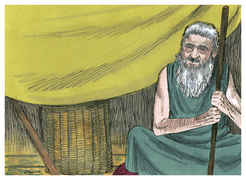

2	E ele disse: Eis que já agora estou velho, e não sei o dia da minha morte;

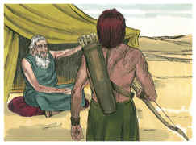

3	Agora, pois, toma as tuas armas, a tua aljava e o teu arco, e sai ao campo, e apanha para mim alguma caça.

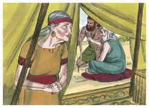

4	E faze-me um guisado saboroso, como eu gosto, e traze-mo, para que eu coma; para que minha alma te abençoe, antes que morra.

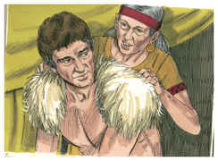

5	E Rebeca escutou quando Isaque falava ao seu filho Esaú. E foi Esaú ao campo para apanhar a caça que havia de trazer.

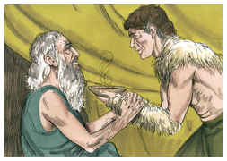

6	Então falou Rebeca a Jacó seu filho, dizendo: Eis que tenho ouvido o teu pai que falava com Esaú teu irmão, dizendo:

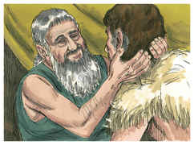

7	Traze-me caça, e faze-me um guisado saboroso, para que eu coma, e te abençoe diante da face do Senhor, antes da minha morte.

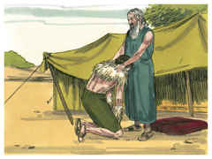

8	Agora, pois, filho meu, ouve a minha voz naquilo que eu te mando:

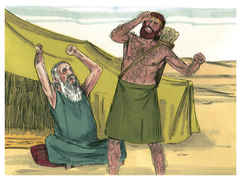

9	Vai agora ao rebanho, e traze-me de lá dois bons cabritos, e eu farei deles um guisado saboroso para teu pai, como ele gosta;

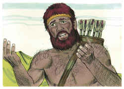

10	E levá-lo-ás a teu pai, para que o coma; para que te abençoe antes da sua morte.

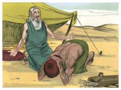

11	Então disse Jacó a Rebeca, sua mãe: Eis que Esaú meu irmão é homem cabeludo, e eu homem liso;

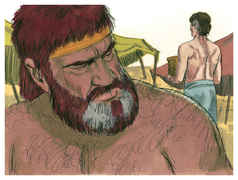

12	Porventura me apalpará o meu pai, e serei aos seus olhos como enganador; assim trarei eu sobre mim maldição, e não bênção.

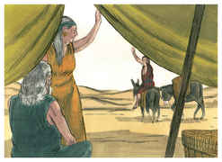

13	E disse-lhe sua mãe: Meu filho, sobre mim seja a tua maldição; somente obedece à minha voz, e vai, traze-mos.

14	E foi, e tomou-os, e trouxe-os a sua mãe; e sua mãe fez um guisado saboroso, como seu pai gostava.

15	Depois tomou Rebeca os vestidos de gala de Esaú, seu filho mais velho, que tinha consigo em casa, e vestiu a Jacó, seu filho menor;

16	E com as peles dos cabritos cobriu as suas mãos e a lisura do seu pescoço;

17	E deu o guisado saboroso e o pão que tinha preparado, na mão de Jacó seu filho.

18	E foi ele a seu pai, e disse: Meu pai! E ele disse: Eis-me aqui; quem és tu, meu filho?

19	E Jacó disse a seu pai: Eu sou Esaú, teu primogênito; tenho feito como me disseste; levanta-te agora, assenta-te e come da minha caça, para que a tua alma me abençoe.

20	Então disse Isaque a seu filho: Como é isto, que tão cedo a achaste, filho meu? E ele disse: Porque o Senhor teu Deus a mandou ao meu encontro.

21	E disse Isaque a Jacó: Chega-te agora, para que te apalpe, meu filho, se és meu filho Esaú mesmo, ou não.

22	Então se chegou Jacó a Isaque seu pai, que o apalpou, e disse: A voz é a voz de Jacó, porém as mãos são as mãos de Esaú.

23	E não o conheceu, porquanto as suas mãos estavam cabeludas, como as mãos de Esaú seu irmão; e abençoou-o.

24	E disse: És tu meu filho Esaú mesmo? E ele disse: Eu sou.

25	Então disse: Faze chegar isso perto de mim, para que coma da caça de meu filho; para que a minha alma te abençoe. E chegou-lhe, e comeu; trouxe-lhe também vinho, e bebeu.

26	E disse-lhe Isaque seu pai: Ora chega-te, e beija-me, filho meu.

27	E chegou-se, e beijou-o; então sentindo o cheiro das suas vestes, abençoou-o, e disse: Eis que o cheiro do meu filho é como o cheiro do campo, que o Senhor abençoou;

28	Assim, pois, te dê Deus do orvalho dos céus, e das gorduras da terra, e abundância de trigo e de mosto.

29	Sirvam-te povos, e nações se encurvem a ti; sê senhor de teus irmãos, e os filhos da tua mãe se encurvem a ti; malditos sejam os que te amaldiçoarem, e benditos sejam os que te abençoarem.

30	E aconteceu que, acabando Isaque de abençoar a Jacó, apenas Jacó acabava de sair da presença de Isaque seu pai, veio Esaú, seu irmão, da sua caça;

31	E fez também ele um guisado saboroso, e trouxe-o a seu pai; e disse a seu pai: Levanta-te, meu pai, e come da caça de teu filho, para que me abençoe a tua alma.

32	E disse-lhe Isaque seu pai: Quem és tu? E ele disse: Eu sou teu filho, o teu primogênito Esaú.

33	Então estremeceu Isaque de um estremecimento muito grande, e disse: Quem, pois, é aquele que apanhou a caça, e ma trouxe? E comi de tudo, antes que tu viesses, e abençoei-o, e ele será bendito.

34	Esaú, ouvindo as palavras de seu pai, bradou com grande e mui amargo brado, e disse a seu pai: Abençoa-me também a mim, meu pai.

35	E ele disse: Veio teu irmão com sutileza, e tomou a tua bênção.

36	Então disse ele: Não é o seu nome justamente Jacó, tanto que já duas vezes me enganou? A minha primogenitura me tomou, e eis que agora me tomou a minha bênção. E perguntou: Não reservaste, pois, para mim nenhuma bênção?

37	Então respondeu Isaque a Esaú dizendo: Eis que o tenho posto por senhor sobre ti, e todos os seus irmãos lhe tenho dado por servos; e de trigo e de mosto o tenho fortalecido; que te farei, pois, agora, meu filho?

38	E disse Esaú a seu pai: Tens uma só bênção, meu pai? Abençoa-me também a mim, meu pai. E levantou Esaú a sua voz, e chorou.

39	Então respondeu Isaque, seu pai, e disse-lhe: Eis que a tua habitação será nas gorduras da terra e no orvalho dos altos céus.

40	E pela tua espada viverás, e ao teu irmão servirás. Acontecerá, porém, que quando te assenhoreares, então sacudirás o seu jugo do teu pescoço.

41	E Esaú odiou a Jacó por causa daquela bênção, com que seu pai o tinha abençoado; e Esaú disse no seu coração: Chegar-se-ão os dias de luto de meu pai; e matarei a Jacó meu irmão.

42	E foram denunciadas a Rebeca estas palavras de Esaú, seu filho mais velho; e ela mandou chamar a Jacó, seu filho menor, e disse-lhe: Eis que Esaú teu irmão se consola a teu respeito, propondo matar-te.

43	Agora, pois, meu filho, ouve a minha voz, e levanta-te; acolhe-te a Labão meu irmão, em Harã,

44	E mora com ele alguns dias, até que passe o furor de teu irmão;

45	Até que se desvie de ti a ira de teu irmão, e se esqueça do que lhe fizeste; então mandarei trazer-te de lá; por que seria eu desfilhada também de vós ambos num mesmo dia?

46	E disse Rebeca a Isaque: Enfadada estou da minha vida, por causa das filhas de Hete; se Jacó tomar mulher das filhas de Hete, como estas são, das filhas desta terra, para que me servirá a vida?

