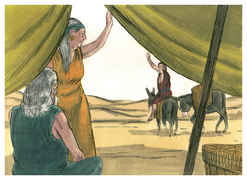
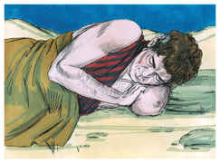
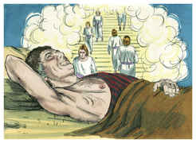
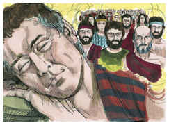
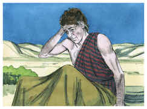
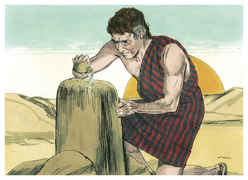
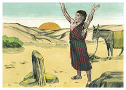
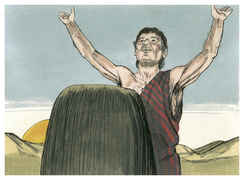
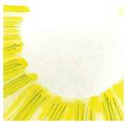

# Gênesis Capítulo 28

## 1
E ISAQUE chamou a Jacó, e abençoou-o, e ordenou-lhe, e disse-lhe: Não tomes mulher de entre as filhas de Canaã;

## 2
Levanta-te, vai a Padã-Arã, à casa de Betuel, pai de tua mãe, e toma de lá uma mulher das filhas de Labão, irmão de tua mãe;

## 3
E Deus Todo-Poderoso te abençoe, e te faça frutificar, e te multiplique, para que sejas uma multidão de povos;

## 4
E te dê a bênção de Abraão, a ti e à tua descendência contigo, para que em herança possuas a terra de tuas peregrinações, que Deus deu a Abraão.

## 5
Assim despediu Isaque a Jacó, o qual se foi a Padã-Arã, a Labão, filho de Betuel, arameu, irmão de Rebeca, mãe de Jacó e de Esaú.

## 6
Vendo, pois, Esaú que Isaque abençoara a Jacó, e o enviara a Padã-Arã, para tomar mulher dali para si, e que, abençoando-o, lhe ordenara, dizendo: Não tomes mulher das filhas de Canaã;

## 7
E que Jacó obedecera a seu pai e a sua mãe, e se fora a Padã-Arã;

## 8
Vendo também Esaú que as filhas de Canaã eram más aos olhos de Isaque seu pai,

## 9
Foi Esaú a Ismael, e tomou para si por mulher, além das suas mulheres, a Maalate filha de Ismael, filho de Abraão, irmã de Nebaiote.

## 10
Partiu, pois, Jacó de Berseba, e foi a Harã;

## 11
E chegou a um lugar onde passou a noite, porque já o sol era posto; e tomou uma das pedras daquele lugar, e a pôs por seu travesseiro, e deitou-se naquele lugar.

## 12
E sonhou: e eis uma escada posta na terra, cujo topo tocava nos céus; e eis que os anjos de Deus subiam e desciam por ela;

## 13
E eis que o Senhor estava em cima dela, e disse: Eu sou o Senhor Deus de Abraão teu pai, e o Deus de Isaque; esta terra, em que estás deitado, darei a ti e à tua descendência;

## 14
E a tua descendência será como o pó da terra, e estender-se-á ao ocidente, e ao oriente, e ao norte, e ao sul, e em ti e na tua descendência serão benditas todas as famílias da terra;

## 15
E eis que estou contigo, e te guardarei por onde quer que fores, e te farei tornar a esta terra; porque não te deixarei, até que haja cumprido o que te tenho falado.

## 16
Acordando, pois, Jacó do seu sono, disse: Na verdade o Senhor está neste lugar; e eu não o sabia.

## 17
E temeu, e disse: Quão terrível é este lugar! Este não é outro lugar senão a casa de Deus; e esta é a porta dos céus.

## 18
Então levantou-se Jacó pela manhã de madrugada, e tomou a pedra que tinha posto por seu travesseiro, e a pôs por coluna, e derramou azeite em cima dela.

## 19
E chamou o nome daquele lugar Betel; o nome porém daquela cidade antes era Luz.

## 20
E Jacó fez um voto, dizendo: Se Deus for comigo, e me guardar nesta viagem que faço, e me der pão para comer, e vestes para vestir;

## 21
E eu em paz tornar à casa de meu pai, o Senhor me será por Deus;

## 22
E esta pedra que tenho posto por coluna será casa de Deus; e de tudo quanto me deres, certamente te darei o dízimo.

