# Gênesis Capítulo 29

1	ENTÃO pôs-se Jacó a caminho e foi à terra do povo do oriente;

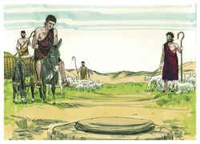

2	E olhou, e eis um poço no campo, e eis três rebanhos de ovelhas que estavam deitados junto a ele; porque daquele poço davam de beber aos rebanhos; e havia uma grande pedra sobre a boca do poço.

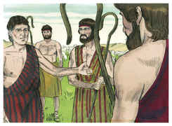

3	E ajuntavam ali todos os rebanhos, e removiam a pedra de sobre a boca do poço, e davam de beber às ovelhas; e tornavam a pôr a pedra sobre a boca do poço, no seu lugar.

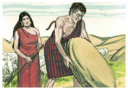

4	E disse-lhes Jacó: Meus irmãos, donde sois? E disseram: Somos de Harã.

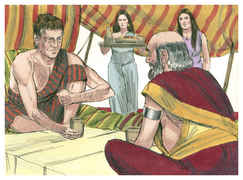

5	E ele lhes disse: Conheceis a Labão, filho de Naor? E disseram: Conhecemos.

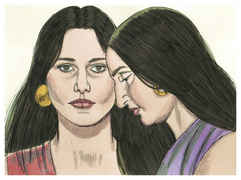

6	Disse-lhes mais: Está ele bem? E disseram: Está bem, e eis aqui Raquel sua filha, que vem com as ovelhas.

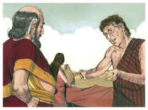

7	E ele disse: Eis que ainda é pleno dia, não é tempo de ajuntar o gado; dai de beber às ovelhas, e ide apascentá-las.

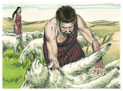

8	E disseram: Não podemos, até que todos os rebanhos se ajuntem, e removam a pedra de sobre a boca do poço, para que demos de beber às ovelhas.

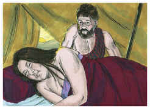

9	Estando ele ainda falando com eles, veio Raquel com as ovelhas de seu pai; porque ela era pastora.

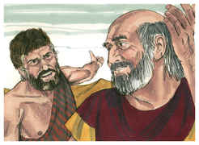

10	E aconteceu que, vendo Jacó a Raquel, filha de Labão, irmão de sua mãe, e as ovelhas de Labão, irmão de sua mãe, chegou Jacó, e revolveu a pedra de sobre a boca do poço e deu de beber às ovelhas de Labão, irmão de sua mãe.

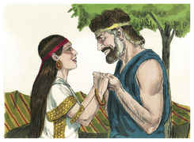

11	E Jacó beijou a Raquel, e levantou a sua voz e chorou.

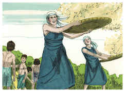

12	E Jacó anunciou a Raquel que era irmão de seu pai, e que era filho de Rebeca; então ela correu, e o anunciou a seu pai.

13	E aconteceu que, ouvindo Labão as novas de Jacó, filho de sua irmã, correu-lhe ao encontro, e abraçou-o, e beijou-o, e levou-o à sua casa; e ele contou a Labão todas estas coisas.

14	Então Labão disse-lhe: Verdadeiramente és tu o meu osso e a minha carne. E ficou com ele um mês inteiro.

15	Depois disse Labão a Jacó: Porque tu és meu irmão, hás de servir-me de graça? Declara-me qual será o teu salário.

16	E Labão tinha duas filhas; o nome da mais velha era Lia, e o nome da menor Raquel.

17	Lia tinha olhos tenros, mas Raquel era de formoso semblante e formosa à vista.

18	E Jacó amava a Raquel, e disse: Sete anos te servirei por Raquel, tua filha menor.

19	Então disse Labão: Melhor é que eu a dê a ti, do que eu a dê a outro homem; fica comigo.

20	Assim serviu Jacó sete anos por Raquel; e estes lhe pareceram como poucos dias, pelo muito que a amava.

21	E disse Jacó a Labão: Dá-me minha mulher, porque meus dias são cumpridos, para que eu me case com ela.

22	Então reuniu Labão a todos os homens daquele lugar, e fez um banquete.

23	E aconteceu, à tarde, que tomou Lia, sua filha, e trouxe-a a Jacó que a possuiu.

24	E Labão deu sua serva Zilpa a Lia, sua filha, por serva.

25	E aconteceu que pela manhã, viu que era Lia; pelo que disse a Labão: Por que me fizeste isso? Não te tenho servido por Raquel? Por que então me enganaste?

26	E disse Labão: Não se faz assim no nosso lugar, que a menor se dê antes da primogênita.

27	Cumpre a semana desta; então te daremos também a outra, pelo serviço que ainda outros sete anos comigo servires.

28	E Jacó fez assim, e cumpriu a semana de Lia; então lhe deu por mulher Raquel sua filha.

29	E Labão deu sua serva Bila por serva a Raquel, sua filha.

30	E possuiu também a Raquel, e amou também a Raquel mais do que a Lia e serviu com ele ainda outros sete anos.

31	Vendo, pois, o Senhor que Lia era desprezada, abriu a sua madre; porém Raquel era estéril.

32	E concebeu Lia, e deu à luz um filho, e chamou-o Rúben; pois disse: Porque o Senhor atendeu à minha aflição, por isso agora me amará o meu marido.

33	E concebeu outra vez, e deu à luz um filho, dizendo: Porquanto o Senhor ouviu que eu era desprezada, e deu-me também este. E chamou-o Simeão.

34	E concebeu outra vez, e deu à luz um filho, dizendo: Agora esta vez se unirá meu marido a mim, porque três filhos lhe tenho dado. Por isso chamou-o Levi.

35	E concebeu outra vez e deu à luz um filho, dizendo: Esta vez louvarei ao Senhor. Por isso chamou-o Judá; e cessou de dar à luz.

