# Gênesis Capítulo 3

1	ORA, a serpente era mais astuta que todas as alimárias do campo que o Senhor Deus tinha feito. E esta disse à mulher: É assim que Deus disse: Não comereis de toda a árvore do jardim?

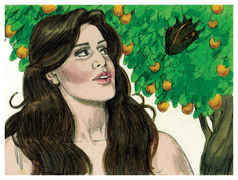

2	E disse a mulher à serpente: Do fruto das árvores do jardim comeremos,

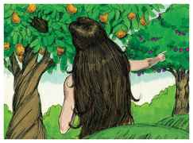

3	Mas do fruto da árvore que está no meio do jardim, disse Deus: Não comereis dele, nem nele tocareis para que não morrais.

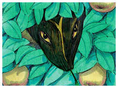

4	Então a serpente disse à mulher: Certamente não morrereis.

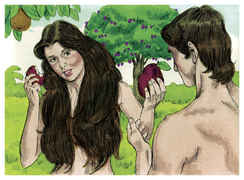

5	Porque Deus sabe que no dia em que dele comerdes se abrirão os vossos olhos, e sereis como Deus, sabendo o bem e o mal.

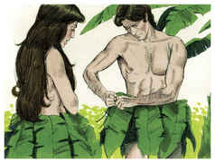

6	E viu a mulher que aquela árvore era boa para se comer, e agradável aos olhos, e árvore desejável para dar entendimento; tomou do seu fruto, e comeu, e deu também a seu marido, e ele comeu com ela.

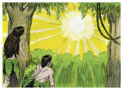

7	Então foram abertos os olhos de ambos, e conheceram que estavam nus; e coseram folhas de figueira, e fizeram para si aventais.

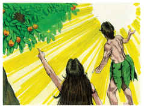

8	E ouviram a voz do Senhor Deus, que passeava no jardim pela viração do dia; e esconderam-se Adão e sua mulher da presença do Senhor Deus, entre as árvores do jardim.

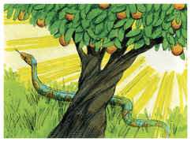

9	E chamou o Senhor Deus a Adão, e disse-lhe: Onde estás?

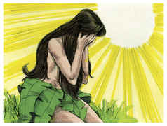

10	E ele disse: Ouvi a tua voz soar no jardim, e temi, porque estava nu, e escondi-me.

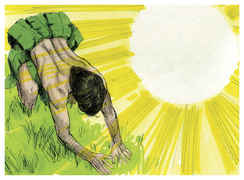

11	E Deus disse: Quem te mostrou que estavas nu? Comeste tu da árvore de que te ordenei que não comesses?

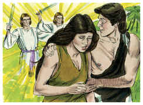

12	Então disse Adão: A mulher que me deste por companheira, ela me deu da árvore, e comi.

13	E disse o Senhor Deus à mulher: Por que fizeste isto? E disse a mulher: A serpente me enganou, e eu comi.

14	Então o Senhor Deus disse à serpente: Porquanto fizeste isto, maldita serás mais que toda a fera, e mais que todos os animais do campo; sobre o teu ventre andarás, e pó comerás todos os dias da tua vida.

15	E porei inimizade entre ti e a mulher, e entre a tua semente e a sua semente; esta te ferirá a cabeça, e tu lhe ferirás o calcanhar.

16	E à mulher disse: Multiplicarei grandemente a tua dor, e a tua conceição; com dor darás à luz filhos; e o teu desejo será para o teu marido, e ele te dominará.

17	E a Adão disse: Porquanto deste ouvidos à voz de tua mulher, e comeste da árvore de que te ordenei, dizendo: Não comerás dela, maldita é a terra por causa de ti; com dor comerás dela todos os dias da tua vida.

18	Espinhos, e cardos também, te produzirá; e comerás a erva do campo.

19	No suor do teu rosto comerás o teu pão, até que te tornes à terra; porque dela foste tomado; porquanto és pó e em pó te tornarás.

20	E chamou Adão o nome de sua mulher Eva; porquanto era a mãe de todos os viventes.

21	E fez o Senhor Deus a Adão e à sua mulher túnicas de peles, e os vestiu.

22	Então disse o Senhor Deus: Eis que o homem é como um de nós, sabendo o bem e o mal; ora, para que não estenda a sua mão, e tome também da árvore da vida, e coma e viva eternamente,

23	O Senhor Deus, pois, o lançou fora do jardim do Éden, para lavrar a terra de que fora tomado.

24	E havendo lançado fora o homem, pôs querubins ao oriente do jardim do Éden, e uma espada inflamada que andava ao redor, para guardar o caminho da árvore da vida.

