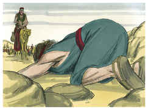
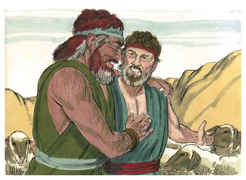
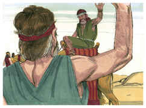

# Gênesis Capítulo 33

1	E LEVANTOU Jacó os seus olhos, e olhou, e eis que vinha Esaú, e quatrocentos homens com ele. Então repartiu os filhos entre Lia, e Raquel, e as duas servas.

2	E pôs as servas e seus filhos na frente, e a Lia e seus filhos atrás; porém a Raquel e José os derradeiros.

3	E ele mesmo passou adiante deles e inclinou-se à terra sete vezes, até que chegou a seu irmão.

4	Então Esaú correu-lhe ao encontro, e abraçou-o, e lançou-se sobre o seu pescoço, e beijou-o; e choraram.

5	Depois levantou os seus olhos, e viu as mulheres, e os meninos, e disse: Quem são estes contigo? E ele disse: Os filhos que Deus graciosamente tem dado a teu servo.

6	Então chegaram as servas; elas e os seus filhos, e inclinaram-se.

7	E chegou também Lia com seus filhos, e inclinaram-se; e depois chegou José e Raquel e inclinaram-se.

8	E disse Esaú: De que te serve todo este bando que tenho encontrado? E ele disse: Para achar graça aos olhos de meu senhor.

9	Mas Esaú disse: Eu tenho bastante, meu irmão; seja para ti o que tens.

10	Então disse Jacó: Não, se agora tenho achado graça em teus olhos, peço-te que tomes o meu presente da minha mão; porquanto tenho visto o teu rosto, como se tivesse visto o rosto de Deus, e tomaste contentamento em mim.

11	Toma, peço-te, a minha bênção, que te foi trazida; porque Deus graciosamente ma tem dado; e porque tenho de tudo. E instou com ele, até que a tomou.

12	E disse: Caminhemos, e andemos, e eu partirei adiante de ti.

13	Porém ele lhe disse: Meu senhor sabe que estes filhos são tenros, e que tenho comigo ovelhas e vacas de leite; se as afadigarem somente um dia, todo o rebanho morrerá.

14	Ora passe o meu senhor adiante de seu servo; e eu irei como guia pouco a pouco, conforme ao passo do gado que vai adiante de mim, e conforme ao passo dos meninos, até que chegue a meu senhor em Seir.

15	E Esaú disse: Permite então que eu deixe contigo alguns da minha gente. E ele disse: Para que é isso? Basta que ache graça aos olhos de meu senhor.

16	Assim voltou Esaú aquele dia pelo seu caminho a Seir.

17	Jacó, porém, partiu para Sucote e edificou para si uma casa; e fez cabanas para o seu gado; por isso chamou aquele lugar Sucote.

18	E chegou Jacó salvo à Salém, cidade de Siquém, que está na terra de Canaã, quando vinha de Padã-Arã; e armou a sua tenda diante da cidade.

19	E comprou uma parte do campo em que estendera a sua tenda, da mão dos filhos de Hamor, pai de Siquém, por cem peças de dinheiro.

20	E levantou ali um altar, e chamou-lhe: Deus, o Deus de Israel.

