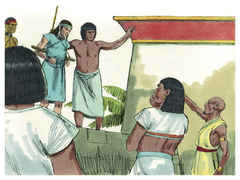
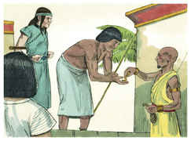
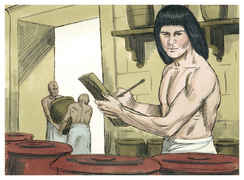
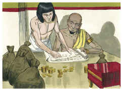
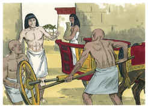
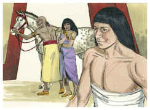
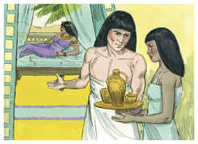
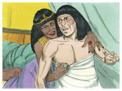
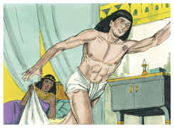
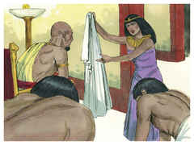

# Gênesis Capítulo 39

1	E JOSÉ foi levado ao Egito, e Potifar, oficial de Faraó, capitão da guarda, homem egípcio, comprou-o da mão dos ismaelitas que o tinham levado lá.

2	E o Senhor estava com José, e foi homem próspero; e estava na casa de seu senhor egípcio.

3	Vendo, pois, o seu senhor que o Senhor estava com ele, e tudo o que fazia o Senhor prosperava em sua mão,

4	José achou graça em seus olhos, e servia-o; e ele o pôs sobre a sua casa, e entregou na sua mão tudo o que tinha.

5	E aconteceu que, desde que o pusera sobre a sua casa e sobre tudo o que tinha, o Senhor abençoou a casa do egípcio por amor de José; e a bênção do Senhor foi sobre tudo o que tinha, na casa e no campo.

6	E deixou tudo o que tinha na mão de José, de maneira que nada sabia do que estava com ele, a não ser do pão que comia. E José era formoso de porte, e de semblante.

7	E aconteceu depois destas coisas que a mulher do seu senhor pôs os seus olhos em José, e disse: Deita-te comigo.

8	Porém ele recusou, e disse à mulher do seu senhor: Eis que o meu senhor não sabe do que há em casa comigo, e entregou em minha mão tudo o que tem;

9	Ninguém há maior do que eu nesta casa, e nenhuma coisa me vedou, senão a ti, porquanto tu és sua mulher; como pois faria eu tamanha maldade, e pecaria contra Deus?

10	E aconteceu que, falando ela cada dia a José, e não lhe dando ele ouvidos, para deitar-se com ela, e estar com ela,

11	Sucedeu num certo dia que ele veio à casa para fazer seu serviço; e nenhum dos da casa estava ali;

12	E ela lhe pegou pela sua roupa, dizendo: Deita-te comigo. E ele deixou a sua roupa na mão dela, e fugiu, e saiu para fora.

13	E aconteceu que, vendo ela que deixara a sua roupa em sua mão, e fugira para fora,

14	Chamou aos homens de sua casa, e falou-lhes, dizendo: Vede, meu marido trouxe-nos um homem hebreu para escarnecer de nós; veio a mim para deitar-se comigo, e eu gritei com grande voz;

15	E aconteceu que, ouvindo ele que eu levantava a minha voz e gritava, deixou a sua roupa comigo, e fugiu, e saiu para fora.

16	E ela pôs a sua roupa perto de si, até que o seu senhor voltou à sua casa.

17	Então falou-lhe conforme as mesmas palavras, dizendo: Veio a mim o servo hebreu, que nos trouxeste, para escarnecer de mim;

18	E aconteceu que, levantando eu a minha voz e gritando, ele deixou a sua roupa comigo, e fugiu para fora.

19	E aconteceu que, ouvindo o seu senhor as palavras de sua mulher, que lhe falava, dizendo: Conforme a estas mesmas palavras me fez teu servo, a sua ira se acendeu.

20	E o senhor de José o tomou, e o entregou na casa do cárcere, no lugar onde os presos do rei estavam encarcerados; assim esteve ali na casa do cárcere.

21	O Senhor, porém, estava com José, e estendeu sobre ele a sua benignidade, e deu-lhe graça aos olhos do carcereiro-mor.

22	E o carcereiro-mor entregou na mão de José todos os presos que estavam na casa do cárcere, e ele ordenava tudo o que se fazia ali.

23	E o carcereiro-mor não teve cuidado de nenhuma coisa que estava na mão dele, porquanto o Senhor estava com ele, e tudo o que fazia o Senhor prosperava.

