# Gênesis Capítulo 4

1	E CONHECEU Adão a Eva, sua mulher, e ela concebeu e deu à luz a Caim, e disse: Alcancei do Senhor um homem.

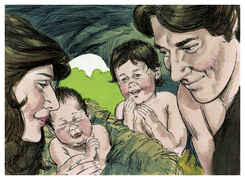

2	E deu à luz mais a seu irmão Abel; e Abel foi pastor de ovelhas, e Caim foi lavrador da terra.

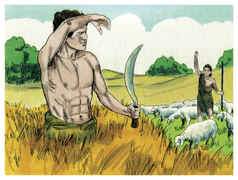

3	E aconteceu ao cabo de dias que Caim trouxe do fruto da terra uma oferta ao Senhor.

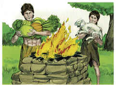

4	E Abel também trouxe dos primogênitos das suas ovelhas, e da sua gordura; e atentou o Senhor para Abel e para a sua oferta.

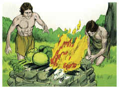

5	Mas para Caim e para a sua oferta não atentou. E irou-se Caim fortemente, e descaiu-lhe o semblante.

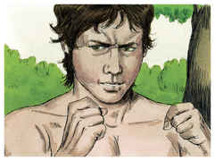

6	E o Senhor disse a Caim: Por que te iraste? E por que descaiu o teu semblante?

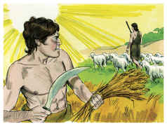

7	Se bem fizeres, não é certo que serás aceito? E se não fizeres bem, o pecado jaz à porta, e sobre ti será o seu desejo, mas sobre ele deves dominar.

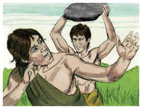

8	E falou Caim com o seu irmão Abel; e sucedeu que, estando eles no campo, se levantou Caim contra o seu irmão Abel, e o matou.

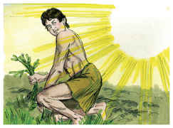

9	E disse o Senhor a Caim: Onde está Abel, teu irmão? E ele disse: Não sei; sou eu guardador do meu irmão?

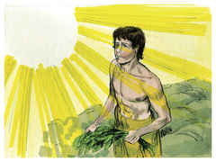

10	E disse Deus: Que fizeste? A voz do sangue do teu irmão clama a mim desde a terra.

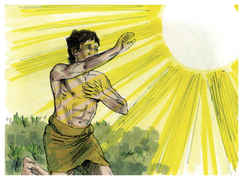

11	E agora maldito és tu desde a terra, que abriu a sua boca para receber da tua mão o sangue do teu irmão.

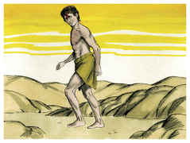

12	Quando lavrares a terra, não te dará mais a sua força; fugitivo e vagabundo serás na terra.

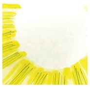

13	Então disse Caim ao Senhor: É maior a minha maldade que a que possa ser perdoada.

14	Eis que hoje me lanças da face da terra, e da tua face me esconderei; e serei fugitivo e vagabundo na terra, e será que todo aquele que me achar, me matará.

15	O Senhor, porém, disse-lhe: Portanto qualquer que matar a Caim, sete vezes será castigado. E pôs o Senhor um sinal em Caim, para que o não ferisse qualquer que o achasse.

16	E saiu Caim de diante da face do Senhor, e habitou na terra de Node, do lado oriental do Éden.

17	E conheceu Caim a sua mulher, e ela concebeu, e deu à luz a Enoque; e ele edificou uma cidade, e chamou o nome da cidade conforme o nome de seu filho Enoque;

18	E a Enoque nasceu Irade, e Irade gerou a Meujael, e Meujael gerou a Metusael e Metusael gerou a Lameque.

19	E tomou Lameque para si duas mulheres; o nome de uma era Ada, e o nome da outra, Zilá.

20	E Ada deu à luz a Jabal; este foi o pai dos que habitam em tendas e têm gado.

21	E o nome do seu irmão era Jubal; este foi o pai de todos os que tocam harpa e órgão.

22	E Zilá também deu à luz a Tubalcaim, mestre de toda a obra de cobre e ferro; e a irmã de Tubalcaim foi Noema.

23	E disse Lameque a suas mulheres Ada e Zilá: Ouvi a minha voz; vós, mulheres de Lameque, escutai as minhas palavras; porque eu matei um homem por me ferir, e um jovem por me pisar.

24	Porque sete vezes Caim será castigado; mas Lameque setenta vezes sete.

25	E tornou Adão a conhecer a sua mulher; e ela deu à luz um filho, e chamou o seu nome Sete; porque, disse ela, Deus me deu outro filho em lugar de Abel; porquanto Caim o matou.

26	E a Sete também nasceu um filho; e chamou o seu nome Enos; então se começou a invocar o nome do Senhor.

