# Gênesis Capítulo 41

1	E ACONTECEU que, ao fim de dois anos inteiros, Faraó sonhou, e eis que estava em pé junto ao rio.

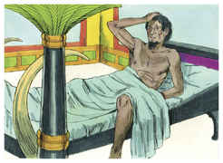

2	E eis que subiam do rio sete vacas, formosas à vista e gordas de carne, e pastavam no prado.

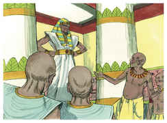

3	E eis que subiam do rio após elas outras sete vacas, feias à vista e magras de carne; e paravam junto às outras vacas na praia do rio.

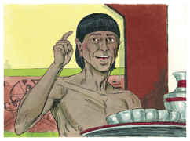

4	E as vacas feias à vista e magras de carne, comiam as sete vacas formosas à vista e gordas. Então acordou Faraó.

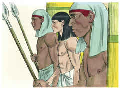

5	Depois dormiu e sonhou outra vez, e eis que brotavam de um mesmo pé sete espigas cheias e boas.

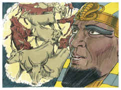

6	E eis que sete espigas miúdas, e queimadas do vento oriental, brotavam após elas.

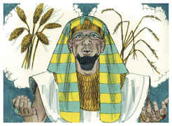

7	E as espigas miúdas devoravam as sete espigas grandes e cheias. Então acordou Faraó, e eis que era um sonho.

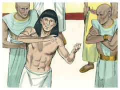

8	E aconteceu que pela manhã o seu espírito perturbou-se, e enviou e chamou todos os adivinhadores do Egito, e todos os seus sábios; e Faraó contou-lhes os seus sonhos, mas ninguém havia que lhos interpretasse.

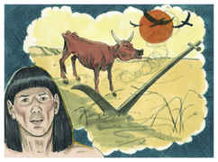

9	Então falou o copeiro-mor a Faraó, dizendo: Das minhas ofensas me lembro hoje:

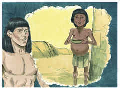

10	Estando Faraó muito indignado contra os seus servos, e pondo-me sob prisão na casa do capitão da guarda, a mim e ao padeiro-mor,

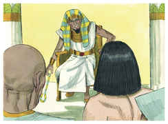

11	Então tivemos um sonho na mesma noite, eu e ele; sonhamos, cada um conforme a interpretação do seu sonho.

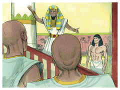

12	E estava ali conosco um jovem hebreu, servo do capitão da guarda, e contamos-lhe os nossos sonhos e ele no-los interpretou, a cada um conforme o seu sonho.

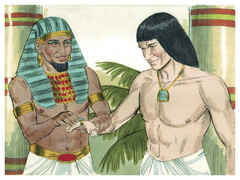

13	E como ele nos interpretou, assim aconteceu; a mim me foi restituído o meu cargo, e ele foi enforcado.

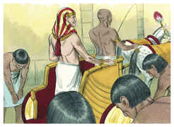

14	Então mandou Faraó chamar a José, e o fizeram sair logo do cárcere; e barbeou-se e mudou as suas roupas e apresentou-se a Faraó.

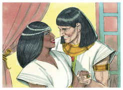

15	E Faraó disse a José: Eu tive um sonho, e ninguém há que o interprete; mas de ti ouvi dizer que quando ouves um sonho o interpretas.

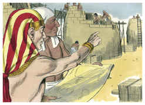

16	E respondeu José a Faraó, dizendo: Isso não está em mim; Deus dará resposta de paz a Faraó.

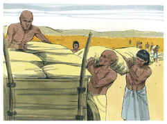

17	Então disse Faraó a José: Eis que em meu sonho estava eu em pé na margem do rio,

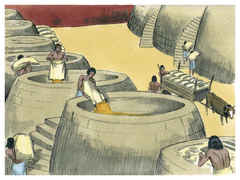

18	E eis que subiam do rio sete vacas gordas de carne e formosas à vista, e pastavam no prado.

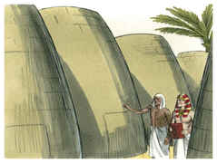

19	E eis que outras sete vacas subiam após estas, muito feias à vista e magras de carne; não tenho visto outras tais, quanto à fealdade, em toda a terra do Egito.

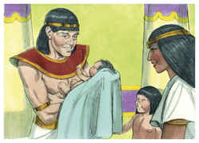

20	E as vacas magras e feias comiam as primeiras sete vacas gordas;

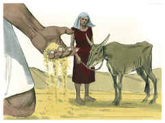

21	E entravam em suas entranhas, mas não se conhecia que houvessem entrado; porque o seu parecer era feio como no princípio. Então acordei.

22	Depois vi em meu sonho, e eis que de um mesmo pé subiam sete espigas cheias e boas;

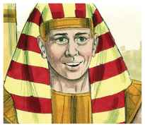

23	E eis que sete espigas secas, miúdas e queimadas do vento oriental, brotavam após elas.

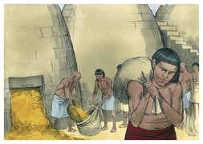

24	E as sete espigas miúdas devoravam as sete espigas boas. E eu contei isso aos magos, mas ninguém houve que mo interpretasse.

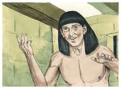

25	Então disse José a Faraó: O sonho de Faraó é um só; o que Deus há de fazer, mostrou-o a Faraó.

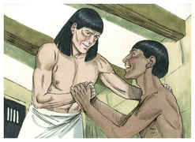

26	As sete vacas formosas são sete anos, as sete espigas formosas também são sete anos, o sonho é um só.

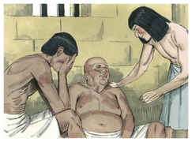

27	E as sete vacas feias à vista e magras, que subiam depois delas, são sete anos, e as sete espigas miúdas e queimadas do vento oriental, serão sete anos de fome.

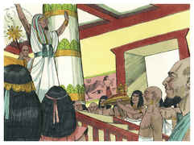

28	Esta é a palavra que tenho dito a Faraó; o que Deus há de fazer, mostrou-o a Faraó.

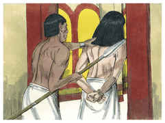

29	E eis que vêm sete anos, e haverá grande fartura em toda a terra do Egito.

30	E depois deles levantar-se-ão sete anos de fome, e toda aquela fartura será esquecida na terra do Egito, e a fome consumirá a terra;

31	E não será conhecida a abundância na terra, por causa daquela fome que haverá depois; porquanto será gravíssima.

32	E que o sonho foi repetido duas vezes a Faraó, é porque esta coisa é determinada por Deus, e Deus se apressa em fazê-la.

33	Portanto, Faraó previna-se agora de um homem entendido e sábio, e o ponha sobre a terra do Egito.

34	Faça isso Faraó e ponha governadores sobre a terra, e tome a quinta parte da terra do Egito nos sete anos de fartura,

35	E ajuntem toda a comida destes bons anos, que vêm, e amontoem o trigo debaixo da mão de Faraó, para mantimento nas cidades, e o guardem.

36	Assim será o mantimento para provimento da terra, para os sete anos de fome, que haverá na terra do Egito; para que a terra não pereça de fome.

37	E esta palavra foi boa aos olhos de Faraó, e aos olhos de todos os seus servos.

38	E disse Faraó a seus servos: Acharíamos um homem como este em quem haja o espírito de Deus?

39	Depois disse Faraó a José: Pois que Deus te fez saber tudo isto, ninguém há tão entendido e sábio como tu.

40	Tu estarás sobre a minha casa, e por tua boca se governará todo o meu povo, somente no trono eu serei maior que tu.

41	Disse mais Faraó a José: Vês aqui te tenho posto sobre toda a terra do Egito.

42	E tirou Faraó o anel da sua mão, e o pôs na mão de José, e o fez vestir de roupas de linho fino, e pôs um colar de ouro no seu pescoço.

43	E o fez subir no segundo carro que tinha, e clamavam diante dele: Ajoelhai. Assim o pôs sobre toda a terra do Egito.

44	E disse Faraó a José: Eu sou Faraó; porém sem ti ninguém levantará a sua mão ou o seu pé em toda a terra do Egito.

45	E Faraó chamou a José de Zafenate-Panéia, e deu-lhe por mulher a Azenate, filha de Potífera, sacerdote de Om; e saiu José por toda a terra do Egito.

46	E José era da idade de trinta anos quando se apresentou a Faraó, rei do Egito. E saiu José da presença de Faraó e passou por toda a terra do Egito.

47	E nos sete anos de fartura a terra produziu abundantemente.

48	E ele ajuntou todo o mantimento dos sete anos, que houve na terra do Egito; e guardou o mantimento nas cidades, pondo nas mesmas o mantimento do campo que estava ao redor de cada cidade.

49	Assim ajuntou José muitíssimo trigo, como a areia do mar, até que cessou de contar; porquanto não havia numeração.

50	E nasceram a José dois filhos (antes que viesse um ano de fome), que lhe deu Azenate, filha de Potífera, sacerdote de Om.

51	E chamou José ao primogênito Manassés, porque disse: Deus me fez esquecer de todo o meu trabalho, e de toda a casa de meu pai.

52	E ao segundo chamou Efraim; porque disse: Deus me fez crescer na terra da minha aflição.

53	Então acabaram-se os sete anos de fartura que havia na terra do Egito.

54	E começaram a vir os sete anos de fome, como José tinha dito; e havia fome em todas as terras, mas em toda a terra do Egito havia pão.

55	E tendo toda a terra do Egito fome, clamou o povo a Faraó por pão; e Faraó disse a todos os egípcios: Ide a José; o que ele vos disser, fazei.

56	Havendo, pois, fome sobre toda a terra, abriu José tudo em que havia mantimento, e vendeu aos egípcios; porque a fome prevaleceu na terra do Egito.

57	E de todas as terras vinham ao Egito, para comprar de José; porquanto a fome prevaleceu em todas as terras.

