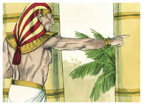

# Gênesis Capítulo 42

## 1
VENDO então Jacó que havia mantimento no Egito, disse a seus filhos: Por que estais olhando uns para os outros?

## 2
Disse mais: Eis que tenho ouvido que há mantimentos no Egito; descei para lá, e comprai-nos dali, para que vivamos e não morramos.

## 3
Então desceram os dez irmãos de José, para comprarem trigo no Egito.

## 4
A Benjamim, porém, irmão de José, não enviou Jacó com os seus irmãos, porque dizia: Para que lhe não suceda, porventura, algum desastre.

## 5
Assim, entre os que iam lá foram os filhos de Israel para comprar, porque havia fome na terra de Canaã.

## 6
José, pois, era o governador daquela terra; ele vendia a todo o povo da terra; e os irmãos de José chegaram e inclinaram-se a ele, com o rosto em terra.

## 7
E José, vendo os seus irmãos, conheceu-os; porém mostrou-se estranho para com eles, e falou-lhes asperamente, e disse-lhes: De onde vindes? E eles disseram: Da terra de Canaã, para comprarmos mantimento.

## 8
José, pois, conheceu os seus irmãos; mas eles não o conheceram.

## 9
Então José lembrou-se dos sonhos que havia tido deles e disse-lhes: Vós sois espias, e viestes para ver a nudez da terra.

## 10
E eles lhe disseram: Não, senhor meu; mas teus servos vieram comprar mantimento.

## 11
Todos nós somos filhos de um mesmo homem; somos homens de retidão; os teus servos não são espias.

## 12
E ele lhes disse: Não; antes viestes para ver a nudez da terra.

## 13
E eles disseram: Nós, teus servos, somos doze irmãos, filhos de um homem na terra de Canaã; e eis que o mais novo está com nosso pai hoje; mas um já não existe.

## 14
Então lhes disse José: Isso é o que vos tenho dito, sois espias;

## 15
Nisto sereis provados; pela vida de Faraó, não saireis daqui senão quando vosso irmão mais novo vier aqui.

## 16
Enviai um dentre vós, que traga vosso irmão, mas vós ficareis presos, e vossas palavras sejam provadas, se há verdade convosco; e se não, pela vida de Faraó, vós sois espias.

## 17
E pô-los juntos, em prisão, três dias.

## 18
E ao terceiro dia disse-lhes José: Fazei isso, e vivereis; porque eu temo a Deus.

## 19
Se sois homens de retidão, que fique um de vossos irmãos preso na casa de vossa prisão; e vós ide, levai mantimento para a fome de vossa casa,

## 20
E trazei-me o vosso irmão mais novo, e serão verificadas vossas palavras, e não morrereis. E eles assim fizeram.

## 21
Então disseram uns aos outros: Na verdade, somos culpados acerca de nosso irmão, pois vimos a angústia da sua alma, quando nos rogava; nós porém não ouvimos, por isso vem sobre nós esta angústia.

## 22
E Rúben respondeu-lhes, dizendo: Não vo-lo dizia eu: Não pequeis contra o menino; mas não ouvistes; e vedes aqui, o seu sangue também é requerido.

## 23
E eles não sabiam que José os entendia, porque havia intérprete entre eles.

## 24
E retirou-se deles e chorou. Depois tornou a eles, e falou-lhes, e tomou a Simeão dentre eles, e amarrou-o perante os seus olhos.

## 25
E ordenou José, que enchessem os seus sacos de trigo, e que lhes restituíssem o seu dinheiro a cada um no seu saco, e lhes dessem comida para o caminho; e fizeram-lhes assim.

## 26
E carregaram o seu trigo sobre os seus jumentos e partiram dali.

## 27
E, abrindo um deles o seu saco, para dar pasto ao seu jumento na estalagem, viu o seu dinheiro; porque eis que estava na boca do seu saco.

## 28
E disse a seus irmãos: Devolveram o meu dinheiro, e ei-lo também aqui no saco. Então lhes desfaleceu o coração, e pasmavam, dizendo um ao outro: Que é isto que Deus nos tem feito?

## 29
E vieram para Jacó, seu pai, na terra de Canaã; e contaram-lhe tudo o que lhes aconteceu, dizendo:

## 30
O homem, o senhor da terra, falou conosco asperamente, e tratou-nos como espias da terra;

## 31
Mas dissemos-lhe: Somos homens de retidão; não somos espias;

## 32
Somos doze irmãos, filhos de nosso pai; um não mais existe, e o mais novo está hoje com nosso pai na terra de Canaã.

## 33
E aquele homem, o senhor da terra, nos disse: Nisto conhecerei que vós sois homens de retidão; deixai comigo um de vossos irmãos, e tomai para a fome de vossas casas, e parti,

## 34
E trazei-me vosso irmão mais novo; assim saberei que não sois espias, mas homens de retidão; então vos darei o vosso irmão e negociareis na terra.

## 35
E aconteceu que, despejando eles os seus sacos, eis que cada um tinha o pacote com seu dinheiro no seu saco; e viram os pacotes com seu dinheiro, eles e seu pai, e temeram.

## 36
Então Jacó, seu pai, disse-lhes: Tendes-me desfilhado; José já não existe e Simeão não está aqui; agora levareis a Benjamim. Todas estas coisas vieram sobre mim.

## 37
Mas Rúben falou a seu pai, dizendo: Mata os meus dois filhos, se eu não tornar a trazê-lo para ti; entrega-o em minha mão, e tornarei a trazê-lo.

## 38
Ele porém disse: Não descerá meu filho convosco; porquanto o seu irmão é morto, e só ele ficou. Se lhe suceder algum desastre no caminho por onde fordes, fareis descer minhas cãs com tristeza à sepultura.

