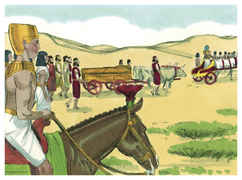

# Gênesis Capítulo 50

1	ENTÃO José se lançou sobre o rosto de seu pai e chorou sobre ele, e o beijou.

2	E José ordenou aos seus servos, os médicos, que embalsamassem a seu pai; e os médicos embalsamaram a Israel.

3	E cumpriram-se-lhe quarenta dias; porque assim se cumprem os dias daqueles que se embalsamam; e os egípcios o choraram setenta dias.

4	Passados, pois, os dias de seu choro, falou José à casa de Faraó, dizendo: Se agora tenho achado graça aos vossos olhos, rogo-vos que faleis aos ouvidos de Faraó, dizendo:

5	Meu pai me fez jurar, dizendo: Eis que eu morro; em meu sepulcro, que cavei para mim na terra de Canaã, ali me sepultarás. Agora, pois, te peço, que eu suba, para que sepulte a meu pai; então voltarei.

6	E Faraó disse: Sobe, e sepulta a teu pai como ele te fez jurar.

7	E José subiu para sepultar a seu pai; e subiram com ele todos os servos de Faraó, os anciãos da sua casa, e todos os anciãos da terra do Egito.

8	Como também toda a casa de José, e seus irmãos, e a casa de seu pai; somente deixaram na terra de Gósen os seus meninos, e as suas ovelhas e as suas vacas.

9	E subiram também com ele, tanto carros como gente a cavalo; e o cortejo foi grandíssimo.

10	Chegando eles, pois, à eira de Atade, que está além do Jordão, fizeram um grande e dolorido pranto; e fez a seu pai uma grande lamentação por sete dias.

11	E vendo os moradores da terra, os cananeus, o luto na eira de Atade, disseram: É este o pranto grande dos egípcios. Por isso chamou-se-lhe Abel-Mizraim, que está além do Jordão.

12	E fizeram-lhe os seus filhos assim como ele lhes ordenara.

13	Pois os seus filhos o levaram à terra de Canaã, e o sepultaram na cova do campo de Macpela, que Abraão tinha comprado com o campo, por herança de sepultura de Efrom, o heteu, em frente de Manre.

14	Depois de haver sepultado seu pai, voltou José para o Egito, ele e seus irmãos, e todos os que com ele subiram a sepultar seu pai.

15	Vendo então os irmãos de José que seu pai já estava morto, disseram: Porventura nos odiará José e certamente nos retribuirá todo o mal que lhe fizemos.

16	Portanto mandaram dizer a José: Teu pai ordenou, antes da sua morte, dizendo:

17	Assim direis a José: Perdoa, rogo-te, a transgressão de teus irmãos, e o seu pecado, porque te fizeram mal; agora, pois, rogamos-te que perdoes a transgressão dos servos do Deus de teu pai. E José chorou quando eles lhe falavam.

18	Depois vieram também seus irmãos, e prostraram-se diante dele, e disseram: Eis-nos aqui por teus servos.

19	E José lhes disse: Não temais; porventura estou eu em lugar de Deus?

20	Vós bem intentastes mal contra mim; porém Deus o intentou para bem, para fazer como se vê neste dia, para conservar muita gente com vida.

21	Agora, pois, não temais; eu vos sustentarei a vós e a vossos filhos. Assim os consolou, e falou segundo o coração deles.

22	José, pois, habitou no Egito, ele e a casa de seu pai; e viveu José cento e dez anos.

23	E viu José os filhos de Efraim, da terceira geração; também os filhos de Maquir, filho de Manassés, nasceram sobre os joelhos de José.

24	E disse José a seus irmãos: Eu morro; mas Deus certamente vos visitará, e vos fará subir desta terra à terra que jurou a Abraão, a Isaque e a Jacó.

25	E José fez jurar os filhos de Israel, dizendo: Certamente vos visitará Deus, e fareis transportar os meus ossos daqui.

26	E morreu José da idade de cento e dez anos, e o embalsamaram e o puseram num caixão no Egito.

