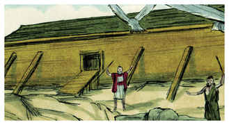
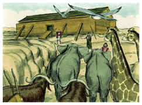
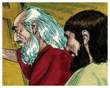
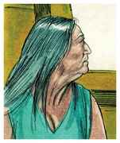
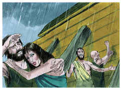
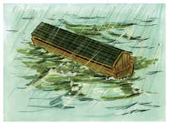
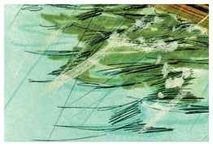

# Gênesis Capítulo 7

1	DEPOIS disse o Senhor a Noé: Entra tu e toda a tua casa na arca, porque tenho visto que és justo diante de mim nesta geração.

2	De todos os animais limpos tomarás para ti sete e sete, o macho e sua fêmea; mas dos animais que não são limpos, dois, o macho e sua fêmea.

3	Também das aves dos céus sete e sete, macho e fêmea, para conservar em vida sua espécie sobre a face de toda a terra.

4	Porque, passados ainda sete dias, farei chover sobre a terra quarenta dias e quarenta noites; e desfarei de sobre a face da terra toda a substância que fiz.

5	E fez Noé conforme a tudo o que o Senhor lhe ordenara.

6	E era Noé da idade de seiscentos anos, quando o dilúvio das águas veio sobre a terra.

7	Noé entrou na arca, e com ele seus filhos, sua mulher e as mulheres de seus filhos, por causa das águas do dilúvio.

8	Dos animais limpos e dos animais que não são limpos, e das aves, e de todo o réptil sobre a terra,

9	Entraram de dois em dois para junto de Noé na arca, macho e fêmea, como Deus ordenara a Noé.

10	E aconteceu que passados sete dias, vieram sobre a terra as águas do dilúvio.

11	No ano seiscentos da vida de Noé, no mês segundo, aos dezessete dias do mês, naquele mesmo dia se romperam todas as fontes do grande abismo, e as janelas dos céus se abriram,

12	E houve chuva sobre a terra quarenta dias e quarenta noites.

13	E no mesmo dia entraram na arca Noé, seus filhos Sem, Cão e Jafé, sua mulher e as mulheres de seus filhos.

14	Eles, e todo o animal conforme a sua espécie, e todo o gado conforme a sua espécie, e todo o réptil que se arrasta sobre a terra conforme a sua espécie, e toda a ave conforme a sua espécie, pássaros de toda qualidade.

15	E de toda a carne, em que havia espírito de vida, entraram de dois em dois para junto de Noé na arca.

16	E os que entraram eram macho e fêmea de toda a carne, como Deus lhe tinha ordenado; e o Senhor o fechou dentro.

17	E durou o dilúvio quarenta dias sobre a terra, e cresceram as águas e levantaram a arca, e ela se elevou sobre a terra.

18	E prevaleceram as águas e cresceram grandemente sobre a terra; e a arca andava sobre as águas.

19	E as águas prevaleceram excessivamente sobre a terra; e todos os altos montes que havia debaixo de todo o céu, foram cobertos.

20	Quinze côvados acima prevaleceram as águas; e os montes foram cobertos.

21	E expirou toda a carne que se movia sobre a terra, tanto de ave como de gado e de feras, e de todo o réptil que se arrasta sobre a terra, e todo o homem.

22	Tudo o que tinha fôlego de espírito de vida em suas narinas, tudo o que havia em terra seca, morreu.

23	Assim foi destruído todo o ser vivente que havia sobre a face da terra, desde o homem até ao animal, até ao réptil, e até à ave dos céus; e foram extintos da terra; e ficou somente Noé, e os que com ele estavam na arca.

24	E prevaleceram as águas sobre a terra cento e cinqüenta dias.

