# Gênesis Capítulo 8

1	E LEMBROU-SE Deus de Noé, e de todos os seres viventes, e de todo o gado que estavam com ele na arca; e Deus fez passar um vento sobre a terra, e aquietaram-se as águas.

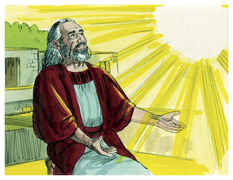

2	Cerraram-se também as fontes do abismo e as janelas dos céus, e a chuva dos céus deteve-se.

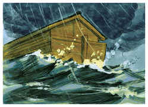

3	E as águas iam-se escoando continuamente de sobre a terra, e ao fim de cento e cinqüenta dias minguaram.

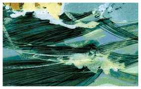

4	E a arca repousou no sétimo mês, no dia dezessete do mês, sobre os montes de Ararate.

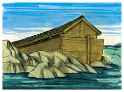

5	E foram as águas indo e minguando até ao décimo mês; no décimo mês, no primeiro dia do mês, apareceram os cumes dos montes.

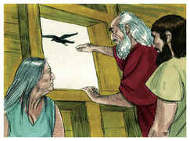

6	E aconteceu que ao cabo de quarenta dias, abriu Noé a janela da arca que tinha feito.

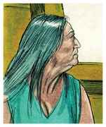

7	E soltou um corvo, que saiu, indo e voltando, até que as águas se secaram de sobre a terra.

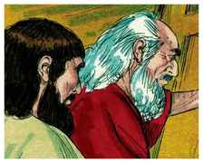

8	Depois soltou uma pomba, para ver se as águas tinham minguado de sobre a face da terra.

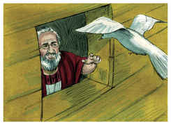

9	A pomba, porém, não achou repouso para a planta do seu pé, e voltou a ele para a arca; porque as águas estavam sobre a face de toda a terra; e ele estendeu a sua mão, e tomou-a, e recolheu-a consigo na arca.

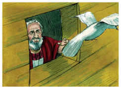

10	E esperou ainda outros sete dias, e tornou a enviar a pomba fora da arca.

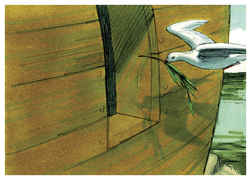

11	E a pomba voltou a ele à tarde; e eis, arrancada, uma folha de oliveira no seu bico; e conheceu Noé que as águas tinham minguado de sobre a terra.

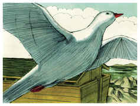

12	Então esperou ainda outros sete dias, e enviou fora a pomba; mas não tornou mais a ele.

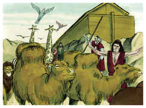

13	E aconteceu que no ano seiscentos e um, no mês primeiro, no primeiro dia do mês, as águas se secaram de sobre a terra. Então Noé tirou a cobertura da arca, e olhou, e eis que a face da terra estava enxuta.

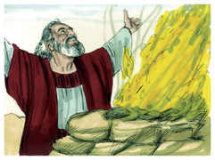

14	E no segundo mês, aos vinte e sete dias do mês, a terra estava seca.

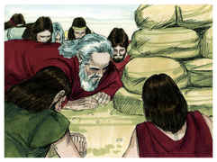

15	Então falou Deus a Noé dizendo:

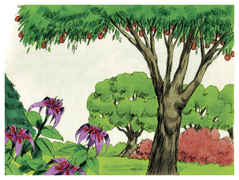

16	Sai da arca, tu com tua mulher, e teus filhos e as mulheres de teus filhos.

17	Todo o animal que está contigo, de toda a carne, de ave, e de gado, e de todo o réptil que se arrasta sobre a terra, traze fora contigo; e povoem abundantemente a terra e frutifiquem, e se multipliquem sobre a terra.

18	Então saiu Noé, e seus filhos, e sua mulher, e as mulheres de seus filhos com ele.

19	Todo o animal, todo o réptil, e toda a ave, e tudo o que se move sobre a terra, conforme as suas famílias, saiu para fora da arca.

20	E edificou Noé um altar ao Senhor; e tomou de todo o animal limpo e de toda a ave limpa, e ofereceu holocausto sobre o altar.

21	E o Senhor sentiu o suave cheiro, e o Senhor disse em seu coração: Não tornarei mais a amaldiçoar a terra por causa do homem; porque a imaginação do coração do homem é má desde a sua meninice, nem tornarei mais a ferir todo o vivente, como fiz.

22	Enquanto a terra durar, sementeira e sega, e frio e calor, e verão e inverno, e dia e noite, não cessarão.

