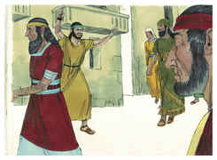
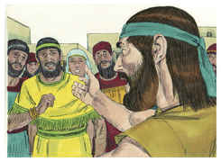
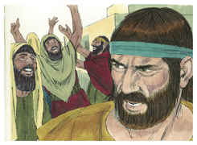

# Jonas Capítulo 3

## 1
E VEIO a palavra do Senhor segunda vez a Jonas, dizendo:

## 2
Levanta-te, e vai à grande cidade de Nínive, e prega contra ela a mensagem que eu te digo.

## 3
E levantou-se Jonas, e foi a Nínive, segundo a palavra do Senhor. Ora, Nínive era uma cidade muito grande, de três dias de caminho.

## 4
E começou Jonas a entrar pela cidade caminho de um dia, e pregava, dizendo: Ainda quarenta dias, e Nínive será subvertida.

## 5
E os homens de Nínive creram em Deus; e proclamaram um jejum, e vestiram-se de saco, desde o maior até ao menor.

## 6
Esta palavra chegou também ao rei de Nínive; e ele levantou-se do seu trono, e tirou de si as suas vestes, e cobriu-se de saco, e sentou-se sobre a cinza.

## 7
E fez uma proclamação que se divulgou em Nínive, pelo decreto do rei e dos seus grandes, dizendo: Nem homens, nem animais, nem bois, nem ovelhas provem coisa alguma, nem se lhes dê alimentos, nem bebam água;

## 8
Mas os homens e os animais sejam cobertos de sacos, e clamem fortemente a Deus, e convertam-se, cada um do seu mau caminho, e da violência que há nas suas mãos.

## 9
Quem sabe se se voltará Deus, e se arrependerá, e se apartará do furor da sua ira, de sorte que não pereçamos?

## 10
E Deus viu as obras deles, como se converteram do seu mau caminho; e Deus se arrependeu do mal que tinha anunciado lhes faria, e não o fez.

