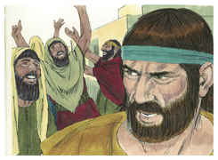
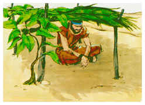
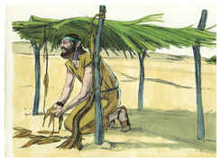
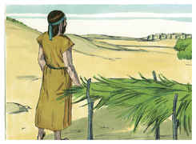

# Jonas Capítulo 4

1	MAS isso desagradou extremamente a Jonas, e ele ficou irado.

2	E orou ao Senhor, e disse: Ah! Senhor! Não foi esta minha palavra, estando ainda na minha terra? Por isso é que me preveni, fugindo para Társis, pois sabia que és Deus compassivo e misericordioso, longânimo e grande em benignidade, e que te arrependes do mal.

3	Peço-te, pois, ó Senhor, tira-me a vida, porque melhor me é morrer do que viver.

4	E disse o Senhor: Fazes bem que assim te ires?

5	Então Jonas saiu da cidade, e sentou-se ao oriente dela; e ali fez uma cabana, e sentou-se debaixo dela, à sombra, até ver o que aconteceria à cidade.

6	E fez o Senhor Deus nascer uma aboboreira, e ela subiu por cima de Jonas, para que fizesse sombra sobre a sua cabeça, a fim de o livrar do seu enfado; e Jonas se alegrou em extremo por causa da aboboreira.

7	Mas Deus enviou um verme, no dia seguinte ao subir da alva, o qual feriu a aboboreira, e esta se secou.

8	E aconteceu que, aparecendo o sol, Deus mandou um vento calmoso oriental, e o sol feriu a cabeça de Jonas; e ele desmaiou, e desejou com toda a sua alma morrer, dizendo: Melhor me é morrer do que viver.

9	Então disse Deus a Jonas: Fazes bem que assim te ires por causa da aboboreira? E ele disse: Faço bem que me revolte até à morte.

10	E disse o Senhor: Tiveste tu compaixão da aboboreira, na qual não trabalhaste, nem a fizeste crescer, que numa noite nasceu, e numa noite pereceu;

11	E não hei de eu ter compaixão da grande cidade de Nínive, em que estão mais de cento e vinte mil homens que não sabem discernir entre a sua mão direita e a sua mão esquerda, e também muitos animais?

