# Jó Capítulo 1

1	HAVIA um homem na terra de Uz, cujo nome era Jó; e era este homem íntegro, reto e temente a Deus e desviava-se do mal.

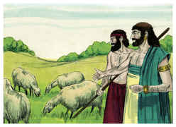

2	E nasceram-lhe sete filhos e três filhas.

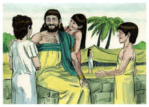

3	E o seu gado era de sete mil ovelhas, três mil camelos, quinhentas juntas de bois e quinhentas jumentas; eram também muitíssimos os servos a seu serviço, de maneira que este homem era maior do que todos os do oriente.

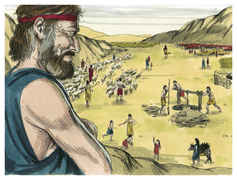

4	E iam seus filhos à casa uns dos outros e faziam banquetes cada um por sua vez; e mandavam convidar as suas três irmãs a comerem e beberem com eles.

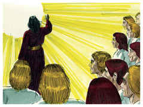

5	Sucedia, pois, que, decorrido o turno de dias de seus banquetes, enviava Jó, e os santificava, e se levantava de madrugada, e oferecia holocaustos segundo o número de todos eles; porque dizia Jó: Porventura pecaram meus filhos, e amaldiçoaram a Deus no seu coração. Assim fazia Jó continuamente.

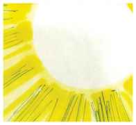

6	E num dia em que os filhos de Deus vieram apresentar-se perante o Senhor, veio também Satanás entre eles.

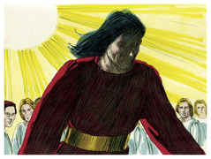

7	Então o Senhor disse a Satanás: Donde vens? E Satanás respondeu ao Senhor, e disse: De rodear a terra, e passear por ela.

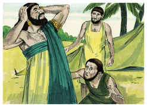

8	E disse o Senhor a Satanás: Observaste tu a meu servo Jó? Porque ninguém há na terra semelhante a ele, homem íntegro e reto, temente a Deus, e que se desvia do mal.

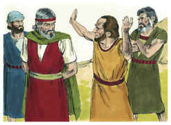

9	Então respondeu Satanás ao Senhor, e disse: Porventura teme Jó a Deus debalde?

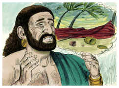

10	Porventura tu não cercaste de sebe, a ele, e a sua casa, e a tudo quanto tem? A obra de suas mãos abençoaste e o seu gado se tem aumentado na terra.

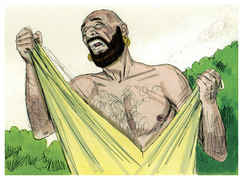

11	Mas estende a tua mão, e toca-lhe em tudo quanto tem, e verás se não blasfema contra ti na tua face.

12	E disse o Senhor a Satanás: Eis que tudo quanto ele tem está na tua mão; somente contra ele não estendas a tua mão. E Satanás saiu da presença do Senhor.

13	E sucedeu um dia, em que seus filhos e suas filhas comiam, e bebiam vinho, na casa de seu irmão primogênito,

14	Que veio um mensageiro a Jó, e lhe disse: Os bois lavravam, e as jumentas pastavam junto a eles;

15	E deram sobre eles os sabeus, e os tomaram, e aos servos feriram ao fio da espada; e só eu escapei para trazer-te a nova.

16	Estando este ainda falando, veio outro e disse: Fogo de Deus caiu do céu, e queimou as ovelhas e os servos, e os consumiu, e só eu escapei para trazer-te a nova.

17	Estando ainda este falando, veio outro, e disse: Ordenando os caldeus três tropas, deram sobre os camelos, e os tomaram, e aos servos feriram ao fio da espada; e só eu escapei para trazer-te a nova.

18	Estando ainda este falando, veio outro, e disse: Estando teus filhos e tuas filhas comendo e bebendo vinho, em casa de seu irmão primogênito,

19	Eis que um grande vento sobreveio dalém do deserto, e deu nos quatro cantos da casa, que caiu sobre os jovens, e morreram; e só eu escapei para trazer-te a nova.

20	Então Jó se levantou, e rasgou o seu manto, e rapou a sua cabeça, e se lançou em terra, e adorou.

21	E disse: Nu saí do ventre de minha mãe e nu tornarei para lá; o Senhor o deu, e o Senhor o tomou: bendito seja o nome do Senhor.

22	Em tudo isto Jó não pecou, nem atribuiu a Deus falta alguma.

# João Capítulo 1

1	NO princípio era o Verbo, e o Verbo estava com Deus, e o Verbo era Deus.

2	Ele estava no princípio com Deus.

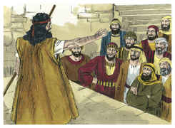

3	Todas as coisas foram feitas por ele, e sem ele nada do que foi feito se fez.

4	Nele estava a vida, e a vida era a luz dos homens.

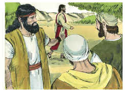

5	E a luz resplandece nas trevas, e as trevas não a compreenderam.

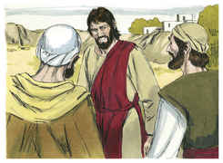

6	Houve um homem enviado de Deus, cujo nome era João.

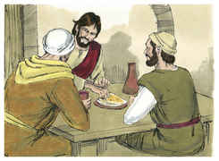

7	Este veio para testemunho, para que testificasse da luz, para que todos cressem por ele.

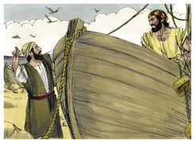

8	Não era ele a luz, mas para que testificasse da luz.

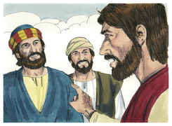

9	Ali estava a luz verdadeira, que ilumina a todo o homem que vem ao mundo.

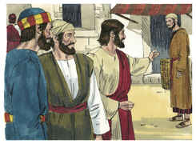

10	Estava no mundo, e o mundo foi feito por ele, e o mundo não o conheceu.

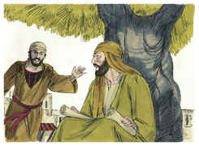

11	Veio para o que era seu, e os seus não o receberam.

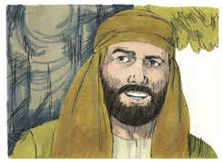

12	Mas, a todos quantos o receberam, deu-lhes o poder de serem feitos filhos de Deus, aos que crêem no seu nome;

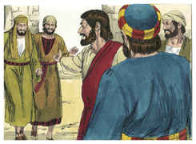

13	Os quais não nasceram do sangue, nem da vontade da carne, nem da vontade do homem, mas de Deus.

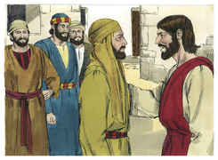

14	E o Verbo se fez carne, e habitou entre nós, e vimos a sua glória, como a glória do unigênito do Pai, cheio de graça e de verdade.

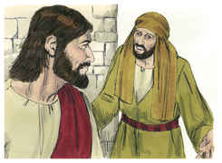

15	João testificou dele, e clamou, dizendo: Este era aquele de quem eu dizia: O que vem após mim é antes de mim, porque foi primeiro do que eu.

16	E todos nós recebemos também da sua plenitude, e graça por graça.

17	Porque a lei foi dada por Moisés; a graça e a verdade vieram por Jesus Cristo.

18	Deus nunca foi visto por alguém. O Filho unigênito, que está no seio do Pai, esse o revelou.

19	E este é o testemunho de João, quando os judeus mandaram de Jerusalém sacerdotes e levitas para que lhe perguntassem: Quem és tu?

20	E confessou, e não negou; confessou: Eu não sou o Cristo.

21	E perguntaram-lhe: Então quê? És tu Elias? E disse: Não sou. És tu profeta? E respondeu: Não.

22	Disseram-lhe pois: Quem és? para que demos resposta àqueles que nos enviaram; que dizes de ti mesmo?

23	Disse: Eu sou a voz do que clama no deserto: Endireitai o caminho do Senhor, como disse o profeta Isaías.

24	E os que tinham sido enviados eram dos fariseus.

25	E perguntaram-lhe, e disseram-lhe: Por que batizas, pois, se tu não és o Cristo, nem Elias, nem o profeta?

26	João respondeu-lhes, dizendo: Eu batizo com água; mas no meio de vós está um a quem vós não conheceis.

27	Este é aquele que vem após mim, que é antes de mim, do qual eu não sou digno de desatar a correia da alparca.

28	Estas coisas aconteceram em Betabara, do outro lado do Jordão, onde João estava batizando.

29	No dia seguinte João viu a Jesus, que vinha para ele, e disse: Eis o Cordeiro de Deus, que tira o pecado do mundo.

30	Este é aquele do qual eu disse: Após mim vem um homem que é antes de mim, porque foi primeiro do que eu.

31	E eu não o conhecia; mas, para que ele fosse manifestado a Israel, vim eu, por isso, batizando com água.

32	E João testificou, dizendo: Eu vi o Espírito descer do céu como pomba, e repousar sobre ele.

33	E eu não o conhecia, mas o que me mandou a batizar com água, esse me disse: Sobre aquele que vires descer o Espírito, e sobre ele repousar, esse é o que batiza com o Espírito Santo.

34	E eu vi, e tenho testificado que este é o Filho de Deus.

35	No dia seguinte João estava outra vez ali, e dois dos seus discípulos;

36	E, vendo passar a Jesus, disse: Eis aqui o Cordeiro de Deus.

37	E os dois discípulos ouviram-no dizer isto, e seguiram a Jesus.

38	E Jesus, voltando-se e vendo que eles o seguiam, disse-lhes: Que buscais? E eles disseram: Rabi (que, traduzido, quer dizer Mestre), onde moras?

39	Ele lhes disse: Vinde, e vede. Foram, e viram onde morava, e ficaram com ele aquele dia; e era já quase a hora décima.

40	Era André, irmão de Simão Pedro, um dos dois que ouviram aquilo de João, e o haviam seguido.

41	Este achou primeiro a seu irmão Simão, e disse-lhe: Achamos o Messias (que, traduzido, é o Cristo).

42	E levou-o a Jesus. E, olhando Jesus para ele, disse: Tu és Simão, filho de Jonas; tu serás chamado Cefas (que quer dizer Pedro).

43	No dia seguinte quis Jesus ir à Galiléia, e achou a Filipe, e disse-lhe: Segue-me.

44	E Filipe era de Betsaida, cidade de André e de Pedro.

45	Filipe achou Natanael, e disse-lhe: Havemos achado aquele de quem Moisés escreveu na lei, e os profetas: Jesus de Nazaré, filho de José.

46	Disse-lhe Natanael: Pode vir alguma coisa boa de Nazaré? Disse-lhe Filipe: Vem, e vê.

47	Jesus viu Natanael vir ter com ele, e disse dele: Eis aqui um verdadeiro israelita, em quem não há dolo.

48	Disse-lhe Natanael: De onde me conheces tu? Jesus respondeu, e disse-lhe: Antes que Filipe te chamasse, te vi eu, estando tu debaixo da figueira.

49	Natanael respondeu, e disse-lhe: Rabi, tu és o Filho de Deus; tu és o Rei de Israel.

50	Jesus respondeu, e disse-lhe: Porque te disse: Vi-te debaixo da figueira, crês? Coisas maiores do que estas verás.

51	E disse-lhe: Na verdade, na verdade vos digo que daqui em diante vereis o céu aberto, e os anjos de Deus subindo e descendo sobre o Filho do homem.

