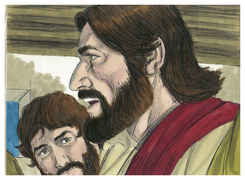
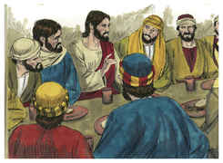

# Jó Capítulo 13

## 1
EIS que tudo isto viram os meus olhos, e os meus ouvidos o ouviram e entenderam.

## 2
Como vós o sabeis, também eu o sei; não vos sou inferior.

## 3
Mas eu falarei ao Todo-Poderoso, e quero defender-me perante Deus.

## 4
Vós, porém, sois inventores de mentiras, e vós todos médicos que não valem nada.

## 5
Quem dera que vos calásseis de todo, pois isso seria a vossa sabedoria.

## 6
Ouvi agora a minha defesa, e escutai os argumentos dos meus lábios.

## 7
Porventura por Deus falareis perversidade e por ele falareis mentiras?

## 8
Fareis acepção da sua pessoa? Contendereis por Deus?

## 9
Ser-vos-ia bom, se ele vos esquadrinhasse? Ou zombareis dele, como se zomba de algum homem?

## 10
Certamente vos repreenderá, se em oculto fizerdes acepção de pessoas.

## 11
Porventura não vos espantará a sua alteza, e não cairá sobre vós o seu terror?

## 12
As vossas memórias são como provérbios de cinza; as vossas defesas como defesas de lodo.

## 13
Calai-vos perante mim, e falarei eu, e venha sobre mim o que vier.

## 14
Por que razão tomarei eu a minha carne com os meus dentes, e porei a minha vida na minha mão?

## 15
Ainda que ele me mate, nele esperarei; contudo os meus caminhos defenderei diante dele.

## 16
Também ele será a minha salvação; porém o hipócrita não virá perante ele.

## 17
Ouvi com atenção as minhas palavras, e com os vossos ouvidos a minha declaração.

## 18
Eis que já tenho ordenado a minha causa, e sei que serei achado justo.

## 19
Quem é o que contenderá comigo? Se eu agora me calasse, renderia o espírito.

## 20
Duas coisas somente não faças para comigo; então não me esconderei do teu rosto:

## 21
Desvia a tua mão para longe, de mim, e não me espante o teu terror.

## 22
Chama, pois, e eu responderei; ou eu falarei, e tu me responderás.

## 23
Quantas culpas e pecados tenho eu? Notifica-me a minha transgressão e o meu pecado.

## 24
Por que escondes o teu rosto, e me tens por teu inimigo?

## 25
Porventura acossarás uma folha arrebatada pelo vento? E perseguirás o restolho seco?

## 26
Por que escreves contra mim coisas amargas e me fazes herdar as culpas da minha mocidade?

## 27
Também pões os meus pés no tronco, e observas todos os meus caminhos, e marcas os sinais dos meus pés.

## 28
E ele me consome como a podridão, e como a roupa, à qual rói a traça.

# João Capítulo 13

## 1
ORA, antes da festa da páscoa, sabendo Jesus que já era chegada a sua hora de passar deste mundo para o Pai, como havia amado os seus, que estavam no mundo, amou-os até o fim.

## 2
E, acabada a ceia, tendo já o diabo posto no coração de Judas Iscariotes, filho de Simão, que o traísse,

## 3
Jesus, sabendo que o Pai tinha depositado nas suas mãos todas as coisas, e que havia saído de Deus e ia para Deus,

## 4
Levantou-se da ceia, tirou as vestes, e, tomando uma toalha, cingiu-se.

## 5
Depois deitou água numa bacia, e começou a lavar os pés aos discípulos, e a enxugar-lhos com a toalha com que estava cingido.

## 6
Aproximou-se, pois, de Simão Pedro, que lhe disse: Senhor, tu lavas-me os pés a mim?

## 7
Respondeu Jesus, e disse-lhe: O que eu faço não o sabes tu agora, mas tu o saberás depois.

## 8
Disse-lhe Pedro: Nunca me lavarás os pés. Respondeu-lhe Jesus: Se eu te não lavar, não tens parte comigo.

## 9
Disse-lhe Simão Pedro: Senhor, não só os meus pés, mas também as mãos e a cabeça.

## 10
Disse-lhe Jesus: Aquele que está lavado não necessita de lavar senão os pés, pois no mais todo está limpo. Ora vós estais limpos, mas não todos.

## 11
Porque bem sabia ele quem o havia de trair; por isso disse: Nem todos estais limpos.

## 12
Depois que lhes lavou os pés, e tomou as suas vestes, e se assentou outra vez à mesa, disse-lhes: Entendeis o que vos tenho feito?

## 13
Vós me chamais Mestre e Senhor, e dizeis bem, porque eu o sou.

## 14
Ora, se eu, Senhor e Mestre, vos lavei os pés, vós deveis também lavar os pés uns aos outros.

## 15
Porque eu vos dei o exemplo, para que, como eu vos fiz, façais vós também.

## 16
Na verdade, na verdade vos digo que não é o servo maior do que o seu senhor, nem o enviado maior do que aquele que o enviou.

## 17
Se sabeis estas coisas, bem-aventurados sois se as fizerdes.

## 18
Não falo de todos vós; eu bem sei os que tenho escolhido; mas para que se cumpra a Escritura: O que come o pão comigo, levantou contra mim o seu calcanhar.

## 19
Desde agora vo-lo digo, antes que aconteça, para que, quando acontecer, acrediteis que eu sou.

## 20
Na verdade, na verdade vos digo: Se alguém receber o que eu enviar, me recebe a mim, e quem me recebe a mim, recebe aquele que me enviou.

## 21
Tendo Jesus dito isto, turbou-se em espírito, e afirmou, dizendo: Na verdade, na verdade vos digo que um de vós me há de trair.

## 22
Então os discípulos olhavam uns para os outros, duvidando de quem ele falava.

## 23
Ora, um de seus discípulos, aquele a quem Jesus amava, estava reclinado no seio de Jesus.

## 24
Então Simão Pedro fez sinal a este, para que perguntasse quem era aquele de quem ele falava.

## 25
E, inclinando-se ele sobre o peito de Jesus, disse-lhe: Senhor, quem é?

## 26
Jesus respondeu: É aquele a quem eu der o bocado molhado. E, molhando o bocado, o deu a Judas Iscariotes, filho de Simão.

## 27
E, após o bocado, entrou nele Satanás. Disse, pois, Jesus: O que fazes, faze-o depressa.

## 28
E nenhum dos que estavam assentados à mesa compreendeu a que propósito lhe dissera isto.

## 29
Porque, como Judas tinha a bolsa, pensavam alguns que Jesus lhe tinha dito: Compra o que nos é necessário para a festa; ou que desse alguma coisa aos pobres.

## 30
E, tendo Judas tomado o bocado, saiu logo. E era já noite.

## 31
Tendo ele, pois, saído, disse Jesus: Agora é glorificado o Filho do homem, e Deus é glorificado nele.

## 32
Se Deus é glorificado nele, também Deus o glorificará em si mesmo, e logo o há de glorificar.

## 33
Filhinhos, ainda por um pouco estou convosco. Vós me buscareis, mas, como tenho dito aos judeus: Para onde eu vou não podeis vós ir; eu vo-lo digo também agora.

## 34
Um novo mandamento vos dou: Que vos ameis uns aos outros; como eu vos amei a vós, que também vós uns aos outros vos ameis.

## 35
Nisto todos conhecerão que sois meus discípulos, se vos amardes uns aos outros.

## 36
Disse-lhe Simão Pedro: Senhor, para onde vais? Jesus lhe respondeu: Para onde eu vou não podes agora seguir-me, mas depois me seguirás.

## 37
Disse-lhe Pedro: Por que não posso seguir-te agora? Por ti darei a minha vida.

## 38
Respondeu-lhe Jesus: Tu darás a tua vida por mim? Na verdade, na verdade te digo que não cantará o galo enquanto não me tiveres negado três vezes.

