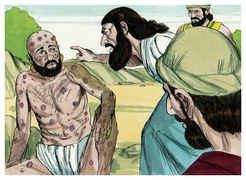

# Jó Capítulo 15

1	ENTÃO respondeu Elifaz o temanita, e disse:

2	Porventura proferirá o sábio vã sabedoria? E encherá do vento oriental o seu ventre,

3	Argüindo com palavras que de nada servem, e com razões, de que nada aproveita?

4	E tu tens feito vão o temor, e diminuis os rogos diante de Deus.

5	Porque a tua boca declara a tua iniqüidade; e tu escolhes a língua dos astutos.

6	A tua boca te condena, e não eu, e os teus lábios testificam contra ti.

7	És tu porventura o primeiro homem que nasceu? Ou foste formado antes dos outeiros?

8	Ou ouviste o secreto conselho de Deus e a ti só limitaste a sabedoria?

9	Que sabes tu, que nós não saibamos? Que entendes, que não haja em nós?

10	Também há entre nós encanecidos e idosos, muito mais idosos do que teu pai.

11	Porventura fazes pouco caso das consolações de Deus, e da suave palavra que te dirigimos?

12	Por que te arrebata o teu coração, e por que piscam os teus olhos?

13	Para virares contra Deus o teu espírito, e deixares sair tais palavras da tua boca?

14	Que é o homem, para que seja puro? E o que nasce da mulher, para ser justo?

15	Eis que ele não confia nos seus santos, e nem os céus são puros aos seus olhos.

16	Quanto mais abominável e corrupto é o homem que bebe a iniqüidade como a água?

17	Escuta-me, mostrar-te-ei; e o que tenho visto te contarei

18	(O que os sábios anunciaram, ouvindo-o de seus pais, e o não ocultaram;

19	Aos quais somente se dera a terra, e nenhum estranho passou por entre eles):

20	Todos os dias o ímpio é atormentado, e se reserva, para o tirano, um certo número de anos.

21	O sonido dos horrores está nos seus ouvidos; até na paz lhe sobrevém o assolador.

22	Não crê que tornará das trevas, mas que o espera a espada.

23	Anda vagueando por pão, dizendo: Onde está? Bem sabe que já o dia das trevas lhe está preparado, à mão.

24	Assombram-no a angústia e a tribulação; prevalecem contra ele, como o rei preparado para a peleja;

25	Porque estendeu a sua mão contra Deus, e contra o Todo-Poderoso se embraveceu.

26	Arremete contra ele com a dura cerviz, e contra os pontos grossos dos seus escudos.

27	Porquanto cobriu o seu rosto com a sua gordura, e criou gordura nas ilhargas.

28	E habitou em cidades assoladas, em casas em que ninguém morava, que estavam a ponto de fazer-se montões de ruínas.

29	Não se enriquecerá, nem subsistirá a sua fazenda, nem se estenderão pela terra as suas possessões.

30	Não escapará das trevas; a chama do fogo secará os seus renovos, e ao sopro da sua boca desaparecerá.

31	Não confie, pois, na vaidade, enganando-se a si mesmo, porque a vaidade será a sua recompensa.

32	Antes do seu dia ela se consumará; e o seu ramo não reverdecerá.

33	Sacudirá as suas uvas verdes, como as da vide, e deixará cair a sua flor como a oliveira,

34	Porque a congregação dos hipócritas se fará estéril, e o fogo consumirá as tendas do suborno.

35	Concebem a malícia, e dão à luz a iniqüidade, e o seu ventre prepara enganos.

# João Capítulo 15

1	EU sou a videira verdadeira, e meu Pai é o lavrador.

2	Toda a vara em mim, que não dá fruto, a tira; e limpa toda aquela que dá fruto, para que dê mais fruto.

3	Vós já estais limpos, pela palavra que vos tenho falado.

4	Estai em mim, e eu em vós; como a vara de si mesma não pode dar fruto, se não estiver na videira, assim também vós, se não estiverdes em mim.

5	Eu sou a videira, vós as varas; quem está em mim, e eu nele, esse dá muito fruto; porque sem mim nada podeis fazer.

6	Se alguém não estiver em mim, será lançado fora, como a vara, e secará; e os colhem e lançam no fogo, e ardem.

7	Se vós estiverdes em mim, e as minhas palavras estiverem em vós, pedireis tudo o que quiserdes, e vos será feito.

8	Nisto é glorificado meu Pai, que deis muito fruto; e assim sereis meus discípulos.

9	Como o Pai me amou, também eu vos amei a vós; permanecei no meu amor.

10	Se guardardes os meus mandamentos, permanecereis no meu amor; do mesmo modo que eu tenho guardado os mandamentos de meu Pai, e permaneço no seu amor.

11	Tenho-vos dito isto, para que o meu gozo permaneça em vós, e o vosso gozo seja completo.

12	O meu mandamento é este: Que vos ameis uns aos outros, assim como eu vos amei.

13	Ninguém tem maior amor do que este, de dar alguém a sua vida pelos seus amigos.

14	Vós sereis meus amigos, se fizerdes o que eu vos mando.

15	Já vos não chamarei servos, porque o servo não sabe o que faz o seu senhor; mas tenho-vos chamado amigos, porque tudo quanto ouvi de meu Pai vos tenho feito conhecer.

16	Não me escolhestes vós a mim, mas eu vos escolhi a vós, e vos nomeei, para que vades e deis fruto, e o vosso fruto permaneça; a fim de que tudo quanto em meu nome pedirdes ao Pai ele vo-lo conceda.

17	Isto vos mando: Que vos ameis uns aos outros.

18	Se o mundo vos odeia, sabei que, primeiro do que a vós, me odiou a mim.

19	Se vós fôsseis do mundo, o mundo amaria o que era seu, mas porque não sois do mundo, antes eu vos escolhi do mundo, por isso é que o mundo vos odeia.

20	Lembrai-vos da palavra que vos disse: Não é o servo maior do que o seu senhor. Se a mim me perseguiram, também vos perseguirão a vós; se guardaram a minha palavra, também guardarão a vossa.

21	Mas tudo isto vos farão por causa do meu nome, porque não conhecem aquele que me enviou.

22	Se eu não viera, nem lhes houvera falado, não teriam pecado, mas agora não têm desculpa do seu pecado.

23	Aquele que me odeia, odeia também a meu Pai.

24	Se eu entre eles não fizesse tais obras, quais nenhum outro tem feito, não teriam pecado; mas agora, viram-nas e me odiaram a mim e a meu Pai.

25	Mas é para que se cumpra a palavra que está escrita na sua lei: Odiaram-me sem causa.

26	Mas, quando vier o Consolador, que eu da parte do Pai vos hei de enviar, aquele Espírito de verdade, que procede do Pai, ele testificará de mim.

27	E vós também testificareis, pois estivestes comigo desde o princípio.

