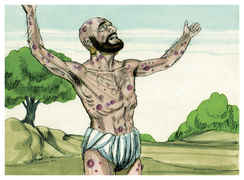

# Jó Capítulo 16

## 1
ENTÃO respondeu Jó, dizendo:

## 2
Tenho ouvido muitas coisas como estas; todos vós sois consoladores molestos.

## 3
Porventura não terão fim essas palavras de vento? Ou o que te irrita, para assim responderes?

## 4
Falaria eu também como vós falais, se a vossa alma estivesse em lugar da minha alma, ou amontoaria palavras contra vós, e menearia contra vós a minha cabeça?

## 5
Antes vos fortaleceria com a minha boca, e a consolação dos meus lábios abrandaria a vossa dor.

## 6
Se eu falar, a minha dor não cessa, e, calando-me eu, qual é o meu alívio?

## 7
Na verdade, agora tu me tens fatigado; tu assolaste toda a minha companhia,

## 8
Testemunha disto é que já me fizeste enrugado, e a minha magreza já se levanta contra mim, e no meu rosto testifica contra mim.

## 9
Na sua ira me despedaçou, e ele me perseguiu; rangeu os seus dentes contra mim; aguça o meu adversário os seus olhos contra mim.

## 10
Abrem a sua boca contra mim; com desprezo me feriram nos queixos, e contra mim se ajuntam todos.

## 11
Entrega-me Deus ao perverso, e nas mãos dos ímpios me faz cair.

## 12
Descansado estava eu, porém ele me quebrantou; e pegou-me pela cerviz, e me despedaçou; também me pôs por seu alvo.

## 13
Cercam-me os seus flecheiros; atravessa-me os rins, e não me poupa, e o meu fel derrama sobre a terra,

## 14
Fere-me com ferimento sobre ferimento; arremete contra mim como um valente.

## 15
Cosi sobre a minha pele o cilício, e revolvi a minha cabeça no pó.

## 16
O meu rosto está todo avermelhado de chorar, e sobre as minhas pálpebras está a sombra da morte:

## 17
Apesar de não haver violência nas minhas mãos, e de ser pura a minha oração.

## 18
Ah! terra, não cubras o meu sangue e não haja lugar para ocultar o meu clamor!

## 19
Eis que também agora a minha testemunha está no céu, e nas alturas o meu testemunho está.

## 20
Os meus amigos são os que zombam de mim; os meus olhos se desfazem em lágrimas diante de Deus.

## 21
Ah! se alguém pudesse contender com Deus pelo homem, como o homem pelo seu próximo!

## 22
Porque decorridos poucos anos, eu seguirei o caminho por onde não tornarei.

# João Capítulo 16

## 1
TENHO-VOS dito estas coisas para que vos não escandalizeis.

## 2
Expulsar-vos-ão das sinagogas; vem mesmo a hora em que qualquer que vos matar cuidará fazer um serviço a Deus.

## 3
E isto vos farão, porque não conheceram ao Pai nem a mim.

## 4
Mas tenho-vos dito isto, a fim de que, quando chegar aquela hora, vos lembreis de que já vo-lo tinha dito. E eu não vos disse isto desde o princípio, porque estava convosco.

## 5
E agora vou para aquele que me enviou; e nenhum de vós me pergunta: Para onde vais?

## 6
Antes, porque isto vos tenho dito, o vosso coração se encheu de tristeza.

## 7
Todavia digo-vos a verdade, que vos convém que eu vá; porque, se eu não for, o Consolador não virá a vós; mas, quando eu for, vo-lo enviarei.

## 8
E, quando ele vier, convencerá o mundo do pecado, e da justiça e do juízo.

## 9
Do pecado, porque não crêem em mim;

## 10
Da justiça, porque vou para meu Pai, e não me vereis mais;

## 11
E do juízo, porque já o príncipe deste mundo está julgado.

## 12
Ainda tenho muito que vos dizer, mas vós não o podeis suportar agora.

## 13
Mas, quando vier aquele, o Espírito de verdade, ele vos guiará em toda a verdade; porque não falará de si mesmo, mas dirá tudo o que tiver ouvido, e vos anunciará o que há de vir.

## 14
Ele me glorificará, porque há de receber do que é meu, e vo-lo há de anunciar.

## 15
Tudo quanto o Pai tem é meu; por isso vos disse que há de receber do que é meu e vo-lo há de anunciar.

## 16
Um pouco, e não me vereis; e outra vez um pouco, e ver-me-eis; porquanto vou para o Pai.

## 17
Então alguns dos seus discípulos disseram uns aos outros: Que é isto que nos diz? Um pouco, e não me vereis; e outra vez um pouco, e ver-me-eis; e: Porquanto vou para o Pai?

## 18
Diziam, pois: Que quer dizer isto: Um pouco? Não sabemos o que diz.

## 19
Conheceu, pois, Jesus que o queriam interrogar, e disse-lhes: Indagais entre vós acerca disto que disse: Um pouco, e não me vereis, e outra vez um pouco, e ver-me-eis?

## 20
Na verdade, na verdade vos digo que vós chorareis e vos lamentareis, e o mundo se alegrará, e vós estareis tristes, mas a vossa tristeza se converterá em alegria.

## 21
A mulher, quando está para dar à luz, sente tristeza, porque é chegada a sua hora; mas, depois de ter dado à luz a criança, já não se lembra da aflição, pelo prazer de haver nascido um homem no mundo.

## 22
Assim também vós agora, na verdade, tendes tristeza; mas outra vez vos verei, e o vosso coração se alegrará, e a vossa alegria ninguém vo-la tirará.

## 23
E naquele dia nada me perguntareis. Na verdade, na verdade vos digo que tudo quanto pedirdes a meu Pai, em meu nome, ele vo-lo há de dar.

## 24
Até agora nada pedistes em meu nome; pedi, e recebereis, para que o vosso gozo se cumpra.

## 25
Disse-vos isto por parábolas; chega, porém, a hora em que não vos falarei mais por parábolas, mas abertamente vos falarei acerca do Pai.

## 26
Naquele dia pedireis em meu nome, e não vos digo que eu rogarei por vós ao Pai;

## 27
Pois o mesmo Pai vos ama, visto como vós me amastes, e crestes que saí de Deus.

## 28
Saí do Pai, e vim ao mundo; outra vez deixo o mundo, e vou para o Pai.

## 29
Disseram-lhe os seus discípulos: Eis que agora falas abertamente, e não dizes parábola alguma.

## 30
Agora conhecemos que sabes tudo, e não precisas de que alguém te interrogue. Por isso cremos que saíste de Deus.

## 31
Respondeu-lhes Jesus: Credes agora?

## 32
Eis que chega a hora, e já se aproxima, em que vós sereis dispersos cada um para sua parte, e me deixareis só; mas não estou só, porque o Pai está comigo.

## 33
Tenho-vos dito isto, para que em mim tenhais paz; no mundo tereis aflições, mas tende bom ânimo, eu venci o mundo.

