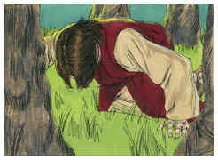

# Jó Capítulo 17

## 1
O MEU espírito se vai consumindo, os meus dias se vão apagando, e só tenho perante mim a sepultura.

## 2
Deveras estou cercado de zombadores, e os meus olhos contemplam as suas provocações.

## 3
Promete agora, e dá-me um fiador para contigo; quem há que me dê a mão?

## 4
Porque aos seus corações encobriste o entendimento, por isso não os exaltarás.

## 5
O que denuncia os seus amigos, a fim de serem despojados, também os olhos de seus filhos desfalecerão.

## 6
Porém a mim me pôs por um provérbio dos povos, de modo que me tornei uma abominação para eles.

## 7
Pelo que já se escureceram de mágoa os meus olhos, e já todos os meus membros são como a sombra.

## 8
Os retos pasmarão disto, e o inocente se levantará contra o hipócrita.

## 9
E o justo seguirá o seu caminho firmemente, e o puro de mãos irá crescendo em força.

## 10
Mas, na verdade, tornai todos vós e vinde; porque sábio nenhum acharei entre vós.

## 11
Os meus dias passaram, e malograram os meus propósitos, as aspirações do meu coração.

## 12
Trocaram a noite em dia; a luz está perto do fim, por causa das trevas.

## 13
Se eu esperar, a sepultura será a minha casa; nas trevas estenderei a minha cama.

## 14
À corrupção clamo: Tu és meu pai; e aos vermes: Vós sois minha mãe e minha irmã.

## 15
Onde, pois, estaria agora a minha esperança? Sim, a minha esperança, quem a poderá ver?

## 16
As barras da sepultura descerão quando juntamente no pó teremos descanso.

# João Capítulo 17

## 1
JESUS falou assim e, levantando seus olhos ao céu, e disse: Pai, é chegada a hora; glorifica a teu Filho, para que também o teu Filho te glorifique a ti;

## 2
Assim como lhe deste poder sobre toda a carne, para que dê a vida eterna a todos quantos lhe deste.

## 3
E a vida eterna é esta: que te conheçam, a ti só, por único Deus verdadeiro, e a Jesus Cristo, a quem enviaste.

## 4
Eu glorifiquei-te na terra, tendo consumado a obra que me deste a fazer.

## 5
E agora glorifica-me tu, ó Pai, junto de ti mesmo, com aquela glória que tinha contigo antes que o mundo existisse.

## 6
Manifestei o teu nome aos homens que do mundo me deste; eram teus, e tu mos deste, e guardaram a tua palavra.

## 7
Agora já têm conhecido que tudo quanto me deste provém de ti;

## 8
Porque lhes dei as palavras que tu me deste; e eles as receberam, e têm verdadeiramente conhecido que saí de ti, e creram que me enviaste.

## 9
Eu rogo por eles; não rogo pelo mundo, mas por aqueles que me deste, porque são teus.

## 10
E todas as minhas coisas são tuas, e as tuas coisas são minhas; e neles sou glorificado.

## 11
E eu já não estou mais no mundo, mas eles estão no mundo, e eu vou para ti. Pai santo, guarda em teu nome aqueles que me deste, para que sejam um, assim como nós.

## 12
Estando eu com eles no mundo, guardava-os em teu nome. Tenho guardado aqueles que tu me deste, e nenhum deles se perdeu, senão o filho da perdição, para que a Escritura se cumprisse.

## 13
Mas agora vou para ti, e digo isto no mundo, para que tenham a minha alegria completa em si mesmos.

## 14
Dei-lhes a tua palavra, e o mundo os odiou, porque não são do mundo, assim como eu não sou do mundo.

## 15
Não peço que os tires do mundo, mas que os livres do mal.

## 16
Não são do mundo, como eu do mundo não sou.

## 17
Santifica-os na tua verdade; a tua palavra é a verdade.

## 18
Assim como tu me enviaste ao mundo, também eu os enviei ao mundo.

## 19
E por eles me santifico a mim mesmo, para que também eles sejam santificados na verdade.

## 20
E não rogo somente por estes, mas também por aqueles que pela tua palavra hão de crer em mim;

## 21
Para que todos sejam um, como tu, ó Pai, o és em mim, e eu em ti; que também eles sejam um em nós, para que o mundo creia que tu me enviaste.

## 22
E eu dei-lhes a glória que a mim me deste, para que sejam um, como nós somos um.

## 23
Eu neles, e tu em mim, para que eles sejam perfeitos em unidade, e para que o mundo conheça que tu me enviaste a mim, e que os tens amado a eles como me tens amado a mim.

## 24
Pai, aqueles que me deste quero que, onde eu estiver, também eles estejam comigo, para que vejam a minha glória que me deste; porque tu me amaste antes da fundação do mundo.

## 25
Pai justo, o mundo não te conheceu; mas eu te conheci, e estes conheceram que tu me enviaste a mim.

## 26
E eu lhes fiz conhecer o teu nome, e lho farei conhecer mais, para que o amor com que me tens amado esteja neles, e eu neles esteja.

