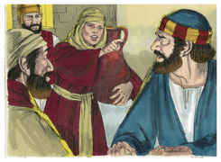
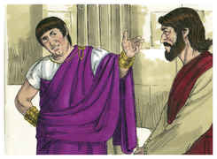
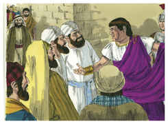
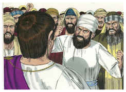

# Jó Capítulo 18

## 1
ENTÃO respondeu Bildade, o suíta, e disse:

## 2
Até quando poreis fim às palavras? Considerai bem, e então falaremos.

## 3
Por que somos tratados como animais, e como imundos aos vossos olhos?

## 4
Oh tu, que despedaças a tua alma na tua ira, será a terra deixada por tua causa? Remover-se-ão as rochas do seu lugar?

## 5
Na verdade, a luz dos ímpios se apagará, e a chama do seu fogo não resplandecerá.

## 6
A luz se escurecerá nas suas tendas, e a sua lâmpada sobre ele se apagará.

## 7
Os seus passos firmes se estreitarão, e o seu próprio conselho o derrubará.

## 8
Porque por seus próprios pés é lançado na rede, e andará nos fios enredados.

## 9
O laço o apanhará pelo calcanhar, e a armadilha o prenderá.

## 10
Está escondida debaixo da terra uma corda, e uma armadilha na vereda.

## 11
Os assombros o espantarão de todos os lados, e o perseguirão a cada passo.

## 12
Será faminto o seu vigor, e a destruição está pronta ao seu lado.

## 13
Serão devorados os membros do seu corpo; sim, o primogênito da morte devorará os seus membros.

## 14
A sua confiança será arrancada da sua tenda, onde está confiado, e isto o fará caminhar para o rei dos terrores.

## 15
Morará na sua mesma tenda, o que não lhe pertence; espalhar-se-á enxofre sobre a sua habitação.

## 16
Por baixo se secarão as suas raízes e por cima serão cortados os seus ramos.

## 17
A sua memória perecerá da terra, e pelas praças não terá nome.

## 18
Da luz o lançarão nas trevas, e afugentá-lo-ão do mundo.

## 19
Não terá filho nem neto entre o seu povo, e nem quem lhe suceda nas suas moradas.

## 20
Do seu dia se espantarão os do ocidente, assim como se espantam os do oriente.

## 21
Tais são, na verdade, as moradas do perverso, e este é o lugar do que não conhece a Deus.

# João Capítulo 18

## 1
TENDO Jesus dito isto, saiu com os seus discípulos para além do ribeiro de Cedrom, onde havia um horto, no qual ele entrou e seus discípulos.

## 2
E Judas, que o traía, também conhecia aquele lugar, porque Jesus muitas vezes se ajuntava ali com os seus discípulos.

## 3
Tendo, pois, Judas recebido a coorte e oficiais dos principais sacerdotes e fariseus, veio para ali com lanternas, e archotes e armas.

## 4
Sabendo, pois, Jesus todas as coisas que sobre ele haviam de vir, adiantou-se, e disse-lhes: A quem buscais?

## 5
Responderam-lhe: A Jesus Nazareno. Disse-lhes Jesus: Sou eu. E Judas, que o traía, estava com eles.

## 6
Quando, pois, lhes disse: Sou eu, recuaram, e caíram por terra.

## 7
Tornou-lhes, pois, a perguntar: A quem buscais? E eles disseram: A Jesus Nazareno.

## 8
Jesus respondeu: Já vos disse que sou eu; se, pois, me buscais a mim, deixai ir estes;

## 9
Para que se cumprisse a palavra que tinha dito: Dos que me deste nenhum deles perdi.

## 10
Então Simão Pedro, que tinha espada, desembainhou-a, e feriu o servo do sumo sacerdote, cortando-lhe a orelha direita. E o nome do servo era Malco.

## 11
Mas Jesus disse a Pedro: Põe a tua espada na bainha; não beberei eu o cálice que o Pai me deu?

## 12
Então a coorte, e o tribuno, e os servos dos judeus prenderam a Jesus e o maniataram.

## 13
E conduziram-no primeiramente a Anás, por ser sogro de Caifás, que era o sumo sacerdote daquele ano.

## 14
Ora, Caifás era quem tinha aconselhado aos judeus que convinha que um homem morresse pelo povo.

## 15
E Simão Pedro e outro discípulo seguiam a Jesus. E este discípulo era conhecido do sumo sacerdote, e entrou com Jesus na sala do sumo sacerdote.

## 16
E Pedro estava da parte de fora, à porta. Saiu então o outro discípulo que era conhecido do sumo sacerdote, e falou à porteira, levando Pedro para dentro.

## 17
Então a porteira disse a Pedro: Não és tu também dos discípulos deste homem? Disse ele: Não sou.

## 18
Ora, estavam ali os servos e os servidores, que tinham feito brasas, e se aquentavam, porque fazia frio; e com eles estava Pedro, aquentando-se também.

## 19
E o sumo sacerdote interrogou Jesus acerca dos seus discípulos e da sua doutrina.

## 20
Jesus lhe respondeu: Eu falei abertamente ao mundo; eu sempre ensinei na sinagoga e no templo, onde os judeus sempre se ajuntam, e nada disse em oculto.

## 21
Para que me perguntas a mim? Pergunta aos que ouviram o que é que lhes ensinei; eis que eles sabem o que eu lhes tenho dito.

## 22
E, tendo dito isto, um dos servidores que ali estavam, deu uma bofetada em Jesus, dizendo: Assim respondes ao sumo sacerdote?

## 23
Respondeu-lhe Jesus: Se falei mal, dá testemunho do mal; e, se bem, por que me feres?

## 24
E Anás mandou-o, maniatado, ao sumo sacerdote Caifás.

## 25
E Simão Pedro estava ali, e aquentava-se. Disseram-lhe, pois: Não és também tu um dos seus discípulos? Ele negou, e disse: Não sou.

## 26
E um dos servos do sumo sacerdote, parente daquele a quem Pedro cortara a orelha, disse: Não te vi eu no horto com ele?

## 27
E Pedro negou outra vez, e logo o galo cantou.

## 28
Depois levaram Jesus da casa de Caifás para a audiência. E era pela manhã cedo. E não entraram na audiência, para não se contaminarem, mas poderem comer a páscoa.

## 29
Então Pilatos saiu fora e disse-lhes: Que acusação trazeis contra este homem?

## 30
Responderam, e disseram-lhe: Se este não fosse malfeitor, não to entregaríamos.

## 31
Disse-lhes, pois, Pilatos: Levai-o vós, e julgai-o segundo a vossa lei. Disseram-lhe então os judeus: A nós não nos é lícito matar pessoa alguma.

## 32
(Para que se cumprisse a palavra que Jesus tinha dito, significando de que morte havia de morrer).

## 33
Tornou, pois, a entrar Pilatos na audiência, e chamou a Jesus, e disse-lhe: Tu és o Rei dos Judeus?

## 34
Respondeu-lhe Jesus: Tu dizes isso de ti mesmo, ou disseram-to outros de mim?

## 35
Pilatos respondeu: Porventura sou eu judeu? A tua nação e os principais dos sacerdotes entregaram-te a mim. Que fizeste?

## 36
Respondeu Jesus: O meu reino não é deste mundo; se o meu reino fosse deste mundo, pelejariam os meus servos, para que eu não fosse entregue aos judeus; mas agora o meu reino não é daqui.

## 37
Disse-lhe, pois, Pilatos: Logo tu és rei? Jesus respondeu: Tu dizes que eu sou rei. Eu para isso nasci, e para isso vim ao mundo, a fim de dar testemunho da verdade. Todo aquele que é da verdade ouve a minha voz.

## 38
Disse-lhe Pilatos: Que é a verdade? E, dizendo isto, tornou a ir ter com os judeus, e disse-lhes: Não acho nele crime algum.

## 39
Mas vós tendes por costume que eu vos solte alguém pela páscoa. Quereis, pois, que vos solte o Rei dos Judeus?

## 40
Então todos tornaram a clamar, dizendo: Este não, mas Barrabás. E Barrabás era um salteador.

