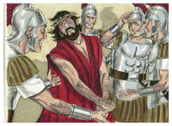
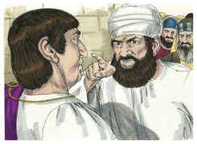
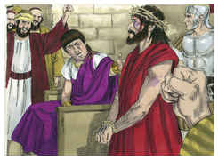
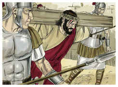
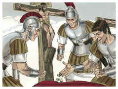
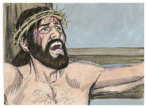
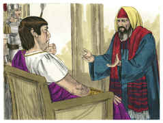

# Jó Capítulo 19

## 1
RESPONDEU, porém, Jó, dizendo:

## 2
Até quando afligireis a minha alma, e me quebrantareis com palavras?

## 3
Já dez vezes me vituperastes; não tendes vergonha de injuriar-me.

## 4
Embora haja eu, na verdade, errado, comigo ficará o meu erro.

## 5
Se deveras vos quereis engrandecer contra mim, e argüir-me pelo meu opróbrio,

## 6
Sabei agora que Deus é o que me transtornou, e com a sua rede me cercou.

## 7
Eis que clamo: Violência! Porém não sou ouvido. Grito: Socorro! Porém não há justiça.

## 8
O meu caminho ele entrincheirou, e já não posso passar, e nas minhas veredas pôs trevas.

## 9
Da minha honra me despojou; e tirou-me a coroa da minha cabeça.

## 10
Quebrou-me de todos os lados, e eu me vou; e arrancou a minha esperança, como a uma árvore.

## 11
E fez inflamar contra mim a sua ira, e me reputou para consigo, como a seus inimigos.

## 12
Juntas vieram as suas tropas, e prepararam contra mim o seu caminho, e se acamparam ao redor da minha tenda.

## 13
Pôs longe de mim a meus irmãos, e os que me conhecem, como estranhos se apartaram de mim.

## 14
Os meus parentes me deixaram, e os meus conhecidos se esqueceram de mim.

## 15
Os meus domésticos e as minhas servas me reputaram como um estranho, e vim a ser um estrangeiro aos seus olhos.

## 16
Chamei a meu criado, e ele não me respondeu; cheguei a suplicar-lhe com a minha própria boca.

## 17
O meu hálito se fez estranho à minha mulher; tanto que supliquei o interesse dos filhos do meu corpo.

## 18
Até os pequeninos me desprezam, e, levantando-me eu, falam contra mim.

## 19
Todos os homens da minha confidência me abominam, e até os que eu amava se tornaram contra mim.

## 20
Os meus ossos se apegaram à minha pele e à minha carne, e escapei só com a pele dos meus dentes.

## 21
Compadecei-vos de mim, amigos meus, compadecei-vos de mim, porque a mão de Deus me tocou.

## 22
Por que me perseguis assim como Deus, e da minha carne não vos fartais?

## 23
Quem me dera agora, que as minhas palavras fossem escritas! Quem me dera, fossem gravadas num livro!

## 24
E que, com pena de ferro, e com chumbo, para sempre fossem esculpidas na rocha.

## 25
Porque eu sei que o meu Redentor vive, e que por fim se levantará sobre a terra.

## 26
E depois de consumida a minha pele, contudo ainda em minha carne verei a Deus,

## 27
Vê-lo-ei, por mim mesmo, e os meus olhos, e não outros o contemplarão; e por isso os meus rins se consomem no meu interior.

## 28
Na verdade, que devíeis dizer: Por que o perseguimos? Pois a raiz da acusação se acha em mim.

## 29
Temei vós mesmos a espada; porque o furor traz os castigos da espada, para saberdes que há um juízo.

# João Capítulo 19

## 1
PILATOS, pois, tomou então a Jesus, e o açoitou.

## 2
E os soldados, tecendo uma coroa de espinhos, lha puseram sobre a cabeça, e lhe vestiram roupa de púrpura.

## 3
E diziam: Salve, Rei dos Judeus. E davam-lhe bofetadas.

## 4
Então Pilatos saiu outra vez fora, e disse-lhes: Eis aqui vo-lo trago fora, para que saibais que não acho nele crime algum.

## 5
Saiu, pois, Jesus fora, levando a coroa de espinhos e roupa de púrpura. E disse-lhes Pilatos: Eis aqui o homem.

## 6
Vendo-o, pois, os principais dos sacerdotes e os servos, clamaram, dizendo: Crucifica-o, crucifica-o. Disse-lhes Pilatos: Tomai-o vós, e crucificai-o; porque eu nenhum crime acho nele.

## 7
Responderam-lhe os judeus: Nós temos uma lei e, segundo a nossa lei, deve morrer, porque se fez Filho de Deus.

## 8
E Pilatos, quando ouviu esta palavra, mais atemorizado ficou.

## 9
E entrou outra vez na audiência, e disse a Jesus: De onde és tu? Mas Jesus não lhe deu resposta.

## 10
Disse-lhe, pois, Pilatos: Não me falas a mim? Não sabes tu que tenho poder para te crucificar e tenho poder para te soltar?

## 11
Respondeu Jesus: Nenhum poder terias contra mim, se de cima não te fosse dado; mas aquele que me entregou a ti maior pecado tem.

## 12
Desde então Pilatos procurava soltá-lo; mas os judeus clamavam, dizendo: Se soltas este, não és amigo de César; qualquer que se faz rei é contra César.

## 13
Ouvindo, pois, Pilatos este dito, levou Jesus para fora, e assentou-se no tribunal, no lugar chamado Litóstrotos, e em hebraico Gabatá.

## 14
E era a preparação da páscoa, e quase à hora sexta; e disse aos judeus: Eis aqui o vosso Rei.

## 15
Mas eles bradaram: Tira, tira, crucifica-o. Disse-lhes Pilatos: Hei de crucificar o vosso Rei? Responderam os principais dos sacerdotes: Não temos rei, senão César.

## 16
Então, conseqüentemente entregou-lho, para que fosse crucificado. E tomaram a Jesus, e o levaram.

## 17
E, levando ele às costas a sua cruz, saiu para o lugar chamado Caveira, que em hebraico se chama Gólgota,

## 18
Onde o crucificaram, e com ele outros dois, um de cada lado, e Jesus no meio.

## 19
E Pilatos escreveu também um título, e pô-lo em cima da cruz; e nele estava escrito: JESUS NAZARENO, O REI DOS JUDEUS.

## 20
E muitos dos judeus leram este título; porque o lugar onde Jesus estava crucificado era próximo da cidade; e estava escrito em hebraico, grego e latim.

## 21
Diziam, pois, os principais sacerdotes dos judeus a Pilatos: Não escrevas, O Rei dos Judeus, mas que ele disse: Sou o Rei dos Judeus.

## 22
Respondeu Pilatos: O que escrevi, escrevi.

## 23
Tendo, pois, os soldados crucificado a Jesus, tomaram as suas vestes, e fizeram quatro partes, para cada soldado uma parte; e também a túnica. A túnica, porém, tecida toda de alto a baixo, não tinha costura.

## 24
Disseram, pois, uns aos outros: Não a rasguemos, mas lancemos sortes sobre ela, para ver de quem será. Para que se cumprisse a Escritura que diz: Repartiram entre si as minhas vestes, e sobre a minha vestidura lançaram sortes. Os soldados, pois, fizeram estas coisas.

## 25
E junto à cruz de Jesus estava sua mãe, e a irmã de sua mãe, Maria mulher de Clopas, e Maria Madalena.

## 26
Ora Jesus, vendo ali sua mãe, e que o discípulo a quem ele amava estava presente, disse a sua mãe: Mulher, eis aí o teu filho.

## 27
Depois disse ao discípulo: Eis aí tua mãe. E desde aquela hora o discípulo a recebeu em sua casa.

## 28
Depois, sabendo Jesus que já todas as coisas estavam terminadas, para que a Escritura se cumprisse, disse: Tenho sede.

## 29
Estava, pois, ali um vaso cheio de vinagre. E encheram de vinagre uma esponja, e, pondo-a num hissopo, lha chegaram à boca.

## 30
E, quando Jesus tomou o vinagre, disse: Está consumado. E, inclinando a cabeça, entregou o espírito.

## 31
Os judeus, pois, para que no sábado não ficassem os corpos na cruz, visto como era a preparação (pois era grande o dia de sábado), rogaram a Pilatos que se lhes quebrassem as pernas, e fossem tirados.

## 32
Foram, pois, os soldados, e, na verdade, quebraram as pernas ao primeiro, e ao outro que como ele fora crucificado;

## 33
Mas, vindo a Jesus, e vendo-o já morto, não lhe quebraram as pernas.

## 34
Contudo um dos soldados lhe furou o lado com uma lança, e logo saiu sangue e água.

## 35
E aquele que o viu testificou, e o seu testemunho é verdadeiro; e sabe que é verdade o que diz, para que também vós o creiais.

## 36
Porque isto aconteceu para que se cumprisse a Escritura, que diz: Nenhum dos seus ossos será quebrado.

## 37
E outra vez diz a Escritura: Verão aquele que traspassaram.

## 38
Depois disto, José de Arimatéia (o que era discípulo de Jesus, mas oculto, por medo dos judeus) rogou a Pilatos que lhe permitisse tirar o corpo de Jesus. E Pilatos lho permitiu. Então foi e tirou o corpo de Jesus.

## 39
E foi também Nicodemos (aquele que anteriormente se dirigira de noite a Jesus), levando quase cem arráteis de um composto de mirra e aloés.

## 40
Tomaram, pois, o corpo de Jesus e o envolveram em lençóis com as especiarias, como os judeus costumam fazer, na preparação para o sepulcro.

## 41
E havia um horto naquele lugar onde fora crucificado, e no horto um sepulcro novo, em que ainda ninguém havia sido posto.

## 42
Ali, pois (por causa da preparação dos judeus, e por estar perto aquele sepulcro), puseram a Jesus.

